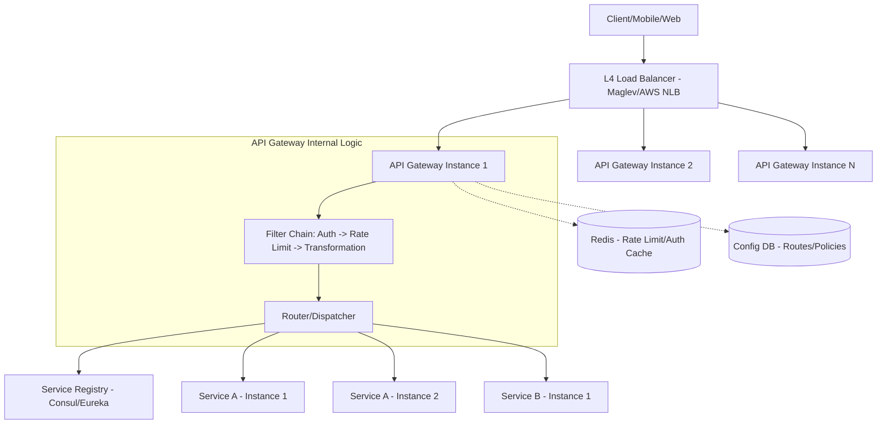

# System Design: API Gateway and Load Balancer

## 1. Requirements & System Constraints

### 1.1 Functional Requirements
*   **Request Routing:** Route incoming HTTP requests to the appropriate backend microservice based on the path, host, or headers.
*   **Authentication & Authorization:** Centralize security checks (JWT validation, API key verification) before requests reach backend services.
*   **Rate Limiting & Throttling:** Prevent system abuse by limiting the number of requests a client can make within a time window.
*   **Load Balancing:** Distribute traffic across multiple instances of a service to ensure high availability and optimal resource utilization.
*   **Protocol Translation:** Convert between different protocols (e.g., REST/HTTP to gRPC or WebSockets).
*   **Response Aggregation:** Combine results from multiple microservices into a single response to reduce client-side round trips.
*   **Observability:** Centralized logging, metrics collection, and distributed tracing (injection of Trace IDs).

### 1.2 Non-Functional Requirements
*   **Ultra-Low Latency:** The gateway is in the critical path of every request; overhead must be minimal (typically < 10-30ms).
*   **High Availability:** The gateway must be a highly available cluster; if the gateway goes down, the entire ecosystem is unreachable.
*   **Scalability:** Must scale horizontally to handle millions of requests per second (RPS).
*   **Fault Tolerance:** Implement circuit breakers to prevent a failing backend service from cascading failure across the system.

### 1.3 Scale Estimations (HLD)
*   **Traffic:** 100,000 requests per second (RPS) average; 500,000 RPS peak.
*   **Latency Budget:** $\le 20\text{ms}$ overhead added by the gateway.
*   **Backend Services:** 50+ distinct microservices.
*   **Concurrent Connections:** Millions of keep-alive TCP connections.

---

## 2. High-Level Architecture

The system employs a multi-tier approach. A Layer 4 (L4) Load Balancer distributes traffic across a cluster of API Gateway instances (Layer 7). The API Gateway then interacts with a Service Registry to find healthy backend pods.

### 2.1 Architecture Diagram



### 2.2 Component Interaction
1.  **L4 Load Balancer:** Handles TCP/UDP traffic. It uses a simple hashing algorithm (like IP hash) to distribute traffic to the API Gateway cluster.
2.  **API Gateway Cluster:** A set of stateless nodes. Each node runs a "Filter Chain."
3.  **Filter Chain:**
    *   **Auth Filter:** Validates JWTs or API keys.
    *   **Rate Limit Filter:** Checks Redis for the current request count against the allowed quota.
    *   **Transformation Filter:** Modifies headers or rewrites paths (e.g., `/api/v1/users` $\rightarrow$ `/users-service/v1`).
4.  **Service Registry:** Provides the current IP addresses of healthy backend service instances.
5.  **Router:** Selects a backend instance using a Load Balancing algorithm (e.g., Round Robin, Least Connections).

---

## 3. Detailed Database Schema Design

The API Gateway is primarily a data-plane component (stateless), but it requires a control-plane to manage configurations and a fast store for stateful constraints (rate limiting).

### 3.1 Configuration Store (SQL - PostgreSQL)
Used to manage routing rules, API keys, and global policies. SQL is chosen for strong consistency and complex querying of administrative rules.

**Table: `routes`**
| Field | Type | Constraints | Description |
| :--- | :--- | :--- | :--- |
| `route_id` | UUID | PK | Unique identifier for the route |
| `path_pattern` | VARCHAR | Indexed | Regex or glob pattern (e.g., `/api/users/*`) |
| `target_service` | VARCHAR | Not Null | Name of the backend service (for Registry lookup) |
| `timeout_ms` | INT | Default 5000 | Request timeout |
| `is_active` | BOOLEAN | Default True | Kill-switch for the route |

**Table: `api_keys`**
| Field | Type | Constraints | Description |
| :--- | :--- | :--- | :--- |
| `key_hash` | VARCHAR | PK | SHA-256 hash of the API key |
| `client_id` | UUID | FK | Reference to client profile |
| `tier` | VARCHAR | Not Null | 'Free', 'Premium', 'Enterprise' |
| `expires_at` | TIMESTAMP | Indexed | Key expiration date |

### 3.2 Rate Limit Store (NoSQL - Redis)
Redis is used for its atomic increments (`INCR`) and TTL (Time-to-Live) capabilities, essential for sliding-window or fixed-window rate limiting.

**Key Structure:**
*   **Key:** `ratelimit:{client_id}:{endpoint_id}:{window_timestamp}`
*   **Value:** `Integer` (Current request count)
*   **TTL:** 60 seconds (for a 1-minute window).

---

## 4. Core API Design (Control Plane)

The API Gateway is managed by a Control Plane API that allows admins to update routing and policies without restarting the gateway instances.

### 4.1 Update Route
`POST /admin/routes`
**Request:**
```json
{
  "path_pattern": "/api/v1/payments/*",
  "target_service": "payments-service",
  "timeout_ms": 2000,
  "auth_required": true,
  "rate_limit_policy": "payment_tier_policy"
}
```
**Response:** `201 Created`

### 4.2 Update Rate Limit Policy
`PUT /admin/policies/{policy_id}`
**Request:**
```json
{
  "policy_id": "payment_tier_policy",
  "requests_per_second": 100,
  "burst_capacity": 150
}
```
**Response:** `200 OK`

---

## 5. Scalability & Advanced Topics

### 5.1 Load Balancing Algorithms
*   **Round Robin:** Simple, works well if all backend instances have identical specs.
*   **Least Connections:** Routes to the instance with the fewest active requests; better for long-lived connections.
*   **Consistent Hashing:** Routes based on a request attribute (e.g., `user_id`). Ensures a specific user always hits the same backend instance, enabling effective local caching.

### 5.2 Rate Limiting Strategy
*   **Token Bucket:** Allows for bursts of traffic while maintaining a steady average rate.
*   **Distributed Rate Limiting:** To avoid "local" limits on individual gateway nodes, a global Redis cluster is used. To reduce Redis latency, the gateway can use **Local Batching**: increment the counter locally for 100ms, then sync to Redis in one call.

### 5.3 Fault Tolerance & Reliability
*   **Circuit Breaker:** If a backend service returns $5xx$ errors above a certain threshold (e.g., 50% failure over 10 seconds), the gateway "opens" the circuit and fails fast for that service, preventing resource exhaustion.
*   **Retries with Exponential Backoff:** For idempotent requests (GET, PUT), the gateway can retry a failed request on a different backend instance.
*   **Health Checks:** The gateway continuously polls `/health` endpoints of backends or relies on a Heartbeat mechanism from the Service Registry.

### 5.4 Caching Strategy
*   **Edge Caching:** Cache responses for static or semi-static data (e.g., `/api/v1/countries`) using a TTL.
*   **Cache Key:** `hash(HTTP_Method + Path + QueryParams + Auth_Tier)`.

---

## 6. Trade-off Analysis

| Trade-off | Decision | Reasoning |
| :--- | :--- | :--- |
| **Latency vs. Security** | Filter Chain | We accept a small latency hit (ms) to ensure all requests are authenticated and rate-limited before they hit the internal network. |
| **Consistency vs. Availability (Rate Limiting)** | Eventual Consistency | We use Redis. If Redis is temporarily unavailable, the gateway fails "open" (allows traffic) rather than "closed" (blocking all users), prioritizing availability. |
| **L4 LB vs L7 LB (at entry)** | L4 at entry $\rightarrow$ L7 Gateway | L4 (NLB) is significantly faster and handles TCP millions of packets. L7 (Gateway) provides the intelligence (routing, auth) needed for microservices. |
| **SQL vs NoSQL (Config)** | SQL for Config, NoSQL for State | Routing rules change rarely and require relational integrity (SQL). Rate limits change millions of times per second (Redis). |
| **Centralized vs Distributed Gateway** | Centralized Cluster | While a "Sidecar" (Service Mesh) is more granular, a centralized API Gateway is simpler to manage for external-facing traffic and provides a single point of security enforcement. |