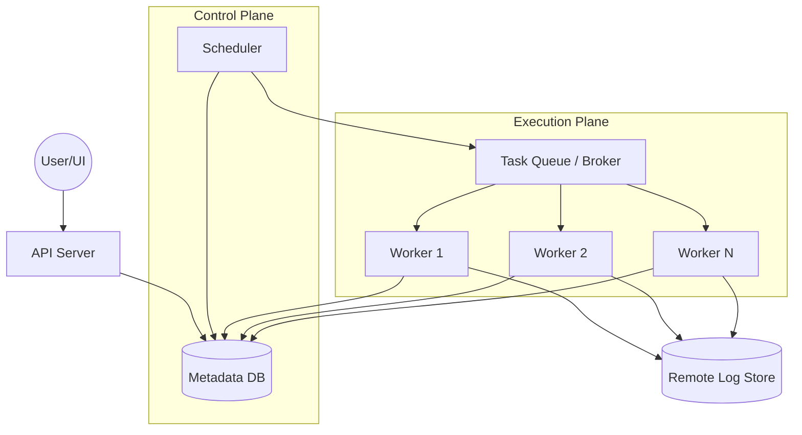

# System Design Document: Distributed Workflow Orchestrator

## 1. Requirements & System Constraints

### 1.1 Functional Requirements
*   **DAG Definition:** Users must be able to define workflows as Directed Acyclic Graphs (DAGs), specifying tasks and their dependencies.
*   **Scheduling:** Support for various scheduling triggers:
    *   Time-based (Cron expressions, fixed intervals).
    *   Event-based (External API triggers, Webhooks).
    *   Dependency-based (Triggered upon completion of another DAG).
*   **Task Execution:** Ability to execute diverse task types (Python scripts, Bash commands, SQL queries, API calls).
*   **Dependency Management:** A task should only execute once all its upstream dependencies have succeeded.
*   **Fault Tolerance & Retries:** Automatic retries with configurable backoff policies upon task failure.
*   **Monitoring & Observability:** A UI to visualize DAG progress, view logs for specific task instances, and manually trigger/clear tasks.
*   **State Management:** Track the state of every DAG run and every individual task instance (e.g., `queued`, `running`, `success`, `failed`, `up_for_retry`).

### 1.2 Non-Functional Requirements
*   **Scalability:** Handle thousands of active DAGs and millions of task instances per day.
*   **High Availability:** No single point of failure for the scheduler or worker nodes.
*   **Reliability (Exactly-Once/At-Least-Once):** Ensure tasks are not lost. While strict exactly-once is hard in distributed systems, the system should aim for at-least-once execution with idempotency requirements on the task level.
*   **Extensibility:** Ability to add new "Operators" (task types) without modifying the core engine.
*   **Durability:** DAG definitions and execution history must persist across system restarts.

### 1.3 Scale Estimations (HLD)
*   **DAGs:** 10,000 active DAGs.
*   **Daily Task Instances:** $\sim 1,000,000$ tasks/day.
*   **Throughput:** Average $\sim 12$ tasks per second, but peak bursts could reach $500$ tasks/sec.
*   **Storage:** Task logs are the primary storage driver. If each task generates 10KB of logs, $10^6 \text{ tasks} \times 10\text{KB} = 10\text{GB/day}$.

---

## 2. High-Level Architecture

The system follows a decoupled architecture separating the **Control Plane** (Scheduler, API, DB) from the **Data Plane** (Workers).

### 2.1 Core Components
1.  **API Server:** The entry point for the UI and external triggers. Handles DAG CRUD operations and manual triggers.
2.  **Scheduler:** The "Brain." It continuously polls the Metadata DB to identify DAGs that need to be run and tasks that are ready for execution based on dependency resolution.
3.  **Metadata Database:** The source of truth for DAG definitions, run states, and task instance history.
4.  **Task Queue (Message Broker):** Decouples the Scheduler from Workers. The Scheduler pushes "ready-to-run" task metadata into the queue.
5.  **Worker Nodes:** Pull tasks from the queue, execute the actual logic, and update the task state in the Metadata DB.
6.  **Log Store:** A distributed storage system (e.g., S3, GCS, or Elasticsearch) to store task execution logs.

### 2.2 Architecture Diagram



### 2.3 Sequence Flow: Task Execution
1.  **Trigger:** The Scheduler detects a Cron trigger or the API receives a manual trigger.
2.  **DagRun Creation:** Scheduler creates a `DagRun` entry in the DB with status `running`.
3.  **Dependency Check:** Scheduler scans the DAG for tasks with no dependencies (or whose dependencies are `success`).
4.  **Queuing:** Scheduler creates `TaskInstance` entries and pushes a message `{dag_run_id, task_id}` to the Task Queue.
5.  **Execution:** A Worker picks up the message, fetches the task definition, and executes the code.
6.  **State Update:** Upon completion, the Worker updates the `TaskInstance` state to `success` or `failed` in the DB.
7.  **Cycle:** The Scheduler sees the state change and triggers the next set of downstream tasks.

---

## 3. Detailed Database Schema Design

A Relational Database (PostgreSQL/MySQL) is chosen for the Metadata DB because workflow orchestration requires strict ACID properties to prevent race conditions (e.g., two schedulers starting the same task).

### 3.1 Schema Tables

#### Table: `dag`
Stores the definition and configuration of the workflow.
| Field | Type | Constraints | Description |
| :--- | :--- | :--- | :--- |
| `dag_id` | VARCHAR | PK | Unique identifier for the DAG |
| `schedule_interval`| VARCHAR | | Cron expression or interval |
| `is_paused` | BOOLEAN | | Whether the DAG is currently active |
| `owner` | VARCHAR | | User who created the DAG |
| `created_at` | TIMESTAMP | | Creation timestamp |

#### Table: `task`
Defines the individual units of work within a DAG.
| Field | Type | Constraints | Description |
| :--- | :--- | :--- | :--- |
| `task_id` | VARCHAR | PK | Unique identifier for the task |
| `dag_id` | VARCHAR | FK $\rightarrow$ `dag` | Parent DAG |
| `operator_type` | VARCHAR | | e.g., `PythonOperator`, `BashOperator` |
| `command` | TEXT | | The code or command to execute |
| `retries` | INT | | Max number of retries |

#### Table: `task_dependency`
Defines the edges of the DAG.
| Field | Type | Constraints | Description |
| :--- | :--- | :--- | :--- |
| `upstream_task_id`| VARCHAR | FK $\rightarrow$ `task` | The prerequisite task |
| `downstream_task_id`| VARCHAR | FK $\rightarrow$ `task` | The task to trigger |

#### Table: `dag_run`
A specific execution instance of a DAG.
| Field | Type | Constraints | Description |
| :--- | :--- | :--- | :--- |
| `run_id` | UUID | PK | Unique instance ID |
| `dag_id` | VARCHAR | FK $\rightarrow$ `dag` | Parent DAG |
| `execution_date` | TIMESTAMP | INDEX | The logical date the DAG is running for |
| `state` | ENUM | | `running`, `success`, `failed` |

#### Table: `task_instance`
The state of a specific task within a specific DAG run.
| Field | Type | Constraints | Description |
| :--- | :--- | :--- | :--- |
| `ti_id` | UUID | PK | Unique instance ID |
| `run_id` | UUID | FK $\rightarrow$ `dag_run` | Parent Run |
| `task_id` | VARCHAR | FK $\rightarrow$ `task` | Parent Task |
| `state` | ENUM | INDEX | `queued`, `running`, `success`, `failed`, `up_for_retry` |
| `try_number` | INT | | Current attempt count |
| `start_date` | TIMESTAMP | | When execution started |
| `end_date` | TIMESTAMP | | When execution finished |

### 3.2 Indexing Strategy
*   **`task_instance(run_id, state)`**: Crucial for the Scheduler to quickly find tasks that are `success` to unlock downstream tasks.
*   **`dag_run(dag_id, execution_date)`**: To prevent duplicate runs for the same period.
*   **`dag(is_paused)`**: To filter only active DAGs during scheduling cycles.

---

## 4. Core API Design

The API serves as the management layer.

### 4.1 Endpoints

#### `POST /api/v1/dags`
Creates a new DAG definition.
*   **Payload:**
    ```json
    {
      "dag_id": "daily_sales_report",
      "schedule": "0 0 * * *",
      "tasks": [
        {"task_id": "extract", "operator": "PythonOperator", "cmd": "extract_data()"},
        {"task_id": "transform", "operator": "PythonOperator", "cmd": "transform_data()"},
        {"task_id": "load", "operator": "SQLOperator", "cmd": "INSERT INTO ..."}
      ],
      "dependencies": [
        {"upstream": "extract", "downstream": "transform"},
        {"upstream": "transform", "downstream": "load"}
      ]
    }
    ```
*   **Response:** `201 Created`

#### `POST /api/v1/dags/{dag_id}/trigger`
Manually triggers a DAG run.
*   **Payload:** `{"conf": {"date": "2023-10-01"}}` (Optional configuration)
*   **Response:** `202 Accepted` `{ "run_id": "uuid-123" }`

#### `GET /api/v1/runs/{run_id}/status`
Fetches the status of a specific run and all its task instances.
*   **Response:**
    ```json
    {
      "run_id": "uuid-123",
      "state": "running",
      "tasks": [
        {"task_id": "extract", "state": "success", "start": "..."},
        {"task_id": "transform", "state": "running", "start": "..."}
      ]
    }
    ```

---

## 5. Scalability & Advanced Topics

### 5.1 Scaling the Scheduler
The Scheduler is often the bottleneck. To scale:
*   **DAG Partitioning:** Instead of one scheduler polling all DAGs, we use a "Scheduler Cluster." DAGs are sharded across scheduler instances using consistent hashing on `dag_id`.
*   **Distributed Locking:** Use a tool like ZooKeeper or Etcd (or `SELECT FOR UPDATE` in SQL) to ensure that only one scheduler instance is processing a specific `dag_id` at a time to avoid double-queuing.

### 5.2 Worker Scaling & Resource Isolation
*   **Dynamic Scaling:** Workers can be deployed as Kubernetes Pods. Use a K8s Horizontal Pod Autoscaler (HPA) based on the depth of the Task Queue.
*   **Worker Queues:** Implement "named queues." For example, `gpu-queue` for ML tasks and `cpu-queue` for data parsing. Workers only subscribe to the queues they are equipped to handle.
*   **Task Timeouts:** Implement a "Zombie Detection" mechanism. The worker sends heartbeats to the DB. If a worker crashes, the scheduler sees the missing heartbeat and marks the task as `up_for_retry`.

### 5.3 Log Management
Writing logs directly to the DB is an anti-pattern.
*   **Remote Log Store:** Workers stream logs to an object store (S3) or a log aggregator (Elasticsearch).
*   **Log Retrieval:** The UI requests logs via the API, which generates a pre-signed URL to the S3 object, offloading the data transfer from the API server.

### 5.4 Fault Tolerance
*   **Idempotency:** Since the system provides "at-least-once" delivery, tasks must be idempotent. The system can support this by passing the `run_id` and `execution_date` to the task, allowing the user to implement "upsert" logic.
*   **Database High Availability:** Use a Multi-AZ RDS deployment with synchronous replication.

---

## 6. Trade-off Analysis

### 6.1 CAP Theorem: Consistency vs. Availability
In a workflow orchestrator, **Consistency (CP)** is prioritized over Availability. If the Metadata DB is unavailable, it is better to stop scheduling new tasks than to risk triggering the same data pipeline twice, which could lead to corrupted data or duplicate financial transactions.

### 6.2 Polling vs. Event-Driven Scheduling
*   **Polling (Current Choice):** The Scheduler polls the DB. 
    *   *Pro:* Simple, robust, handles "missed" intervals easily.
    *   *Con:* Introduces latency between a dependency finishing and the next task starting.
*   **Event-Driven:** Workers notify the Scheduler via a message when a task finishes.
    *   *Pro:* Near-instant trigger.
    *   *Con:* High complexity in handling missed events (lost messages) and race conditions.

### 6.3 SQL vs. NoSQL for Metadata
*   **SQL (Chosen):** Needed for complex joins (Tasks $\rightarrow$ Dependencies $\rightarrow$ Runs) and ACID transactions to ensure state transitions are atomic.
*   **NoSQL:** While better for scaling, it lacks the relational integrity required to maintain a DAG's structural constraints and run-state consistency.

### 6.4 Summary Table

| Trade-off | Selection | Reason |
| :--- | :--- | :--- |
| **State Storage** | PostgreSQL | ACID compliance and relational queries. |
| **Task Dispatch** | Message Queue | Decouples scheduling from execution; enables scaling. |
| **Log Storage** | Object Store (S3) | Cost-effective, scalable, and prevents DB bloat. |
| **Scheduler** | Partitioned Polling | Balances simplicity with horizontal scalability. |