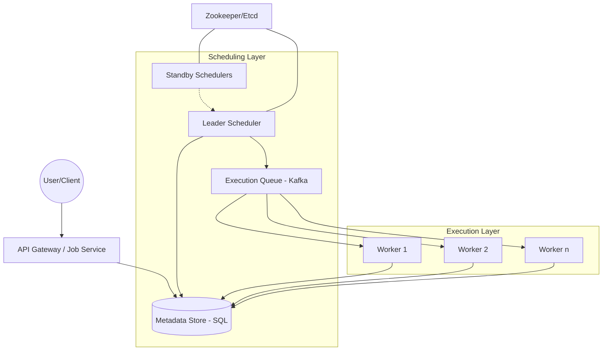

# Distributed Job Scheduler Design Guide

## 1. Requirements & System Constraints

### 1.1 Functional Requirements
*   **Job Submission:** Users can submit a job with a payload, a target execution time (one-time), or a recurring schedule (Cron expression).
*   **Job Execution:** The system must trigger the job at the specified time.
*   **Job Management:** Ability to cancel, update, or manually trigger a scheduled job.
*   **Status Tracking:** Users can query the current status of a job (Pending, Running, Completed, Failed).
*   **Retry Mechanism:** Configurable retry policies (exponential backoff) for failed jobs.
*   **Idempotency:** Ensure that a job is not executed multiple times for the same scheduled instance.

### 1.2 Non-Functional Requirements
*   **High Availability:** The scheduler must be operational 24/7; no single point of failure.
*   **Scalability:** Support millions of scheduled jobs and thousands of concurrent executions.
*   **Durability:** Jobs must not be lost if a node crashes.
*   **Precision:** Execution should happen as close to the scheduled time as possible (low latency drift).
*   **Reliability:** Guarantee "at-least-once" execution. "Exactly-once" is targeted via idempotency keys.

### 1.3 Scale Estimations (HLD)
*   **Job Volume:** 100 million jobs scheduled per day.
*   **Execution Rate:** Average 1,100 jobs per second; peaks of 10,000+ jobs per second.
*   **Storage:** Assuming 1KB per job metadata, 100M jobs $\approx$ 100GB/day. Retention for 30 days $\approx$ 3TB.
*   **Latency:** Job trigger delay should be $< 1$ second from the scheduled time.

---

## 2. High-Level Architecture

The system follows a decoupled architecture consisting of a submission layer, a scheduling layer, and an execution layer.

### 2.1 Core Components
1.  **API Gateway / Job Service:** Handles user requests, validates payloads, and persists job metadata.
2.  **Metadata Store (DB):** A durable store for job definitions and their current state.
3.  **Scheduler (Dispatcher):** Scans for jobs due for execution and pushes them into the execution queue.
4.  **Execution Queue:** A distributed message broker (e.g., Kafka or RabbitMQ) to decouple scheduling from execution.
5.  **Worker Pool:** A cluster of workers that consume jobs from the queue and execute the actual logic.
6.  **State Coordinator:** (e.g., Zookeeper or Etcd) Used for leader election among scheduler instances to prevent duplicate dispatching.

### 2.2 Architecture Diagram



### 2.3 Interaction Sequence
1.  **Submission:** User $\rightarrow$ API $\rightarrow$ Metadata Store (Status: `SCHEDULED`).
2.  **Polling:** Leader Scheduler polls Metadata Store for jobs where `execution_time <= NOW()` and `status == SCHEDULED`.
3.  **Dispatch:** Leader updates status to `QUEUED` and pushes the job ID/payload to Kafka.
4.  **Execution:** A Worker pulls the message $\rightarrow$ updates status to `RUNNING` $\rightarrow$ executes job $\rightarrow$ updates status to `COMPLETED` or `FAILED`.
5.  **Retry:** If `FAILED`, the worker calculates the next retry time and updates the `execution_time` and status back to `SCHEDULED`.

---

## 3. Detailed Database Schema Design

### 3.1 Technology Selection
*   **Metadata Store:** Relational Database (PostgreSQL/MySQL). We need ACID properties to ensure that job state transitions (e.g., `SCHEDULED` $\rightarrow$ `QUEUED`) are atomic to avoid duplicate executions.
*   **Execution Logs:** NoSQL (Cassandra/MongoDB). Execution history grows linearly and is write-heavy; it doesn't require complex joins.

### 3.2 Schema: `jobs` table (SQL)
| Field | Type | Constraint | Description |
| :--- | :--- | :--- | :--- |
| `job_id` | UUID | PK | Unique identifier for the job. |
| `user_id` | UUID | Index | Owner of the job. |
| `payload` | JSONB | - | Data required for job execution. |
| `cron_expr` | VARCHAR | - | Cron expression for recurring jobs (null if one-time). |
| `next_run_at` | Timestamp | Index | The next time the job should run. |
| `status` | Enum | Index | `SCHEDULED`, `QUEUED`, `RUNNING`, `COMPLETED`, `FAILED`, `CANCELLED`. |
| `retry_count` | Int | - | Number of attempts made. |
| `max_retries` | Int | - | Maximum allowed retries. |
| `timeout` | Int | - | Max execution time in seconds. |
| `version` | Int | - | Optimistic locking version. |

### 3.3 Schema: `job_executions` table (NoSQL/SQL)
| Field | Type | Constraint | Description |
| :--- | :--- | :--- | :--- |
| `execution_id` | UUID | PK | Unique execution instance ID. |
| `job_id` | UUID | Index | FK to `jobs` table. |
| `start_time` | Timestamp | - | Actual start time. |
| `end_time` | Timestamp | - | Actual end time. |
| `worker_id` | String | - | ID of the worker that processed the job. |
| `result` | Text/JSON | - | Output or error stack trace. |

### 3.4 Indexing Strategy
*   **Composite Index on `(status, next_run_at)`**: Critical for the Scheduler to quickly find jobs that are due for execution.
*   **Index on `user_id`**: To allow users to list and manage their own jobs.

---

## 4. Core API Design

### 4.1 Create Job
`POST /v1/jobs`
**Request:**
```json
{
  "userId": "user_123",
  "payload": { "url": "https://api.example.com/webhook", "data": { "id": 456 } },
  "schedule": {
    "type": "CRON", // or "ONCE"
    "value": "0 0 * * *" // Daily at midnight
  },
  "retryPolicy": {
    "maxRetries": 3,
    "initialInterval": "1m"
  }
}
```
**Response:** `201 Created` with `jobId`.

### 4.2 Get Job Status
`GET /v1/jobs/{jobId}`
**Response:**
```json
{
  "jobId": "job_abc",
  "status": "SCHEDULED",
  "nextRunAt": "2023-10-27T10:00:00Z",
  "lastRunResult": "Success"
}
```

### 4.3 Cancel Job
`DELETE /v1/jobs/{jobId}`
**Response:** `204 No Content`.

---

## 5. Scalability & Advanced Topics

### 5.1 Scaling the Polling Mechanism
Polling a single SQL table with `SELECT ... WHERE next_run_at <= NOW()` becomes a bottleneck at scale.
*   **Database Sharding:** Shard the `jobs` table by `job_id` or `user_id`.
*   **Time-Bucket Partitioning:** Divide the schedule into time slots (e.g., 1-minute buckets). Each scheduler instance is responsible for a specific bucket.
*   **Hierarchical Timing Wheels:** Use an in-memory timing wheel for jobs due in the next 60 seconds to avoid DB hits for every single second's tick.

### 5.2 Ensuring "Exactly-Once" Execution
True exactly-once is nearly impossible in distributed systems, but we achieve "effectively once":
1.  **Optimistic Locking:** Use the `version` field in the `jobs` table.
    `UPDATE jobs SET status = 'QUEUED', version = version + 1 WHERE job_id = X AND version = Y AND status = 'SCHEDULED'`
2.  **Idempotency Keys:** The Worker generates or uses the `execution_id` as an idempotency key when calling external downstream services.

### 5.3 Handling Worker Failures
*   **Visibility Timeout:** When a worker picks up a job, it marks it as `RUNNING` and sets a heartbeat. If the heartbeat stops or the `timeout` is exceeded, the Scheduler resets the job status to `SCHEDULED` for another worker to pick up.
*   **Dead Letter Queue (DLQ):** Jobs that fail after `max_retries` are moved to a DLQ for manual inspection.

### 5.4 High Availability (Leader Election)
To prevent multiple schedulers from dispatching the same job:
*   Use **Zookeeper/Etcd** to elect one Leader Scheduler.
*   The Leader maintains a lease. If the Leader dies, a standby node is promoted.
*   If using a sharded approach, use **Consistent Hashing** to assign job ranges to different scheduler instances.

---

## 6. Trade-off Analysis

| Trade-off | Choice | Reasoning |
| :--- | :--- | :--- |
| **Consistency vs Availability** | **Consistency (CP)** | In a scheduler, executing a job twice is often worse than a slight delay in execution. We prioritize strong consistency for state transitions. |
| **Polling vs Push** | **Hybrid** | We poll the DB for "due" jobs (Pull) but push those jobs into a Message Queue (Push) to maximize worker throughput. |
| **SQL vs NoSQL** | **Polyglot Persistence** | SQL for job state (requires transactions/indexes); NoSQL for logs (requires high write volume/scalability). |
| **Precision vs Throughput** | **Throughput** | By batching jobs into the queue, we may introduce a few milliseconds of jitter, but we gain the ability to handle massive bursts of concurrent jobs. |