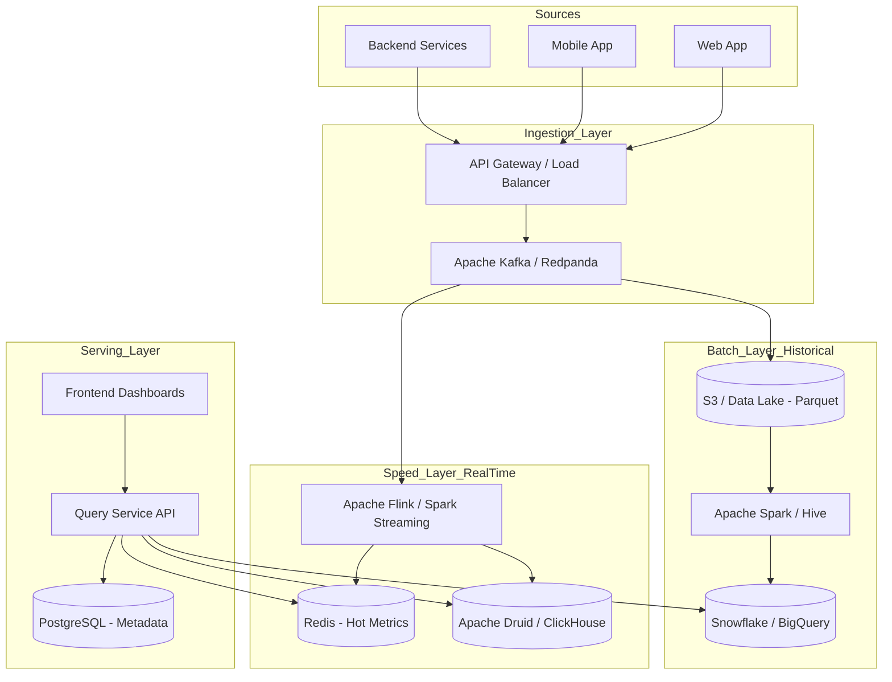

# System Design Document: Enterprise Analytics Platform (Batch + Real-time)

## 1. Requirements & System Constraints

### 1.1 Functional Requirements
*   **Event Ingestion:** Ability to ingest massive volumes of events (clickstreams, logs, transactions) from various sources (web, mobile, backend services).
*   **Real-time Analytics:** Provide low-latency insights (seconds) for operational monitoring and live dashboards.
*   **Batch Analytics:** Provide high-accuracy, complex historical reports and trend analysis over months or years.
*   **Custom Query Interface:** Allow users to define custom dimensions and metrics for aggregation.
*   **Alerting System:** Trigger notifications when specific metrics cross predefined thresholds in real-time.
*   **Data Retention:** Support tiered storage (hot, warm, cold) to manage costs over time.

### 1.2 Non-Functional Requirements
*   **Scalability:** Must handle peaks of $10^5$ to $10^6$ events per second.
*   **Availability:** 99.99% availability for ingestion; 99.9% for query services.
*   **Fault Tolerance:** No data loss during ingestion or processing (at-least-once or exactly-once semantics).
*   **Latency:** 
    *   Ingestion to Real-time Dashboard: $< 2$ seconds.
    *   Query Response Time: $< 500\text{ms}$ for pre-aggregated data, $< 10\text{s}$ for ad-hoc historical queries.
*   **Consistency:** Eventual consistency for analytics; strong consistency for configuration/metadata.

### 1.3 Scale Estimations (HLD)
*   **Daily Volume:** $10^6 \text{ events/sec} \times 86,400 \text{ sec} \approx 86.4 \text{ Billion events/day}$.
*   **Data Size:** Avg event size $500\text{ bytes} \implies \approx 43 \text{ TB/day}$ raw data.
*   **Storage (Annual):** $\sim 15 \text{ PB/year}$ (before compression/aggregation).
*   **Query Volume:** $\sim 1,000$ concurrent users running various dashboard queries.

---

## 2. High-Level Architecture

The system adopts a **Lambda Architecture** to balance the trade-off between latency (Speed Layer) and accuracy/completeness (Batch Layer).

### 2.1 Architecture Diagram



### 2.2 Component Interactions
1.  **Ingestion:** Events are pushed to the API Gateway, which validates the schema and produces them into **Kafka** topics partitioned by `tenant_id` or `event_type`.
2.  **Speed Layer:** **Apache Flink** consumes from Kafka, performs windowed aggregations (e.g., 1-minute sliding windows), and writes results to **Druid** (for OLAP) and **Redis** (for instant counters).
3.  **Batch Layer:** Raw events are archived from Kafka to **S3** in Parquet format. **Spark** jobs run periodically (e.g., every 4 hours) to perform heavy cleanup, deduplication, and deep aggregations, loading results into a data warehouse like **Snowflake**.
4.  **Serving Layer:** The **Query Service** acts as an orchestrator. It decides whether to fetch data from Redis (real-time), Druid (recent history), or Snowflake (long-term trends) based on the time range requested.

---

## 3. Detailed Database Schema Design

### 3.1 Metadata Store (PostgreSQL)
Used for managing users, dashboards, and alert configurations.
*   **`users`**: `user_id (PK), email, organization_id, created_at`
*   **`metrics_config`**: `metric_id (PK), name, definition_sql, aggregation_type (SUM, AVG, COUNT), alert_threshold`
*   **`dashboards`**: `dashboard_id (PK), user_id (FK), layout_json, created_at`

### 3.2 Real-time OLAP Store (Apache Druid / ClickHouse)
Designed for high-dimensional slicing and dicing.
*   **Table: `events_realtime`**
    *   `timestamp` (Primary Dimension/Partition Key)
    *   `event_type` (String, Indexed)
    *   `user_id` (String, Indexed)
    *   `dimension_json` (JSONB/Map - for flexible attributes)
    *   `metric_value` (Double)
    *   **Indexing:** Partitioned by `Day`, Clustered by `event_type` and `user_id`.

### 3.3 Historical Data Lake (S3 + Parquet)
*   **Structure:** `s3://analytics-bucket/year=2023/month=10/day=27/event_type=click/part-001.parquet`
*   **Format:** Columnar (Parquet) to minimize I/O for aggregate queries.

### 3.4 Hot Cache (Redis)
*   **Key Pattern:** `metric:{metric_id}:{window_timestamp}` $\rightarrow$ `value`
*   **TTL:** 24 hours.

---

## 4. Core API Design

### 4.1 Event Ingestion API
`POST /v1/events`
*   **Payload:**
    ```json
    {
      "event_id": "uuid-123",
      "event_type": "page_view",
      "user_id": "user_888",
      "timestamp": "2023-10-27T10:00:00Z",
      "properties": {
        "page_url": "/home",
        "device": "mobile",
        "region": "US-East"
      }
    }
    ```
*   **Response:** `202 Accepted` (Async processing).

### 4.2 Analytics Query API
`POST /v1/query`
*   **Payload:**
    ```json
    {
      "metric_id": "daily_active_users",
      "start_time": "2023-10-01T00:00:00Z",
      "end_time": "2023-10-27T23:59:59Z",
      "granularity": "hour",
      "dimensions": ["region", "device"],
      "filters": [{ "field": "event_type", "op": "eq", "value": "login" }]
    }
    ```
*   **Response:**
    ```json
    {
      "data": [
        { "timestamp": "2023-10-27T10:00:00Z", "region": "US-East", "device": "mobile", "value": 1500 },
        { "timestamp": "2023-10-27T10:00:00Z", "region": "US-East", "device": "desktop", "value": 800 }
      ]
    }
    ```

---

## 5. Scalability & Advanced Topics

### 5.1 Handling Data Skew
*   **Problem:** A few "celebrity" users or viral events can overload specific Kafka partitions or Flink operators.
*   **Solution:** Use **Salting**. Append a random integer to the partition key for hot keys, aggregate locally, and then perform a global aggregation in a second stage.

### 5.2 Storage Tiering
*   **Hot (0-7 days):** Druid/ClickHouse on SSDs for sub-second queries.
*   **Warm (7-90 days):** Druid deep storage (S3) with cached segments.
*   **Cold (90+ days):** Snowflake/Iceberg on S3; accessed via asynchronous batch queries.

### 5.3 Fault Tolerance & Exactly-Once
*   **Kafka:** Use `acks=all` and idempotent producers.
*   **Flink:** Enable **Checkpointing** and use the Two-Phase Commit (2PC) sink to ensure that data written to Druid/Redis is not duplicated during a task failure.
*   **Batch:** Spark jobs are idempotent; they overwrite specific partitions in the Data Warehouse upon retry.

### 5.4 Query Optimization
*   **Materialized Views:** Pre-calculate common aggregations (e.g., hourly sums) in Druid.
*   **Projection:** Only read the specific columns required from Parquet files to reduce S3 egress costs.

---

## 6. Trade-off Analysis

| Trade-off | Choice | Reasoning |
| :--- | :--- | :--- |
| **Lambda vs Kappa** | **Lambda** | While Kappa is simpler (single stream), Lambda is chosen here to allow the Batch layer to handle "Late Arriving Data" and massive historical reprocessing without stressing the real-time stream. |
| **Consistency vs Availability** | **Availability** | In analytics, missing a few events in a dashboard for 2 seconds (Eventual Consistency) is preferable to rejecting ingestion requests (Strong Consistency) during a network partition. |
| **Row vs Columnar Store** | **Columnar** | Since analytics involves aggregating over millions of rows for a few columns (e.g., `SUM(revenue)`), columnar storage (Parquet/ClickHouse) provides orders of magnitude better performance than row-based (Postgres). |
| **Latency vs Storage Cost** | **Tiered Storage** | Keeping all data in Druid/RAM is too expensive. Moving old data to S3/Parquet increases query latency for old data but reduces costs by $\approx 90\%$. |