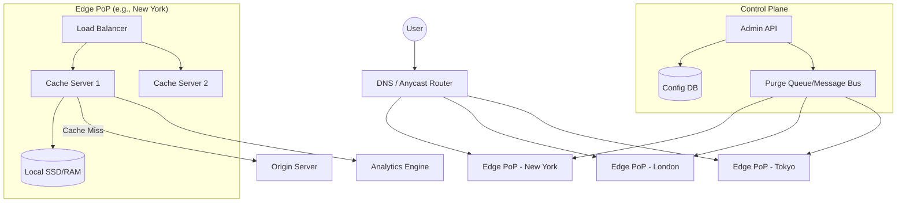

# System Design: Content Delivery Network (CDN)

## 1. Requirements & System Constraints

### 1.1 Functional Requirements
*   **Content Delivery:** Serve static assets (images, JS, CSS, videos) to users from the nearest geographical location to minimize latency.
*   **Content Acquisition:** 
    *   **Pull Model:** Automatically fetch content from the origin server upon the first request (cache miss).
    *   **Push Model:** Allow origin servers to proactively push content to edge nodes.
*   **Cache Invalidation:** Provide a mechanism to purge or update stale content across the global network.
*   **Request Routing:** Route users to the optimal Edge PoP (Point of Presence) based on latency, geography, or server health.
*   **Analytics:** Track requests, cache hit/miss ratios, and bandwidth usage.

### 1.2 Non-Functional Requirements
*   **Ultra-Low Latency:** The primary goal is to reduce Time to First Byte (TTFB).
*   **High Availability:** The system must be resilient to PoP failures; traffic should failover to the next closest node.
*   **Scalability:** Support millions of requests per second (RPS) and petabytes of cached data.
*   **Eventual Consistency:** Content updates do not need to be instantaneous globally, but purge requests should propagate within seconds/minutes.

### 1.3 Scale Estimations
*   **Traffic:** Assume 10 million requests per second globally.
*   **Content Size:** Average asset size 500KB; total library size in petabytes.
*   **PoPs:** 50–100 global locations.
*   **Read/Write Ratio:** Extremely read-heavy (10,000:1).

---

## 2. High-Level Architecture

### 2.1 Core Components
1.  **DNS Resolver / Request Router:** Uses Anycast DNS or Geo-DNS to map the user's IP to the closest Edge PoP.
2.  **Edge Server (PoP):** A cluster of caching servers that store content in memory (L1) and SSDs (L2).
3.  **Origin Server:** The customer's primary server containing the authoritative version of the content.
4.  **Control Plane:** The management layer used for configuration, monitoring, and processing purge requests.
5.  **Purge Queue:** A distributed message bus used to propagate invalidation signals to all Edge servers.

### 2.2 Architecture Diagram



### 2.3 Request Flow
1.  **DNS Resolution:** The user requests `static.example.com/image.jpg`. The DNS router identifies the user's location via IP and returns the IP of the nearest PoP.
2.  **Edge Request:** The user connects to the PoP's Load Balancer, which forwards the request to a Cache Server.
3.  **Cache Check:**
    *   **Hit:** Content is returned immediately from RAM or SSD.
    *   **Miss:** The Edge server requests the content from the Origin Server, stores a copy locally (based on TTL), and serves it to the user.
4.  **Purge Flow:** An administrator triggers a purge via the Control Plane $\rightarrow$ Message is sent to the Purge Queue $\rightarrow$ All PoPs receive the signal and evict the specific object from their local cache.

---

## 3. Detailed Database Schema Design

The CDN requires two distinct types of storage: a **Configuration Store** (Consistency) and an **Analytics Store** (Throughput).

### 3.1 Configuration Store (SQL - PostgreSQL)
Used for managing customer accounts, domain mappings, and TTL settings.

**Table: `customers`**
| Field | Type | Key | Description |
| :--- | :--- | :--- | :--- |
| `customer_id` | UUID | PK | Unique identifier for the client |
| `account_name` | String | | Company name |
| `api_key` | String | Index | For authentication |

**Table: `cdn_configs`**
| Field | Type | Key | Description |
| :--- | :--- | :--- | :--- |
| `config_id` | UUID | PK | Unique config ID |
| `customer_id` | UUID | FK | Link to customer |
| `domain` | String | Index | The domain being served (e.g., `cdn.example.com`) |
| `origin_url` | String | | Where to fetch content from |
| `default_ttl` | Integer | | Default cache duration in seconds |

### 3.2 Analytics Store (NoSQL - ClickHouse or Cassandra)
Because the volume of logs is massive, a column-oriented database is used for time-series analysis.

**Table: `request_logs`**
| Field | Type | Description |
| :--- | :--- | :--- |
| `timestamp` | DateTime | Event time (Primary Sort Key) |
| `pop_id` | String | Which PoP served the request |
| `url` | String | The requested resource |
| `status` | Integer | HTTP Status (200, 404, etc.) |
| `cache_status` | Enum | HIT, MISS, EXPIRED |
| `latency` | Integer | Time taken to serve in ms |
| `client_ip` | String | User's IP for geo-analysis |

### 3.3 Reasoning
*   **SQL for Config:** Configuration changes are infrequent but must be consistent. ACID properties ensure that when a domain is added, it is correctly mapped.
*   **NoSQL for Analytics:** We are writing millions of rows per second. ClickHouse allows for high-compression and lightning-fast aggregations (e.g., "What was the hit rate in London last hour?").

---

## 4. Core API Design

### 4.1 Content Management API
Used by customers to manage their CDN settings.

**`POST /v1/configs`**
*   **Description:** Set up a new origin mapping.
*   **Payload:**
    ```json
    {
      "domain": "static.example.com",
      "origin_url": "https://origin.example.com/assets",
      "default_ttl": 3600
    }
    ```
*   **Response:** `201 Created`

**`DELETE /v1/purge`**
*   **Description:** Invalidate specific assets or wildcards.
*   **Payload:**
    ```json
    {
      "paths": ["/images/logo.png", "/css/*"],
      "purge_type": "hard" 
    }
    ```
*   **Response:** `202 Accepted` (Processing asynchronously)

### 4.2 Analytics API
**`GET /v1/stats?domain=static.example.com&start=...&end=...`**
*   **Response:**
    ```json
    {
      "cache_hit_ratio": 0.94,
      "total_requests": 15000000,
      "bandwidth_gb": 4500,
      "top_pops": [{"pop": "NYC", "hits": 5000000}, {"pop": "LON", "hits": 4000000}]
    }
    ```

---

## 5. Scalability & Advanced Topics

### 5.1 Caching Strategies
*   **Multi-tier Caching:** 
    *   **L1 (RAM):** Hot assets stored in memory (Redis/Memcached) for microsecond access.
    *   **L2 (SSD):** Larger set of assets stored on NVMe drives.
*   **Eviction Policy:** **LRU (Least Recently Used)** is standard. For very high-traffic sites, **LFU (Least Frequently Used)** prevents "one-hit wonders" from polluting the cache.
*   **Cache Warming:** For anticipated traffic spikes (e.g., a movie release), the Control Plane can "push" content to the edges before users request it.

### 5.2 Request Routing (The "Magic")
*   **Anycast DNS:** Multiple PoPs advertise the same IP address via BGP. The internet routing infrastructure naturally sends the packet to the "closest" PoP in terms of network hops.
*   **Geo-DNS:** The DNS server looks up the user's IP in a Geo-IP database and returns the IP of the PoP physically closest to the user.

### 5.3 Handling the "Thundering Herd" Problem
If a highly popular object expires, thousands of concurrent requests might hit the Origin Server simultaneously.
*   **Request Collapsing:** The Edge server ensures only *one* request for a specific object is sent to the Origin; others wait for the response and share the result.

### 5.4 Fault Tolerance
*   **Health Checks:** The Control Plane constantly pings PoPs. If a PoP is unresponsive, the DNS router removes that PoP's IP from the rotation.
*   **Origin Shield:** A mid-tier caching layer between the Edge PoPs and the Origin. This reduces the load on the Origin server by aggregating requests from multiple PoPs.

---

## 6. Trade-off Analysis

| Trade-off | Decision | Reasoning |
| :--- | :--- | :--- |
| **Consistency vs. Latency** | **Latency (AP)** | In a CDN, serving a slightly stale image is better than making a user wait 500ms for a round-trip to the origin. Eventual consistency is accepted. |
| **Push vs. Pull** | **Hybrid** | Pull is effortless for customers; Push is necessary for massive files (Videos/Game Patches) to avoid origin overload during the first wave of requests. |
| **Storage vs. Cost** | **Aggressive Eviction** | Storing every file at every PoP is impossible. We trade off a slightly lower hit rate (via LRU eviction) to keep hardware costs manageable. |
| **Anycast vs. Unicast** | **Anycast** | Anycast provides seamless failover and lower latency without requiring complex client-side logic or frequent DNS TTL refreshes. |