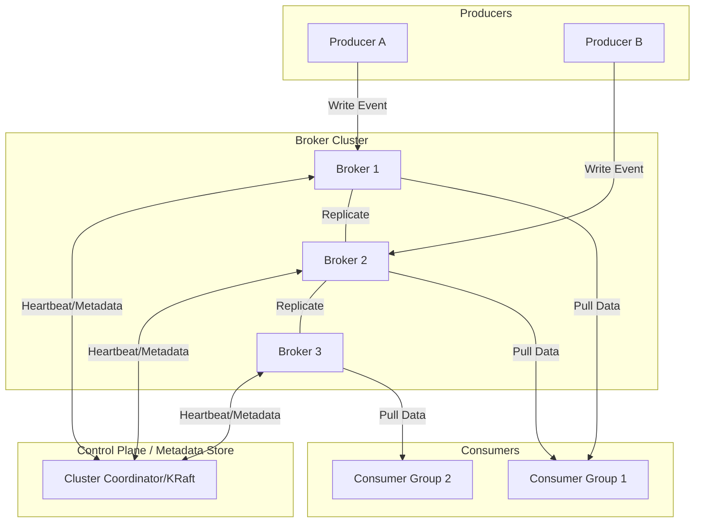

# System Design: Distributed Event Streaming Platform (Kafka-style)

## 1. Requirements & System Constraints

### 1.1 Functional Requirements
*   **Produce Events:** Producers must be able to send streams of events (messages) to specific "Topics."
*   **Consume Events:** Consumers must be able to read events from topics.
*   **Topics & Partitioning:** Topics must be divisible into partitions to allow for horizontal scaling and parallelism.
*   **Consumer Groups:** Multiple consumers should be able to join a group to share the load of a topic (one partition per consumer in a group).
*   **Persistence:** Events must be persisted to disk to allow for "replayability" (reading old data).
*   **Offset Management:** The system must track the position (offset) of each consumer group within a partition.
*   **Retention:** Support for time-based (e.g., 7 days) or size-based (e.g., 100GB) data retention.

### 1.2 Non-Functional Requirements
*   **High Throughput:** Ability to handle millions of events per second.
*   **Low Latency:** End-to-end latency (producer $\rightarrow$ broker $\rightarrow$ consumer) should be in the millisecond range.
*   **Durability:** Once an event is acknowledged as written, it must not be lost (replication).
*   **Scalability:** Ability to add brokers to the cluster without downtime.
*   **Fault Tolerance:** Automatic failover if a broker or partition leader crashes.

### 1.3 Scale Estimations (HLD)
*   **Throughput:** 10M events/sec.
*   **Average Event Size:** 1 KB.
*   **Ingress Bandwidth:** $10 \text{M} \times 1\text{KB} \approx 10\text{GB/s}$.
*   **Storage (7-day retention):** $10\text{GB/s} \times 86,400\text{s} \times 7\text{days} \approx 6\text{PB}$.
*   **Fan-out:** Average of 3 consumers per event $\approx 30\text{GB/s}$ egress.

---

## 2. High-Level Architecture

### 2.1 Core Components
1.  **Producer:** Client application that publishes data. It handles partitioning logic (e.g., hashing a key) and batching.
2.  **Broker:** The server responsible for receiving, storing, and serving events. It manages a set of partition replicas.
3.  **Consumer:** Client application that polls the broker for new data.
4.  **Cluster Coordinator (Metadata Store):** A distributed consensus service (e.g., KRaft or Zookeeper) that manages cluster metadata, broker registration, and leader election for partitions.
5.  **Log Segment:** The physical storage unit on the broker's disk where events are appended.

### 2.2 Architecture Diagram



### 2.3 Component Interactions
1.  **Metadata Discovery:** Producers and Consumers query the Cluster Coordinator to find which broker is the **Leader** for a specific partition.
2.  **Writing (Produce):** The Producer sends a batch of messages to the Leader Broker. The Leader writes to its local log and waits for a subset of followers (ISR - In-Sync Replicas) to acknowledge before confirming success to the Producer.
3.  **Reading (Consume):** Consumers request data from the Leader Broker starting from a specific **Offset**.
4.  **Rebalancing:** When a consumer joins or leaves a group, the Coordinator re-assigns partitions among the remaining members.

---

## 3. Detailed Database & Storage Design

The platform does not use a traditional relational database for event storage; instead, it uses a **Distributed Commit Log**.

### 3.1 Storage Layer (The Log)
Events are stored in an append-only file format.
*   **Topic-Partition Directory:** Each partition is a directory on the broker's disk.
*   **Segments:** The log is split into segments (e.g., 1GB each). Once a segment is full, it is closed and a new one is opened. This simplifies deletion/retention.
*   **Index Files:** To avoid scanning the whole log, a sparse index is maintained mapping `Offset $\rightarrow$ Physical Position` in the segment file.

### 3.2 Metadata Schema (Stored in Coordinator/KV Store)
While events are in logs, the cluster state is kept in a highly available KV store.

| Entity | Fields | Description |
| :--- | :--- | :--- |
| **Topic** | `topic_id (PK), name, partitions_count, replication_factor` | General topic configuration. |
| **Partition** | `partition_id (PK), topic_id (FK), leader_broker_id, replicas[]` | Mapping of partition to brokers. |
| **Broker** | `broker_id (PK), host, port, status` | Registry of active nodes. |
| **ConsumerOffset**| `group_id, topic_id, partition_id, offset (Value)` | Tracks the last committed read position. |

**Reasoning:** A Distributed KV store (like Raft-based logs) is chosen over SQL because it provides the necessary linearizability for leader election and cluster membership changes with extremely low latency.

---

## 4. Core API Design

The system primarily uses a binary protocol over TCP for performance, but logically, the APIs are as follows:

### 4.1 Producer API
`POST /produce`
*   **Request:**
    ```json
    {
      "topic": "user_signups",
      "partition": 2, 
      "messages": [
        {"key": "user_123", "value": "...", "timestamp": 1625000000},
        {"key": "user_456", "value": "...", "timestamp": 1625000001}
      ],
      "acks": "all" 
    }
    ```
*   **Response:** `{"status": "success", "offsets": [101, 102]}`

### 4.2 Consumer API
`GET /fetch`
*   **Request:**
    ```json
    {
      "topic": "user_signups",
      "partition": 2,
      "offset": 101,
      "max_bytes": 1048576
    }
    ```
*   **Response:**
    ```json
    {
      "messages": [...],
      "next_offset": 110
    }
    ```

### 4.3 Offset Commit API
`POST /commit`
*   **Request:**
    ```json
    {
      "group_id": "analytics_group",
      "topic": "user_signups",
      "partition": 2,
      "offset": 110
    }
    ```

---

## 5. Scalability & Advanced Topics

### 5.1 High Throughput Optimizations
*   **Sequential I/O:** By using an append-only log, the system avoids random disk seeks, leveraging the maximum speed of HDDs/SSDs.
*   **Zero-Copy (sendfile):** The broker uses the `sendfile` system call to transfer data directly from the OS page cache to the network socket, bypassing the application's user-space buffer.
*   **Batching:** Producers aggregate messages into batches to reduce the number of network requests and disk IOPS.

### 5.2 Partitioning & Sharding
*   **Scaling:** If a topic's throughput exceeds a single broker's capacity, it is split into $N$ partitions distributed across $N$ brokers.
*   **Routing:**
    *   `Key-based`: `partition = hash(key) % num_partitions` (ensures ordering for the same key).
    *   `Round-robin`: Distributed evenly (better load balance).

### 5.3 Fault Tolerance & Replication
*   **ISR (In-Sync Replicas):** The leader maintains a list of followers that are up-to-date.
*   **Ack Levels:**
    *   `acks=0`: No confirmation (highest speed, lowest reliability).
    *   `acks=1`: Leader acknowledges (medium reliability).
    *   `acks=all`: All ISRs acknowledge (highest reliability, highest latency).
*   **Leader Election:** If the leader fails, the Cluster Coordinator promotes the next member of the ISR to be the leader.

### 5.4 Consumer Group Rebalancing
*   When a new consumer joins a group, the "Group Coordinator" (one of the brokers) triggers a rebalance.
*   Partitions are revoked from existing members and redistributed to ensure every partition is read by exactly one consumer in the group.

---

## 6. Trade-off Analysis

### 6.1 CAP Theorem Priority
The system is generally **CP (Consistent and Partition Tolerant)** when `acks=all` is used, as it prioritizes data integrity over availability. However, it can be tuned toward **AP (Available and Partition Tolerant)** by setting `acks=1` or `acks=0`, allowing the system to accept writes even if some replicas are down.

### 6.2 Latency vs. Throughput
*   **Batching:** Increasing batch size increases throughput (fewer syscalls, better compression) but increases latency (messages wait for the batch to fill).
*   **Compression:** Using Gzip/Snappy/LZ4 reduces network and storage usage but increases CPU overhead on both producer and consumer.

### 6.3 Storage vs. Memory
*   The system relies heavily on the **OS Page Cache**. Recent reads/writes happen in memory; older data is read from disk. This allows the system to perform nearly at memory speed for real-time consumers while still providing the durability of disk for historical replay.

### 6.4 Pull vs. Push Model
*   **Pull (Chosen):** Consumers pull data at their own pace.
    *   *Pros:* Prevents consumers from being overwhelmed; allows batching; simplifies offset management.
    *   *Cons:* Slight increase in latency due to polling intervals.