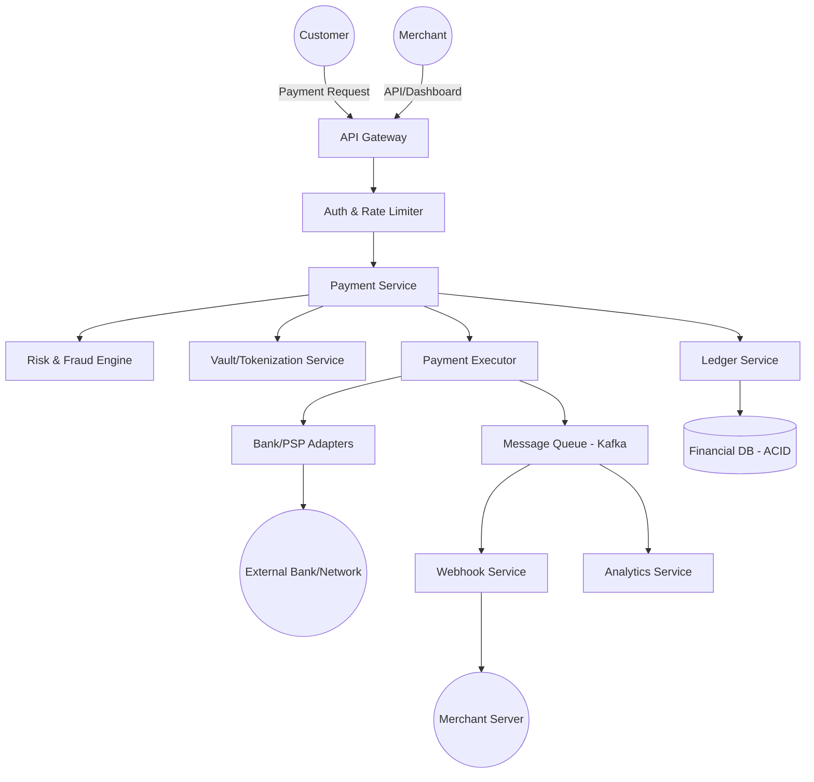

# System Design Document: Payment Gateway (Stripe, Razorpay)

## 1. Requirements & System Constraints

A Payment Gateway is a critical piece of financial infrastructure that acts as an intermediary between merchants, customers, and financial institutions (Acquiring Banks, Card Networks, and Issuing Banks).

### 1.1 Functional Requirements
*   **Payment Processing:** Support multiple payment methods (Credit/Debit Cards, UPI, Digital Wallets, NetBanking).
*   **Merchant Onboarding:** Allow merchants to register, KYC, and configure their accounts.
*   **Transaction Management:** Handle the full lifecycle of a payment (Initiated $\rightarrow$ Pending $\rightarrow$ Success/Failed $\rightarrow$ Refunded).
*   **Payouts:** Transfer funds from the gateway's escrow/holding account to the merchant's bank account.
*   **Webhooks:** Asynchronously notify merchants of payment status changes.
*   **Refunds:** Support full and partial refunds of transactions.
*   **Reporting/Dashboard:** Provide merchants with transaction history and analytics.

### 1.2 Non-Functional Requirements
*   **Strong Consistency (ACID):** Financial transactions cannot be "eventually consistent." Double-charging or missing records are unacceptable.
*   **High Availability:** The system must be available 24/7. Downtime results in immediate revenue loss for merchants.
*   **Idempotency:** Every request must be processed exactly once, regardless of network retries.
*   **Low Latency:** The checkout experience must be seamless to prevent cart abandonment.
*   **Security & Compliance:** PCI-DSS compliance is mandatory. Sensitive data (CVV, Full PAN) must never be stored in plain text or in the primary database.
*   **Auditability:** Every change in transaction state must be logged in an immutable ledger.

### 1.3 Scale Estimations (HLD)
*   **Traffic:** 10,000 Transactions Per Second (TPS) average, peaking at 50,000 TPS during sales.
*   **Storage:** Assuming 1 billion transactions/year, with each record $\sim 1$ KB, we need $\sim 1$ TB/year for the `payments` table.
*   **Read/Write Ratio:** Write-heavy during payment initiation; Read-heavy during reporting.

---

## 2. High-Level Architecture

### 2.1 Architecture Diagram
The system follows a microservices architecture to decouple the high-risk payment execution from the reporting and onboarding flows.



### 2.2 Core Components
1.  **API Gateway:** Handles authentication, SSL termination, and request routing.
2.  **Payment Service:** The orchestrator. It manages the payment state machine and coordinates between risk, tokenization, and execution.
3.  **Vault/Tokenization Service:** A highly secure, isolated service that stores sensitive card data and returns a non-sensitive `token_id`. This minimizes the PCI-DSS scope for other services.
4.  **Risk & Fraud Engine:** Evaluates transactions in real-time using rules or ML models to flag suspicious activities.
5.  **Payment Executor:** The "adapter" layer. Since every bank/PSP has a different API, this service abstracts those differences into a common internal interface.
6.  **Ledger Service:** The source of truth. It implements double-entry bookkeeping to ensure every cent is accounted for.
7.  **Webhook Service:** Reliably delivers event notifications to merchant endpoints using an exponential backoff retry strategy.

---

## 3. Detailed Database Schema Design

We use a **Relational Database (PostgreSQL)** for the core payment and ledger flows due to the requirement for ACID transactions. **NoSQL (Cassandra/ElasticSearch)** is used for logs and analytics.

### 3.1 Database Tables

#### `merchants`
| Field | Type | Constraints | Description |
| :--- | :--- | :--- | :--- |
| `merchant_id` | UUID | PK | Unique ID for the merchant |
| `api_key` | String | Unique, Indexed | For API authentication |
| `webhook_url` | String | - | Endpoint for notifications |
| `status` | Enum | - | ACTIVE, SUSPENDED, PENDING_KYC |
| `created_at` | Timestamp | - | - |

#### `payments`
| Field | Type | Constraints | Description |
| :--- | :--- | :--- | :--- |
| `payment_id` | UUID | PK | Unique transaction ID |
| `merchant_id` | UUID | FK, Indexed | Link to merchant |
| `amount` | Decimal(19,4)| - | Precision for currency |
| `currency` | String(3) | - | ISO currency code (e.g., USD) |
| `status` | Enum | Indexed | PENDING, SUCCESS, FAILED, REFUNDED |
| `idempotency_key`| String | Unique, Indexed | Prevents double charging |
| `payment_method_id`| UUID | FK | Link to tokenized method |
| `created_at` | Timestamp | Indexed | - |
| `updated_at` | Timestamp | - | - |

#### `payment_methods` (The Vault)
*Stored in a separate, encrypted database/vault.*
| Field | Type | Constraints | Description |
| :--- | :--- | :--- | :--- |
| `method_id` | UUID | PK | Token ID |
| `merchant_id` | UUID | FK | Link to merchant |
| `masked_card` | String | - | e.g., **** **** **** 1234 |
| `encrypted_data` | Blob | - | Encrypted PAN, Expiry, etc. |

#### `ledger` (Double-Entry)
| Field | Type | Constraints | Description |
| :--- | :--- | :--- | :--- |
| `ledger_id` | BigInt | PK | - |
| `payment_id` | UUID | FK | Link to payment |
| `account_id` | String | Indexed | e.g., "GATEWAY_ESCROW", "MERCHANT_A" |
| `debit` | Decimal(19,4)| - | Amount deducted |
| `credit` | Decimal(19,4)| - | Amount added |
| `entry_type` | Enum | - | PAYMENT, FEE, PAYOUT |
| `created_at` | Timestamp | - | - |

### 3.2 Reasoning
*   **SQL vs NoSQL:** SQL is non-negotiable for the `ledger` and `payments` tables to avoid data anomalies.
*   **Indexing:** Indices on `merchant_id` and `payment_id` are critical for dashboard queries. An index on `idempotency_key` is required for fast lookups during request deduplication.
*   **Decimal Type:** Never use `float` or `double` for money to avoid rounding errors. `Decimal(19, 4)` is the industry standard.

---

## 4. Core API Design

### 4.1 Create Payment
`POST /v1/payments`
**Headers:** `Idempotency-Key: <uuid>`, `Authorization: Bearer <token>`

**Request Payload:**
```json
{
  "amount": 100.00,
  "currency": "USD",
  "payment_method_id": "pm_12345",
  "description": "Order #9876",
  "callback_url": "https://merchant.com/callback"
}
```
**Response (201 Created):**
```json
{
  "payment_id": "pay_abc123",
  "status": "PENDING",
  "created_at": "2023-10-27T10:00:00Z"
}
```

### 4.2 Get Payment Status
`GET /v1/payments/{payment_id}`

**Response (200 OK):**
```json
{
  "payment_id": "pay_abc123",
  "status": "SUCCESS",
  "amount": 100.00,
  "currency": "USD",
  "updated_at": "2023-10-27T10:00:05Z"
}
```

### 4.3 Process Refund
`POST /v1/refunds`

**Request Payload:**
```json
{
  "payment_id": "pay_abc123",
  "amount": 50.00,
  "reason": "Customer requested partial refund"
}
```

---

## 5. Scalability & Advanced Topics

### 5.1 Idempotency Mechanism
To prevent double-charging, the system uses an **Idempotency Key** (provided by the client):
1.  When a request arrives, the system checks the `payments` table for the `idempotency_key`.
2.  If it exists, it returns the cached response of the original request.
3.  If not, it creates a record with status `PENDING` and proceeds. This prevents race conditions if the client sends two identical requests simultaneously.

### 5.2 Distributed Transactions & The Saga Pattern
Since the process involves multiple services (Payment $\rightarrow$ Risk $\rightarrow$ Bank $\rightarrow$ Ledger), a distributed transaction is needed. We use the **Saga Pattern (Orchestration-based)**:
*   **Step 1:** `PaymentService` reserves the transaction.
*   **Step 2:** `RiskService` approves. (If failed $\rightarrow$ Mark Payment as FAILED).
*   **Step 3:** `Executor` calls Bank API. (If failed $\rightarrow$ Mark Payment as FAILED).
*   **Step 4:** `LedgerService` updates balances. (If failed $\rightarrow$ Trigger Compensating Transaction to void the bank charge).

### 5.3 Fault Tolerance & Availability
*   **Circuit Breakers:** If a specific bank adapter (e.g., Chase API) is timing out, the circuit breaker trips, and the system either fails fast or routes traffic to a backup PSP.
*   **Exponential Backoff:** For Webhooks, if the merchant server is down, the system retries at $2^n$ intervals (e.g., 1m, 2m, 4m... up to 24 hours).
*   **Dead Letter Queues (DLQ):** Any webhook or ledger update that fails after maximum retries is pushed to a DLQ for manual intervention.

### 5.4 Security & Compliance
*   **PCI-DSS:** The `Tokenization Service` is the only component that touches Raw PAN. It resides in a separate VPC with restricted access.
*   **Encryption:** Use AES-256 for data at rest and TLS 1.3 for data in transit.
*   **HMAC Signatures:** Webhooks are signed with a secret key so the merchant can verify the request came from the gateway and wasn't tampered with.

---

## 6. Trade-off Analysis

| Trade-off | Choice | Reasoning |
| :--- | :--- | :--- |
| **Consistency vs Availability** | **CP (Consistency)** | In payments, consistency is paramount. It is better to return a "503 Service Unavailable" than to accidentally charge a customer twice or lose a record of a successful payment. |
| **Latency vs Storage** | **Storage** | We store every single state change in the `ledger` and `payment_audit` tables. This increases storage costs but provides an immutable audit trail required by financial regulators. |
| **Synchronous vs Asynchronous** | **Hybrid** | The initial payment request is synchronous to provide immediate feedback to the user. However, ledger updates, analytics, and webhooks are asynchronous (via Kafka) to keep the critical path latency low. |
| **Database Selection** | **Postgres** | While NoSQL scales better, the complexity of implementing ACID-compliant double-entry bookkeeping in NoSQL outweighs the scaling benefits. Sharding Postgres by `merchant_id` is a viable path for scaling. |