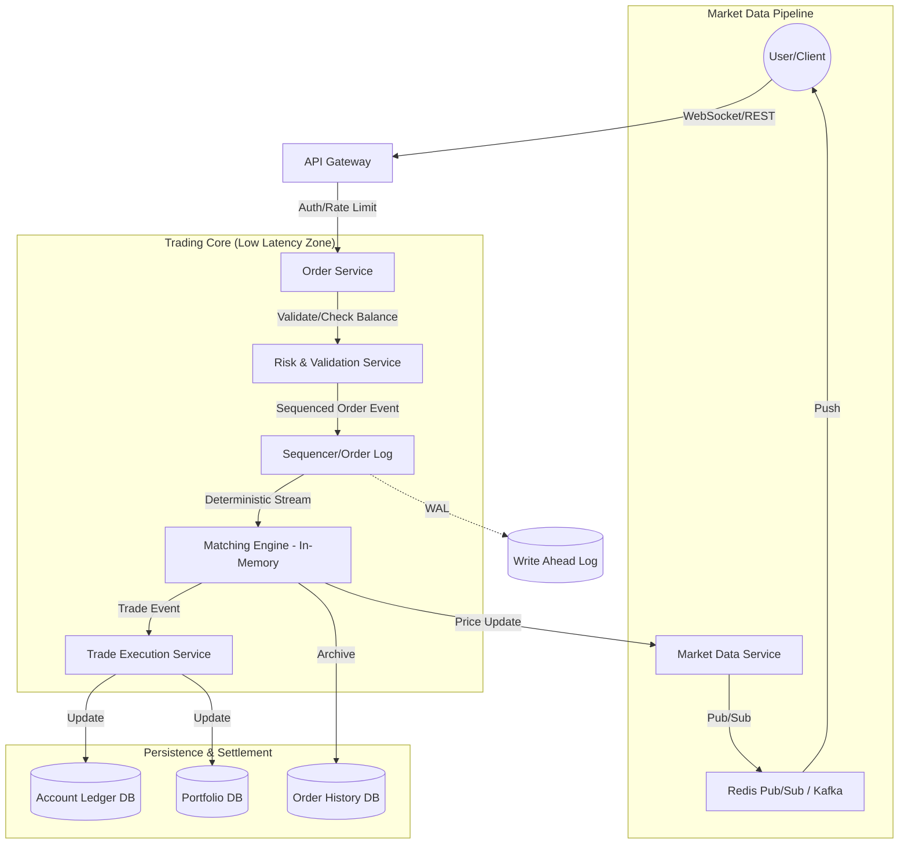

# System Design: High-Frequency Stock Trading Platform

## 1. Requirements & System Constraints

### 1.1 Functional Requirements
*   **Order Management:** Users must be able to place, modify, and cancel buy/sell orders (Market and Limit orders).
*   **Matching Engine:** A core engine that matches buy and sell orders based on price-time priority.
*   **Portfolio & Ledger:** Real-time tracking of user balances (cash) and holdings (shares).
*   **Market Data Feed:** Real-time broadcasting of the "Ticker" (last traded price) and the "Order Book" (L2 data: bids and asks).
*   **Trade Execution:** Atomically update balances and holdings once a match is found.
*   **Order History:** Users must be able to view their past trades and pending orders.

### 1.2 Non-Functional Requirements
*   **Ultra-Low Latency:** The matching engine must process orders in microseconds/milliseconds to prevent slippage.
*   **Strong Consistency:** Financial transactions must be ACID compliant. No "double-spending" of cash or "ghost-selling" of shares.
*   **High Availability:** The system must be available during market hours. A failure in the matching engine must trigger a fast failover.
*   **Determinism:** Given the same sequence of orders, the matching engine must always produce the same result.
*   **Scalability:** Support millions of users and hundreds of thousands of orders per second (TPS).

### 1.3 Scale Estimations (HLD)
*   **Users:** 10 Million registered users.
*   **Active Users:** 1 Million concurrent users during peak hours.
*   **Order Volume:** 100k to 500k orders per second (TPS).
*   **Market Data Updates:** Millions of updates per second across all symbols.
*   **Storage:** Trade history grows linearly; requires petabytes of storage over years (Time-series data).

---

## 2. High-Level Architecture

The system is designed using a **Distributed Event-Driven Architecture**. To achieve ultra-low latency, the Matching Engine is decoupled from the API and Database layers and operates primarily in-memory.

### 2.1 Architecture Diagram



### 2.2 Component Descriptions
1.  **API Gateway:** Handles authentication, SSL termination, and rate limiting.
2.  **Order Service:** Validates basic order syntax and forwards requests to the Risk Service.
3.  **Risk & Validation Service:** Checks if the user has enough funds (for Buy) or enough shares (for Sell) *before* the order enters the matching engine to prevent "junk" orders from clogging the engine.
4.  **Sequencer:** A critical component that assigns a global sequence number to every order. This ensures determinism across replicas.
5.  **Matching Engine (ME):** The heart of the exchange. It maintains an in-memory Order Book (Bids/Asks) for each symbol. It matches orders using a **Price-Time Priority** algorithm.
6.  **Trade Execution Service (TES):** Listens for "Match" events from the ME and performs the actual movement of assets in the Ledger and Portfolio databases.
7.  **Market Data Service:** Aggregates trades and order book changes to push real-time updates to clients via WebSockets.

---

## 3. Detailed Database Schema Design

Given the requirements, a hybrid database approach is used: **RDBMS** for financial consistency and **Time-Series/NoSQL** for market history.

### 3.1 Relational Database (PostgreSQL/CockroachDB)
Used for the Ledger and Portfolios where ACID properties are non-negotiable.

#### Table: `users`
| Field | Type | Constraint | Note |
| :--- | :--- | :--- | :--- |
| `user_id` | UUID | PK | Unique identifier |
| `email` | VARCHAR | Unique | User login |
| `created_at` | TIMESTAMP | NOT NULL | Account creation date |

#### Table: `accounts` (Ledger)
| Field | Type | Constraint | Note |
| :--- | :--- | :--- | :--- |
| `account_id` | UUID | PK | Unique identifier |
| `user_id` | UUID | FK | Link to `users` |
| `currency` | VARCHAR(3) | NOT NULL | e.g., USD |
| `balance` | DECIMAL(20, 8) | CHECK > 0 | Current available cash |
| `version` | BIGINT | NOT NULL | Optimistic Locking version |

#### Table: `portfolios`
| Field | Type | Constraint | Note |
| :--- | :--- | :--- | :--- |
| `portfolio_id`| UUID | PK | Unique identifier |
| `user_id` | UUID | FK | Link to `users` |
| `symbol` | VARCHAR(10) | FK | e.g., AAPL, TSLA |
| `quantity` | DECIMAL(20, 8) | CHECK > 0 | Number of shares owned |

### 3.2 Order & Trade Store (Cassandra or MongoDB)
Orders are high-volume. We use a NoSQL store partitioned by `user_id` or `symbol`.

#### Table: `orders`
*   `order_id` (PK), `user_id` (Index), `symbol` (Index), `side` (BUY/SELL), `type` (LIMIT/MARKET), `price`, `quantity`, `filled_quantity`, `status` (PENDING, FILLED, CANCELLED), `timestamp`.

#### Table: `trades`
*   `trade_id` (PK), `buy_order_id`, `sell_order_id`, `symbol`, `price`, `quantity`, `timestamp`.

### 3.3 Market Data (InfluxDB / KDB+)
Time-series database used for OHLC (Open, High, Low, Close) candles and tick-by-tick historical data.

---

## 4. Core API Design

### 4.1 Order Placement
`POST /api/v1/orders`
**Request:**
```json
{
  "symbol": "AAPL",
  "side": "BUY",
  "type": "LIMIT",
  "quantity": 10,
  "price": 150.25,
  "time_in_force": "GTC" 
}
```
**Response:** `202 Accepted`
```json
{
  "order_id": "ord_12345",
  "status": "PENDING",
  "timestamp": "2023-10-01T10:00:00Z"
}
```

### 4.2 Order Cancellation
`DELETE /api/v1/orders/{order_id}`
**Response:** `200 OK` or `400 Bad Request` (if already filled).

### 4.3 Portfolio Snapshot
`GET /api/v1/portfolio`
**Response:** `200 OK`
```json
{
  "cash_balance": 5000.00,
  "holdings": [
    {"symbol": "AAPL", "quantity": 10, "average_price": 145.00},
    {"symbol": "TSLA", "quantity": 5, "average_price": 700.00}
  ]
}
```

---

## 5. Scalability & Advanced Topics

### 5.1 The Matching Engine: Low Latency Secrets
To handle 500k TPS, the ME cannot query a database.
*   **In-Memory Order Book:** Use two priority queues (or balanced BSTs/B-Trees) per symbol. One for Bids (Max-Heap) and one for Asks (Min-Heap).
*   **LMAX Disruptor Pattern:** Instead of using traditional locks (Mutex), use a **Ring Buffer** to pass events between the Sequencer and the ME. This eliminates lock contention and reduces cache misses.
*   **Single-Threaded Execution:** To avoid context switching and locking, assign one thread per symbol (or group of symbols). Since the state is local to the thread, it runs at CPU cache speeds.

### 5.2 Sharding Strategy
*   **Symbol-Based Sharding:** The Matching Engine is sharded by `symbol`. `AAPL` and `MSFT` may be handled by Engine Node A, while `TSLA` and `AMZN` are handled by Engine Node B.
*   **User-Based Sharding:** The Account/Ledger DB is sharded by `user_id` to distribute the load of balance updates.

### 5.3 Fault Tolerance & Recovery
*   **Event Sourcing:** The Sequencer writes every incoming order to a **Write-Ahead Log (WAL)** on disk (e.g., using Apache Kafka or a replicated journal).
*   **Snapshotting:** Periodically, the ME takes a snapshot of the Order Book and saves it to disk.
*   **Recovery:** On crash, the ME loads the last snapshot and replays the WAL from that point forward to reconstruct the exact state.

### 5.4 Market Data Distribution
*   **WebSocket Push:** Use a Pub/Sub model. The ME publishes "Trade" events $\rightarrow$ Market Data Service $\rightarrow$ Redis Pub/Sub $\rightarrow$ WebSocket Server $\rightarrow$ Client.
*   **Throttling:** Instead of pushing every single tick to every user (which would crash the browser), the Market Data Service can "conflate" updates (e.g., send a snapshot every 100ms).

---

## 6. Trade-off Analysis

### 6.1 CAP Theorem: Consistency vs Availability
In a trading system, **Consistency (C)** and **Partition Tolerance (P)** are prioritized over Availability (A). We cannot allow a "split-brain" scenario where two different matching engines believe they have matched the same share to two different buyers. If the system cannot guarantee consistency, it must halt trading.

### 6.2 Latency vs. Durability
*   **The Conflict:** Writing to disk (Durability) is slow; keeping data in RAM (Latency) is risky.
*   **The Solution:** We use **Asynchronous Persistence** for the Order History but **Synchronous Sequencing** for the WAL. The order is acknowledged to the user only after it is persisted in the Sequencer's log, but before the Matching Engine has finished the trade.

### 6.3 Memory vs. Storage
*   **Trade-off:** Keeping all active orders in RAM is expensive.
*   **Optimization:** Only "Active" (Open) orders reside in the Matching Engine's RAM. "Filled" or "Cancelled" orders are immediately evicted from the ME and moved to the Order History DB.