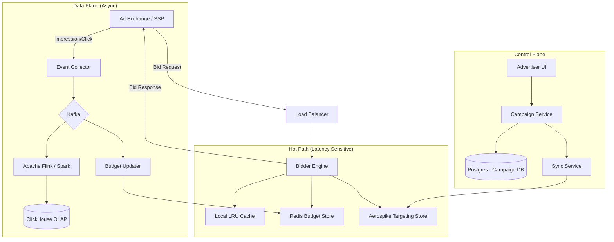

# System Design: Real-Time Bidding (RTB) Ad System

## 1. Requirements & System Constraints

### Functional Requirements
*   **Ad Exchange (SSP) Integration:** The system must receive bid requests from Supply Side Platforms (SSPs) and respond with a bid price and ad creative within a strict time limit.
*   **Campaign Management:** Advertisers must be able to create campaigns, set budgets, define targeting criteria (geo, device, demographics, keywords), and upload creatives.
*   **Bidding Logic:** The system (DSP - Demand Side Platform) must evaluate incoming bid requests against active campaigns and select the optimal bid based on targeting and value.
*   **Budget Management:** Real-time tracking of campaign spending to prevent over-spending (budget capping).
*   **Event Tracking:** Capture impressions and clicks for billing and optimization.
*   **Reporting:** Provide analytics on campaign performance (CTR, CPM, Spend).

### Non-Functional Requirements
*   **Ultra-Low Latency:** The end-to-end bid response must typically occur within **10ms to 100ms**. Any response beyond this is ignored by the exchange.
*   **High Throughput:** Ability to handle millions of bid requests per second (RPS).
*   **High Availability:** The system must be available 24/7; downtime results in immediate revenue loss.
*   **Scalability:** Horizontal scaling to handle spikes in traffic (e.g., Black Friday).
*   **Eventual Consistency for Reporting:** While budget tracking needs to be near real-time, detailed reporting can be eventually consistent.

### Scale Estimations (HLD)
*   **Traffic:** 1 Million bid requests per second (RPS).
*   **Daily Volume:** $\approx 86.4$ Billion requests/day.
*   **Win Rate:** Assume a 1% - 5% win rate $\approx 10k - 50k$ impressions/sec.
*   **Data Volume:** Billions of events daily, requiring a massive OLAP store for reporting.

---

## 2. High-Level Architecture

The system is designed as a **Demand Side Platform (DSP)**. It interacts with an external Ad Exchange (SSP) and manages internal campaign logic.

### Core Components
1.  **Bidder Engine (The Hot Path):** Stateless service that receives requests, evaluates targeting, and submits bids.
2.  **Campaign Service:** Manages the lifecycle of campaigns and targeting rules.
3.  **Budget Service:** Maintains real-time counters for campaign spending.
4.  **Event Collector:** High-throughput ingestion layer for impressions and clicks.
5.  **Analytics Pipeline:** Asynchronous processing of events for reporting.
6.  **Data Store:** A combination of RDBMS (Config), NoSQL/In-Memory (Targeting/Budget), and OLAP (Reporting).

### Architecture Diagram



---

## 3. Detailed Database Schema Design

### 3.1. Campaign Configuration (PostgreSQL)
Used for administrative tasks and source of truth.
*   **Table: `campaigns`**
    *   `campaign_id` (UUID, PK)
    *   `advertiser_id` (UUID, Indexed)
    *   `name` (String)
    *   `total_budget` (Decimal)
    *   `current_spend` (Decimal)
    *   `start_date`, `end_date` (Timestamp)
    *   `status` (Enum: ACTIVE, PAUSED, EXHAUSTED)
*   **Table: `targeting_rules`**
    *   `rule_id` (PK)
    *   `campaign_id` (FK)
    *   `dimension` (Enum: GEO, DEVICE, OS, KEYWORD)
    *   `operator` (Enum: IN, NOT_IN, EQUALS)
    *   `value` (String/JSON)
*   **Table: `creatives`**
    *   `creative_id` (PK)
    *   `campaign_id` (FK)
    *   `cdn_url` (String)
    *   `width`, `height` (Int)
    *   `mime_type` (String)

### 3.2. Targeting Store (Aerospike / Redis)
To meet the $<100ms$ latency, we cannot query Postgres. We use a NoSQL store optimized for key-value lookups.
*   **Key:** `campaign:{id}` $\rightarrow$ **Value:** Protobuf/JSON encoded targeting criteria and bid price.
*   **Inverted Index:** `geo:US` $\rightarrow$ `[campaign_1, campaign_5, ...]` to quickly filter campaigns based on request attributes.

### 3.3. Budget Store (Redis)
*   **Key:** `budget:{campaign_id}` $\rightarrow$ **Value:** `current_spent` (Atomic Integer/Decimal).
*   **Reasoning:** Redis provides `INCRBY` operations with sub-millisecond latency, essential for real-time budget capping.

### 3.4. Analytics Store (ClickHouse)
ClickHouse is chosen for its massive insertion rate and columnar compression.
*   **Table: `events`**
    *   `event_id` (UUID)
    *   `timestamp` (DateTime)
    *   `campaign_id` (UUID)
    *   `event_type` (Enum: IMPRESSION, CLICK)
    *   `cost` (Decimal)
    *   `user_id`, `site_id`, `geo` (Dimensions)
    *   **Primary Key:** `(campaign_id, timestamp)`

---

## 4. Core API Design

### 4.1. RTB Bid Endpoint (OpenRTB Standard)
This is the high-traffic endpoint called by the SSP.
*   **Endpoint:** `POST /bid`
*   **Request Payload:**
```json
{
  "id": "bid_req_12345",
  "imp": [{
    "id": "1",
    "banner": { "w": 300, "h": 250 },
    "device": { "ua": "Mozilla...", "ip": "1.2.3.4", "geo": "US" }
  }],
  "site": { "id": "site_99", "domain": "example.com" },
  "user": { "id": "user_abc" }
}
```
*   **Response Payload:**
```json
{
  "id": "bid_req_12345",
  "seatbid": [{
    "bid": [{
      "id": "bid_789",
      "impid": "1",
      "price": 1.25,
      "adm": "<div id='ad'>...</div>",
      "cid": "campaign_55"
    }]
  }]
}
```

### 4.2. Campaign Management API
*   `POST /campaigns`: Create a new campaign.
*   `PUT /campaigns/{id}`: Update budget or targeting.
*   `GET /reports/{campaign_id}?start=...&end=...`: Fetch performance metrics.

### 4.3. Tracking API
*   `GET /track/impression?bid_id=...&campaign_id=...`
*   `GET /track/click?bid_id=...&campaign_id=...`

---

## 5. Scalability & Advanced Topics

### 5.1. Reducing Latency (The "Hot Path" Optimization)
*   **Local Caching:** Every Bidder node maintains a local cache (e.g., Caffeine in Java) of active campaigns and targeting rules. This eliminates the network hop to Aerospike for the most frequent campaigns.
*   **Protobuf over JSON:** Use Protocol Buffers for internal communication between Bidder, Budget, and Event services to reduce serialization overhead.
*   **UDP for Tracking:** Impression pixels can be sent via UDP or high-speed HTTP to a load balancer that immediately dumps them into Kafka.

### 5.2. Budget Pacing (Avoiding "Budget Exhaustion" in seconds)
If a campaign has a \$1k budget and the system handles 1M RPS, the budget could be gone in milliseconds.
*   **Budget Pacing:** Implement a "leaking bucket" or "token bucket" algorithm. Divide the daily budget by the number of seconds in a day.
*   **Budget Sharding:** Distribute budget slices to different Bidder nodes (e.g., each node gets \$10 for 5 minutes). Nodes only sync with the central Budget Service when their local slice is exhausted.

### 5.3. Handling Throughput with Kafka
The Event Collector acts as a buffer.
*   **Kafka Partitioning:** Partition events by `campaign_id` to ensure that all events for a single campaign are processed in order by the same Budget Worker.
*   **Batching:** Budget Workers batch updates to Redis (e.g., every 100ms or 1000 events) to reduce the number of network calls.

### 5.4. Fault Tolerance
*   **Graceful Degradation:** If the Budget Service is slow, the Bidder can fallback to a "Safe Mode" (bid lower prices or only bid for high-priority campaigns).
*   **Circuit Breakers:** Use Resilience4j or Hystrix to stop calling a failing downstream service to prevent cascading failures.

---

## 6. Trade-off Analysis

### 6.1. CAP Theorem: Availability over Consistency (AP)
In an RTB system, **Availability** and **Partition Tolerance** are prioritized over **Strong Consistency**.
*   **Reasoning:** If the Budget Service is slightly out of sync, a campaign might overspend by a few dollars. This is an acceptable business cost compared to the loss of millions of dollars if the Bidder stops responding due to a consistency lock (CP).

### 6.2. Latency vs. Accuracy
*   **Trade-off:** We use local caches and distributed budget slices.
*   **Impact:** This introduces a "lag" in budget tracking (eventual consistency). The advertiser might spend \$1,005 instead of exactly \$1,000. This is preferred over adding 20ms of latency to every bid request to perform a synchronous global lock on the budget.

### 6.3. Storage: SQL vs. NoSQL vs. OLAP
*   **Postgres (SQL):** Used for Campaign Config because targeting rules require relational integrity and infrequent updates.
*   **Aerospike/Redis (NoSQL):** Used for the Hot Path because they provide predictable $O(1)$ latency.
*   **ClickHouse (OLAP):** Used for reporting because it can aggregate billions of rows in milliseconds using columnar storage, which would crash a traditional RDBMS.