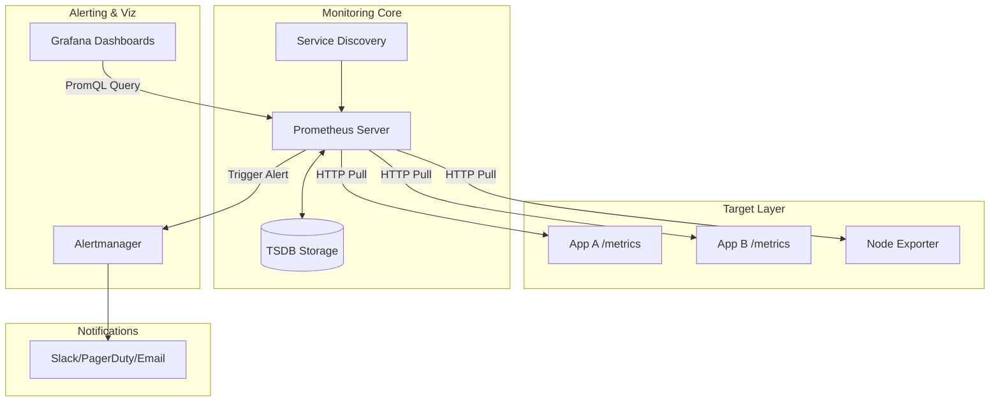

# Monitoring & Alerting System HLD (Prometheus/Grafana)

## 1. Overview & System Requirements

A **Monitoring and Alerting System** is a critical piece of infrastructure designed to provide observability into the health, performance, and reliability of distributed systems. Unlike logging (which records discrete events), monitoring focuses on **metrics**—numerical representations of data measured over intervals of time (Time-Series Data).

The industry standard for this is the **Prometheus** ecosystem for data collection and alerting, combined with **Grafana** for visualization.

### Functional Requirements
- **Metric Collection**: Ability to collect numerical metrics (counters, gauges, histograms) from various services.
- **Querying**: A powerful query language (PromQL) to aggregate and filter time-series data.
- **Visualization**: Real-time dashboards to visualize system health and trends.
- **Alerting**: Define threshold-based rules to trigger notifications when a system enters an unhealthy state.
- **Service Discovery**: Automatically detect new targets/instances to monitor in dynamic environments (e.g., Kubernetes).

### Non-Functional Requirements
- **High Availability**: The monitoring system must not go down when the production system goes down (it must be more reliable than the system it monitors).
- **Scalability**: Must handle millions of unique time series (cardinality) and high write throughput.
- **Low Latency**: Dashboards should load quickly, and alerts should trigger within seconds of a threshold breach.
- **Durability**: Metrics should be persisted to disk, though short-term loss of some samples is often acceptable compared to transactional data.

### Scale Assumptions
- **Infrastructure**: 10,000 server nodes.
- **Metrics per Node**: $\sim 100$ metrics.
- **Scrape Interval**: 15 seconds.
- **Throughput**: $\frac{10,000 \text{ nodes} \times 100 \text{ metrics}}{15 \text{ seconds}} \approx 66,667$ samples per second (Write QPS).
- **Storage**: Retaining 15 days of data with 2-byte floats and 8-byte timestamps.

---

## 2. High-Level System Architecture

The architecture follows a **pull-based model** where the monitoring server actively fetches metrics from targets.

### Architecture Diagram Components
1.  **Targets (Exporters)**: Applications or "Exporters" (e.g., Node Exporter) that expose a `/metrics` HTTP endpoint.
2.  **Prometheus Server**: The core engine that scrapes data, stores it in a TSDB, and evaluates alert rules.
3.  **TSDB (Time Series Database)**: A specialized database optimized for time-stamped numerical data.
4.  **Alertmanager**: A standalone component that handles alerts sent by Prometheus (deduplication, grouping, routing).
5.  **Grafana**: The visualization layer that queries Prometheus via API to render graphs.
6.  **Service Discovery (SD)**: Integration with Kubernetes or Consul to find target IPs automatically.

---

## 3. Key HLD Concepts & Component Design

### A. Pull vs. Push Model
Prometheus uses a **Pull Model**.
- **Why Pull?** 
    - **Self-Protection**: The server decides when to scrape; it cannot be DDoS-ed by a malfunctioning client pushing millions of metrics.
    - **Health Monitoring**: If the server cannot pull from a target, it immediately knows the target is down (implicit "up" metric).
    - **Easier Configuration**: Targets don't need to know where the monitoring server is; the server discovers them.
- **When to Push?** For short-lived jobs (e.g., CronJobs), a **Pushgateway** is used. The job pushes to the gateway, and Prometheus pulls from the gateway.

### B. The Time Series Database (TSDB)
Standard SQL databases are inefficient for time-series data due to massive index overhead.
- **Data Model**: A time series is identified by a **metric name** and a set of **labels** (key-value pairs).
  - Example: `http_requests_total{method="POST", endpoint="/api/login", env="prod"}`
- **Storage Strategy**:
    - **In-memory Head Block**: Recent samples are stored in memory for fast access.
    - **WAL (Write Ahead Log)**: Every single sample is written to a WAL to prevent data loss during crashes.
    - **Chunking**: Periodically, memory blocks are compressed and flushed to disk as "chunks" to reduce storage footprint.
    - **Inverted Index**: To find all series matching `{env="prod"}`, Prometheus uses an inverted index mapping label values to series IDs.

### C. Prometheus Query Language (PromQL)
PromQL allows for powerful on-the-fly aggregations:
- **Rate**: `rate(http_requests_total[5m])` — Calculates the per-second rate of increase over the last 5 minutes.
- **Aggregation**: `sum(rate(http_requests_total[5m])) by (method)` — Sums the rates grouped by the HTTP method.

### D. Alerting Pipeline
1.  **Rule Evaluation**: Prometheus evaluates expressions (e.g., `cpu_usage > 80%`) every $X$ seconds.
2.  **Pending State**: If a rule is true, the alert enters a `Pending` state. It must remain true for a defined `for` duration (e.g., 5 minutes) to avoid "flapping" (brief spikes).
3.  **Firing State**: Once the duration is met, the alert is sent to **Alertmanager**.
4.  **Alertmanager Logic**:
    - **Grouping**: If 100 servers go down, send *one* alert saying "100 servers are down" instead of 100 separate emails.
    - **Inhibition**: If the Data Center is down, suppress alerts for the individual servers inside it.
    - **Routing**: Send "Critical" alerts to PagerDuty and "Warning" alerts to Slack.

---

## 4. Data Flows & Fault Tolerance

### Step-by-Step Data Flow: Metric to Dashboard
1.  **Instrument**: The application uses a Prometheus client library to increment a counter in memory.
2.  **Expose**: The application exposes these counters on `/metrics` in a plain-text format.
3.  **Scrape**: Prometheus queries the `/metrics` endpoint via HTTP.
4.  **Persist**: The sample is written to the WAL and then stored in the TSDB.
5.  **Visualize**: A user opens Grafana $\rightarrow$ Grafana sends a PromQL query to Prometheus $\rightarrow$ Prometheus scans the TSDB $\rightarrow$ Returns data $\rightarrow$ Grafana renders the graph.

### Fault Tolerance & Reliability
| Failure Scenario | Mitigation Strategy |
| :--- | :--- |
| **Prometheus Node Crash** | **WAL (Write Ahead Log)** ensures that data not yet flushed to disk is recovered upon restart. |
| **Target Node Crash** | Prometheus marks the target as `UP=0`, triggering an "Instance Down" alert. |
| **TSDB Disk Full** | **Retention Policies**: Automatically delete data older than $X$ days (e.g., 15 days). |
| **High Cardinality Explosion** | (e.g., putting UserID in a label). Use **recording rules** to pre-calculate aggregates and drop high-cardinality raw data. |

---

## 5. Production Trade-offs & Scaling

### The "Single Node" Limitation
Prometheus is designed as a single-node system. It does not natively support horizontal scaling (sharding).

**Trade-off: Simplicity vs. Scalability**
- **Pros**: No complex cluster management, extremely fast local reads/writes.
- **Cons**: Limited by the disk and RAM of one machine.

### Scaling Strategies for Large-Scale Systems
To handle global-scale monitoring, the following architectures are used:

1.  **Functional Sharding**:
    - Run one Prometheus server for "Database Metrics," one for "Frontend Metrics," and one for "Network Metrics."
2.  **Hierarchical Federation**:
    - **Edge Prometheus**: Local servers in each region/cluster scrape targets.
    - **Global Prometheus**: A central server scrapes only the *aggregated* metrics from the Edge servers.
3.  **Long-Term Storage (The "Thanos/Cortex" approach)**:
    - **Sidecar Pattern**: A sidecar process uploads TSDB blocks to S3/GCS (Object Storage).
    - **Querier**: A separate component that queries both the local Prometheus (for recent data) and S3 (for historical data), providing a **Global View**.
    - **Downsampling**: Converting 15s resolution data to 1h resolution for data older than 30 days to save space.

### Summary Complexity Analysis

| Operation | Time Complexity | Space Complexity | Notes |
| :--- | :--- | :--- | :--- |
| **Write (Scrape)** | $O(1)$ | $O(N)$ | Appending to WAL and Memory. |
| **Query (Simple)** | $O(\log S)$ | $O(R)$ | Binary search on index for series $S$, result set $R$. |
| **Query (Aggregated)**| $O(S \times T)$ | $O(R)$ | Must scan $T$ time samples for $S$ series. |
| **Alert Evaluation** | $O(Rules \times S)$ | $O(1)$ | Periodic scan of active series. |