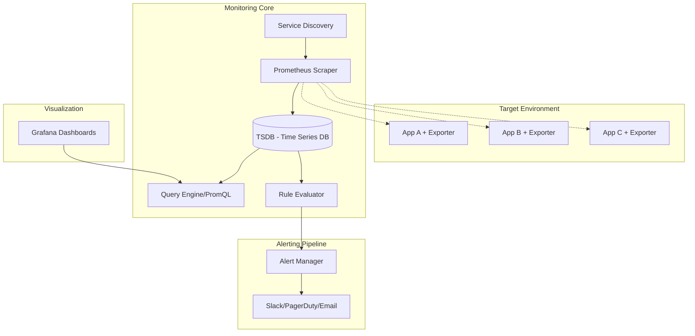

# System Design: Monitoring & Alerting System (Prometheus/Grafana Style)

## 1. Requirements & System Constraints

### 1.1 Functional Requirements
*   **Metric Collection:** The system must collect numerical metrics (counters, gauges, histograms) from various targets (servers, containers, applications).
*   **Time-Series Storage:** Store metrics with a timestamp and a set of labels (tags) for multi-dimensional querying.
*   **Query Engine:** Provide a powerful query language to aggregate, filter, and perform mathematical operations on time-series data over specific time ranges.
*   **Alerting:** Allow users to define rules (e.g., `CPU > 80% for 5 mins`) and trigger notifications via third-party integrations (Slack, PagerDuty, Email).
*   **Visualization:** Provide a dashboarding interface to visualize trends, spikes, and system health.
*   **Service Discovery:** Automatically detect new targets to monitor without manual configuration.

### 1.2 Non-Functional Requirements
*   **High Write Throughput:** Capable of handling millions of samples per second.
*   **Low Query Latency:** Dashboards must load quickly, and alerts must trigger in near real-time.
*   **Availability:** The monitoring system must be more available than the systems it monitors (avoiding the "monitoring the monitor" paradox).
*   **Scalability:** Ability to scale horizontally as the number of monitored targets increases.
*   **Eventual Consistency:** Strong consistency is not required for historical data; eventual consistency is acceptable for dashboards.

### 1.3 Scale Estimations (HLD)
*   **Targets:** 100,000 targets.
*   **Metrics per Target:** Average 100 metrics.
*   **Scrape Interval:** Every 15 seconds.
*   **Ingestion Rate:** $\frac{100,000 \text{ targets} \times 100 \text{ metrics}}{15 \text{ seconds}} \approx 666,666 \text{ samples/sec}$.
*   **Data Volume:** Each sample (Timestamp: 8 bytes, Value: 8 bytes, Series ID: 8 bytes) $\approx$ 24 bytes. 
    *   Daily volume: $666k \times 86,400 \times 24 \approx 1.38 \text{ TB/day}$ (uncompressed).

---

## 2. High-Level Architecture

The system follows a **Pull-based** architecture for collection and a **Distributed TSDB** for storage.

### 2.1 Architecture Components
1.  **Exporters:** Small binaries that run alongside the application, translating internal app metrics into a format the collector understands (e.g., `/metrics` endpoint).
2.  **Prometheus Server (Collector):** 
    *   **Scraper:** Periodically polls exporters based on a configuration/service discovery.
    *   **TSDB (Time Series Database):** Optimized storage for time-stamped data.
    *   **Rule Evaluator:** Periodically runs alerting rules against the TSDB.
3.  **Alert Manager:** Handles alerts sent by the server. It manages deduplication, grouping, and routing to notification channels.
4.  **Grafana (Visualization):** Connects to the Prometheus Query API to render dashboards.
5.  **Service Discovery (SD):** Integrates with Kubernetes, AWS, or Consul to find targets dynamically.

### 2.2 Architecture Diagram



---

## 3. Detailed Database Schema Design

A standard Relational Database (SQL) is inefficient for time-series data due to the massive number of rows and the need for range scans. We use a specialized **TSDB approach**.

### 3.1 Data Model
A time series is uniquely identified by its **Metric Name** and its **Labels**.
*   **Series:** `http_requests_total{method="POST", endpoint="/api/login", env="prod"}`
*   **Sample:** `(timestamp, value)`

### 3.2 Storage Components
To optimize storage, we separate the **Index** from the **Samples**.

#### A. Inverted Index (Label $\rightarrow$ Series ID)
To find all series matching `env="prod"`, we use an inverted index.
*   **Table/Store:** `LabelIndex`
*   **Structure:** `Key: "env=prod" -> Value: [SeriesID_1, SeriesID_45, SeriesID_102...]`
*   **Reasoning:** Allows $O(1)$ or $O(\log N)$ lookup of series IDs regardless of the number of samples.

#### B. Sample Store (Series ID $\rightarrow$ Samples)
Samples are stored in chunks (e.g., 2-hour blocks) to optimize disk I/O.
*   **Structure:** `SeriesID | Timestamp | Value`
*   **Storage Format:** 
    *   **Write-Ahead Log (WAL):** All incoming samples are written to a WAL for crash recovery.
    *   **Memory Chunk:** Recently received samples are kept in a memory-mapped buffer.
    *   **Compressed Block:** Once a chunk is full, it is compressed using **Delta-Delta Encoding** (for timestamps) and **XOR Encoding** (for floating-point values, e.g., Facebook's Gorilla paper) and flushed to disk.

### 3.3 Summary of Storage Selection
| Feature | Selection | Reasoning |
| :--- | :--- | :--- |
| **Primary Storage** | LSM-Tree based TSDB | High write throughput, optimized for sequential time-range reads. |
| **Indexing** | Inverted Index | Fast retrieval of series based on arbitrary label combinations. |
| **Compression** | Gorilla/Delta-Delta | Reduces storage footprint by up to 90% for predictable time-series. |

---

## 4. Core API Design

### 4.1 Query API (PromQL Interface)
Used by Grafana and the Rule Evaluator.

**Endpoint:** `GET /api/v1/query`
*   **Request:**
    *   `query`: The PromQL expression (e.g., `sum(rate(http_requests_total[5m])) by (endpoint)`)
    *   `time`: Epoch timestamp for instant queries.
*   **Response:**
```json
{
  "status": "success",
  "data": {
    "resultType": "vector",
    "result": [
      {
        "metric": { "endpoint": "/api/login", "env": "prod" },
        "value": [1625097600, "45.2"]
      }
    ]
  }
}
```

**Endpoint:** `GET /api/v1/query_range`
*   **Request:** `query`, `start`, `end`, `step` (resolution).
*   **Response:** Returns a matrix of values over the time range.

### 4.2 Target Management API
Used to update the scraper's list of targets.

**Endpoint:** `POST /api/v1/targets`
*   **Payload:**
```json
{
  "targets": [
    { "labels": { "job": "api-server" }, "static_configs": [{ "targets": ["10.0.0.1:9090", "10.0.0.2:9090"] }] }
  ]
}
```

### 4.3 Alert Configuration API
**Endpoint:** `POST /api/v1/rules`
*   **Payload:**
```json
{
  "alert": "HighCpuUsage",
  "expr": "cpu_usage > 80",
  "for": "5m",
  "labels": { "severity": "critical" },
  "annotations": { "summary": "CPU usage is too high on {{ $labels.instance }}" }
}
```

---

## 5. Scalability & Advanced Topics

### 5.1 Scaling Ingestion (Horizontal Scaling)
Since a single Prometheus server has a limit on the number of series it can handle, we employ **Functional Sharding**:
*   **Shard by Target:** Server A scrapes `Service-Group-1`, Server B scrapes `Service-Group-2`.
*   **Shard by Metric:** Server A handles `CPU/Memory` metrics, Server B handles `HTTP/Request` metrics.

### 5.2 Long-Term Storage (Remote Write)
Local TSDBs are usually limited to short retention (e.g., 15 days). For long-term historical analysis:
*   **Remote Write:** The server pushes samples to a centralized long-term store (e.g., **Thanos**, **Cortex**, or **Mimir**).
*   **Object Storage:** These systems move old blocks to S3/GCS, providing virtually infinite retention.
*   **Downsampling:** To keep queries fast, the system aggregates 15s data into 1h blocks for data older than 30 days.

### 5.3 Fault Tolerance & HA
*   **Replication:** Run two identical Prometheus servers scraping the same targets.
*   **Deduplication:** The Alert Manager receives alerts from both servers but uses the alert fingerprint to ensure only one notification is sent.
*   **WAL (Write Ahead Log):** Ensures that in-memory samples are not lost during a crash.

### 5.4 Handling "Cardinality Explosion"
If a user adds a label like `user_id` (which has millions of unique values), the index size explodes, crashing the system.
*   **Mitigation:** 
    *   Implement **Cardinality Limits** per metric.
    *   Alert on the growth of the `prometheus_tsdb_head_series` metric.
    *   Use a "Relabeling" config to drop high-cardinality labels at the ingestion point.

---

## 6. Trade-off Analysis

### 6.1 Pull vs. Push Model
| Feature | Pull (Prometheus) | Push (Graphite/InfluxDB) |
| :--- | :--- | :--- |
| **Control** | Server controls the load; prevents flooding. | Client controls load; can overwhelm server. |
| **Health Check** | Implicitly knows if target is down (up=0). | Doesn't know if target is down (silence). |
| **Config** | Requires Service Discovery for dynamic envs. | Simpler setup for client (just send data). |
| **Network** | Requires network path from server to target. | Only requires path from target to server. |
*   *Decision:* Pull is preferred for infrastructure monitoring; Push is used via a **Pushgateway** for short-lived batch jobs.

### 6.2 Latency vs. Storage (Compression)
*   **Trade-off:** Real-time samples are kept in raw memory for $O(1)$ access (Low Latency), but historical data is heavily compressed (Low Storage).
*   **Impact:** This introduces a "compaction" phase where CPU spikes occur as the system transforms memory chunks into compressed disk blocks.

### 6.3 CAP Theorem Priority
*   **Priority:** **Availability (A)** and **Partition Tolerance (P)**.
*   **Reasoning:** In monitoring, it is better to have slightly stale data or a missing sample than for the entire ingestion pipeline to stop because one node is unavailable. Eventual consistency is acceptable for a dashboard showing a 5-minute average.