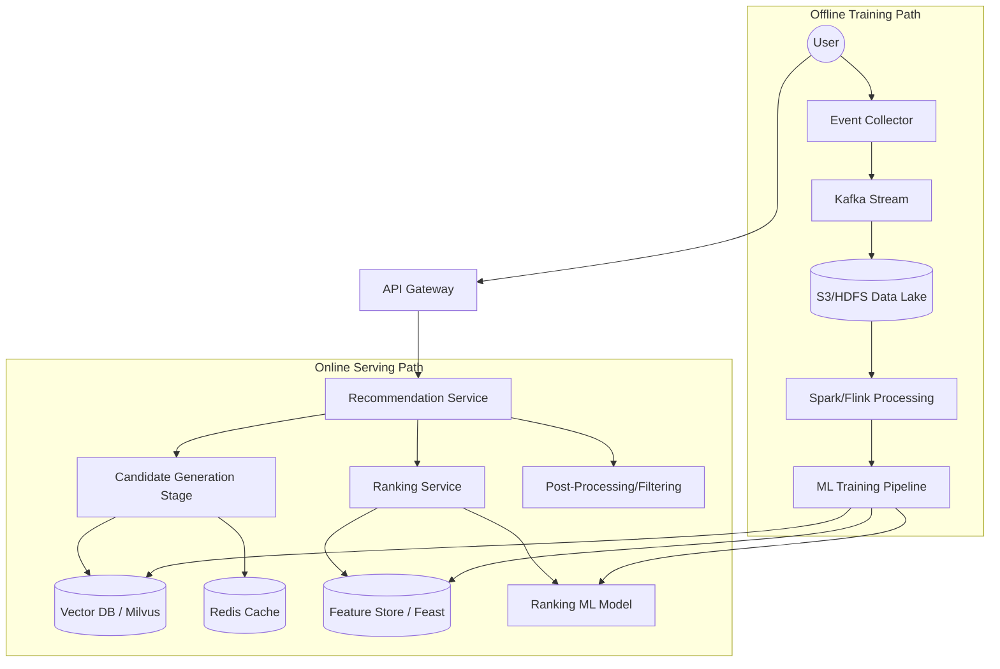

# System Design Document: High-Scale Recommendation Engine (Netflix-style)

## 1. Requirements & System Constraints

### 1.1 Functional Requirements
*   **Personalized Recommendations:** Provide a list of movies/shows tailored to the user's preferences on the home screen.
*   **Similar Content:** "Because you watched X" — recommend items similar to a specific piece of content.
*   **Trending/Popular:** Provide global or regional trending content for new users (solving the cold-start problem).
*   **Real-time Feedback Loop:** Incorporate recent user actions (likes, views, skips) into recommendations quickly.
*   **Diversity & Serendipity:** Ensure the engine doesn't create a "filter bubble" by introducing diverse genres.

### 1.2 Non-Functional Requirements
*   **Low Latency:** The recommendation API must respond within < 200ms to ensure a seamless UI experience.
*   **High Availability:** The system must be available 24/7; failing to provide recommendations should fallback to a "Popular" list rather than a 500 error.
*   **Scalability:** Support 200M+ users and 50k+ content titles with billions of interaction events daily.
*   **Eventual Consistency:** It is acceptable if a recommendation update takes a few minutes to reflect a user's latest action.

### 1.3 Scale Estimations
*   **Users:** 200 Million.
*   **Content Catalog:** 50,000 titles.
*   **Daily Events:** ~1 Billion events (play, pause, search, rate).
*   **Read QPS:** 100k+ requests per second during peak hours.
*   **Storage:** 1B events/day $\times$ 100 bytes $\approx$ 100 GB/day of raw interaction logs.

---

## 2. High-Level Architecture

A modern recommendation engine uses a **Two-Stage Pipeline**: **Candidate Generation (Retrieval)** followed by **Ranking (Scoring)**. This prevents the need to run a complex ML model against the entire catalog for every request.

### 2.1 Architecture Diagram



### 2.2 Component Descriptions
1.  **Event Collector:** Captures implicit (watch time, clicks) and explicit (thumbs up/down) signals.
2.  **Candidate Generation (Retrieval):** Reduces the catalog from 50k to $\sim$200-500 candidates. Uses techniques like Matrix Factorization or Two-Tower Neural Networks to find embeddings.
3.  **Ranking (Scoring):** A deep learning model (e.g., Wide & Deep, DeepFM) that takes the 500 candidates and predicts the probability of a user clicking/watching.
4.  **Feature Store:** A low-latency KV store providing user features (e.g., "preferred genre") and item features (e.g., "average rating") to the Ranker.
5.  **Vector DB:** Stores content embeddings. Uses Approximate Nearest Neighbor (ANN) search to find similar items in $O(\log N)$.
6.  **Post-Processing:** Applies business logic (e.g., remove already watched movies, filter age-restricted content, ensure genre diversity).

---

## 3. Detailed Database Schema Design

### 3.1 Interaction Store (Cold Storage/Data Lake)
Used for offline model training.
*   **Table:** `user_interactions` (Stored in Parquet/S3)
    *   `user_id` (UUID)
    *   `content_id` (UUID)
    *   `interaction_type` (Enum: VIEW, LIKE, DISLIKE, SEARCH)
    *   `duration_watched` (Integer - seconds)
    *   `timestamp` (Timestamp)

### 3.2 Content Metadata (SQL - PostgreSQL)
Stores authoritative metadata for the catalog.
*   **Table:** `content`
    *   `content_id` (PK, UUID)
    *   `title` (Varchar)
    *   `genre_ids` (Array/Relation)
    *   `release_date` (Date)
    *   `rating` (Float)
    *   **Index:** B-Tree on `genre_ids` and `release_date`.

### 3.3 Feature Store (NoSQL - Cassandra or DynamoDB)
Stores pre-computed features for the Ranking model.
*   **Table:** `user_features`
    *   `user_id` (PK) $\rightarrow$ `{ "pref_genres": ["Sci-Fi", "Horror"], "avg_watch_time": 45, "last_login": "..." }`
*   **Table:** `item_features`
    *   `content_id` (PK) $\rightarrow$ `{ "popularity_score": 0.98, "avg_completion_rate": 0.75 }`

### 3.4 Vector Store (Milvus / Pinecone)
Stores the embeddings generated by the Two-Tower model.
*   **Collection:** `content_embeddings`
    *   `content_id` (ID)
    *   `embedding` (Vector[128 dimensions])
    *   **Index:** HNSW (Hierarchical Navigable Small World) for fast ANN search.

---

## 4. Core API Design

### 4.1 Get Recommendations
`GET /v1/recommendations`
*   **Query Params:** `user_id`, `limit=20`, `offset=0`
*   **Response:**
```json
{
  "user_id": "u123",
  "recommendations": [
    {
      "content_id": "m456",
      "score": 0.982,
      "reason": "Because you watched Inception",
      "rank": 1
    },
    {
      "content_id": "m789",
      "score": 0.851,
      "reason": "Trending in your region",
      "rank": 2
    }
  ],
  "request_id": "req-abc-123"
}
```

### 4.2 Record User Interaction
`POST /v1/events`
*   **Payload:**
```json
{
  "user_id": "u123",
  "content_id": "m456",
  "event_type": "WATCH",
  "metadata": {
    "timestamp": 1625097600,
    "duration_seconds": 1200,
    "device": "SmartTV"
  }
}
```

---

## 5. Scalability & Advanced Topics

### 5.1 The "Cold Start" Strategy
*   **New User:** Since no history exists, the system defaults to "Popularity-based" recommendations or asks the user to select 3 favorite genres during onboarding.
*   **New Item:** Use **Content-Based Filtering**. Extract features from the movie description/genre and map the item into the vector space near similar existing items.

### 5.2 Caching Strategy
*   **Pre-computed Recommendations:** For the most active users, pre-calculate the Top 100 recs every 4 hours and store them in **Redis**.
*   **Feature Cache:** Use a local LRU cache in the Ranking Service to store frequently accessed `item_features`.

### 5.3 Model Deployment & A/B Testing
*   **Shadow Mode:** Deploy a new model that generates predictions in parallel with the production model, but doesn't serve them to the user. Compare results offline.
*   **Canary Deployment:** Route 5% of traffic to the new ranking model to measure the CTR (Click-Through Rate) increase.

### 5.4 Handling Data Drift
*   Implement a monitoring pipeline that tracks the distribution of predicted scores. If the average predicted probability drops significantly, trigger an automated model retrain.

---

## 6. Trade-off Analysis

### 6.1 Latency vs. Accuracy
*   **Trade-off:** A complex Deep Learning model is more accurate but slower.
*   **Decision:** We use the **Two-Stage approach**. The Retrieval stage is optimized for latency (ANN search), while the Ranking stage is optimized for accuracy (Complex Model). This provides the best of both worlds.

### 6.2 CAP Theorem
*   **Priority:** **Availability and Partition Tolerance (AP)**.
*   **Reasoning:** If the recommendation system is temporarily inconsistent (e.g., a movie the user just disliked still appears for a few minutes), it is far better than the home page failing to load. We accept eventual consistency in the feature store and embeddings.

### 6.3 Storage vs. Computation
*   **Trade-off:** Pre-computing recommendations for all 200M users would require massive storage ($200M \times 100 \text{ IDs}$).
*   **Decision:** Hybrid approach. Pre-compute for "power users" (top 10%) and compute on-the-fly for the remaining 90% using the retrieval-ranking pipeline.

### 6.4 Vector Search: Exact vs. Approximate
*   **Trade-off:** Exact KNN search is $O(N)$, which is too slow for $N=50,000$ at 100k QPS.
*   **Decision:** Use **ANN (Approximate Nearest Neighbor)**. It reduces search time to $O(\log N)$ by sacrificing a small amount of recall (precision), which is negligible in a recommendation context.