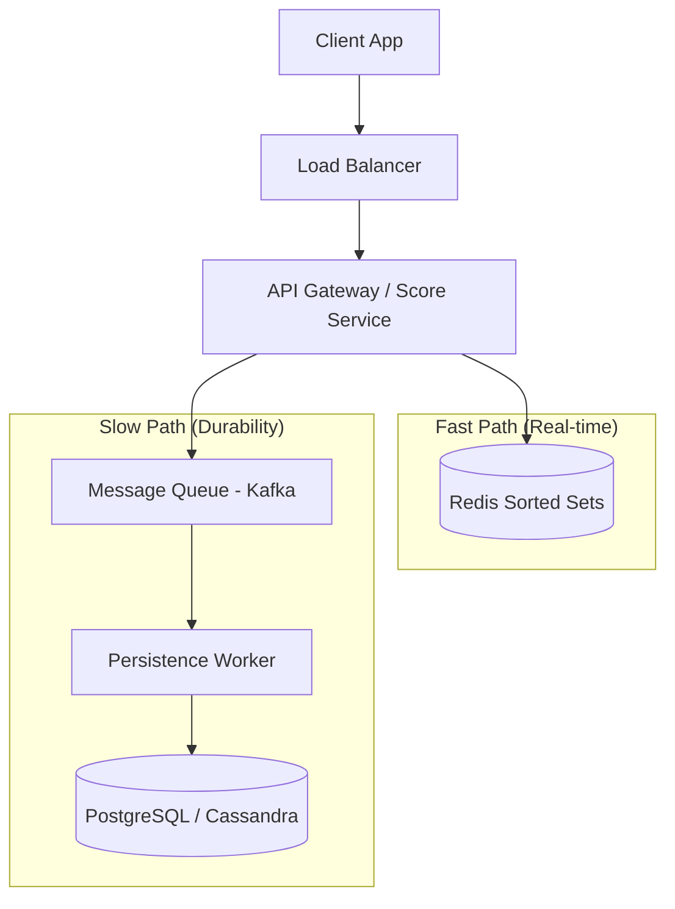

# System Design: Leaderboard & Ranking System (Top K)

## 1. Requirements & System Constraints

### 1.1 Functional Requirements
*   **Update Score:** Ability to update a user's score in real-time or near real-time.
*   **Top K Query:** Retrieve the top $K$ players (e.g., Top 100) globally.
*   **User Rank:** Retrieve the exact rank and score of a specific user.
*   **Surrounding Rank:** Retrieve the "neighborhood" of a user (e.g., 5 players above and 5 players below the user).
*   **Time-bound Leaderboards:** Support for multiple time windows (Daily, Weekly, All-time).

### 1.2 Non-Functional Requirements
*   **Low Latency:** Rank retrieval and score updates must be sub-millisecond or very low millisecond.
*   **High Scalability:** Handle millions of users and high write throughput during peak events (e.g., game launches, competitions).
*   **High Availability:** The leaderboard should be available even if some backend components fail.
*   **Eventual Consistency:** While score updates should reflect quickly, absolute precision across all global mirrors can be eventually consistent.

### 1.3 Scale Estimations (HLD)
*   **Total Users:** 10 Million.
*   **Daily Active Users (DAU):** 1 Million.
*   **Write Load:** 5,000 score updates per second.
*   **Read Load:** 20,000 rank queries per second.
*   **Storage:** For 10M users, storing `userId` (8 bytes) and `score` (8 bytes) $\approx 160$ MB per leaderboard. This fits comfortably in memory.

---

## 2. High-Level Architecture

The core challenge of a leaderboard is that calculating rank in a traditional relational database requires scanning a large index or performing a count of all users with a higher score ($O(N)$), which is prohibitively slow. We use a **Redis Sorted Set (ZSET)** as the primary data structure to achieve $O(\log N)$ complexity for updates and range queries.

### 2.1 Architecture Diagram



### 2.2 Component Interactions
1.  **Score Service:** Handles incoming HTTP requests. It performs a "dual-write" strategy: an immediate update to Redis for real-time visibility and an asynchronous update to the DB via Kafka for durability.
2.  **Redis (ZSET):** Stores the mapping of `userId` $\rightarrow$ `score`. It maintains the elements in a sorted order using a skip list and a hash map.
3.  **Message Queue (Kafka):** Decouples the high-frequency write traffic from the database, preventing DB bottlenecks during spikes.
4.  **Persistence Worker:** Consumes events from Kafka and updates the permanent record in the database.
5.  **Database:** Acts as the "Source of Truth." If Redis crashes or needs to be re-hydrated, data is loaded from here.

---

## 3. Detailed Database Schema Design

### 3.1 Permanent Storage (SQL - PostgreSQL)
We use a relational database for auditing, historical analysis, and durability.

**Table: `user_scores`**
| Field | Type | Constraints | Description |
| :--- | :--- | :--- | :--- |
| `user_id` | UUID | PK | Unique identifier for the user |
| `leaderboard_id` | VARCHAR(50) | PK, Index | ID of the specific leaderboard (e.g., "weekly_2023_W42") |
| `score` | BIGINT | Index | Current score of the user |
| `updated_at` | TIMESTAMP | | Last time the score was modified |

**Indexing Strategy:**
*   Composite PK on `(leaderboard_id, user_id)`.
*   Index on `score` for occasional batch processing or fallback rank calculations.

### 3.2 In-Memory Storage (Redis ZSET)
Redis Sorted Sets are the heart of the system.
*   **Key:** `leaderboard:{leaderboard_id}`
*   **Member:** `user_id`
*   **Score:** `score`

**Time & Space Complexity:**
*   `ZADD` (Update Score): $O(\log N)$
*   `ZRANGE` (Top K): $O(\log N + K)$
*   `ZRANK` (Get User Rank): $O(\log N)$

---

## 4. Core API Design

### 4.1 Update Score
`POST /v1/scores`
**Payload:**
```json
{
  "userId": "user_123",
  "scoreDelta": 50,
  "leaderboardId": "global_all_time"
}
```
**Response:** `202 Accepted` (Processed asynchronously via Kafka).

### 4.2 Get Top K Players
`GET /v1/leaderboard/{leaderboardId}/top?k=100`
**Response:**
```json
{
  "leaderboardId": "global_all_time",
  "rankings": [
    {"rank": 1, "userId": "user_99", "score": 15000},
    {"rank": 2, "userId": "user_45", "score": 14200},
    ...
  ]
}
```

### 4.3 Get User Rank & Neighborhood
`GET /v1/leaderboard/{leaderboardId}/user/{userId}`
**Response:**
```json
{
  "userId": "user_123",
  "rank": 452,
  "score": 1200,
  "surrounding": [
    {"rank": 451, "userId": "user_88", "score": 1210},
    {"rank": 452, "userId": "user_123", "score": 1200},
    {"rank": 453, "userId": "user_11", "score": 1190}
  ]
}
```

---

## 5. Scalability & Advanced Topics

### 5.1 Sharding the Leaderboard
If a single leaderboard exceeds the memory of one Redis node (e.g., 100M users), we can employ:
1.  **Fixed Partitioning:** Divide users into shards based on `userId % N`. Each shard maintains its own ZSET. To get the global Top K, we query the Top K from every shard and merge them (Priority Queue merge).
2.  **Score-based Partitioning:** Divide users by score ranges (e.g., 0-1000, 1001-2000). This is harder to maintain as users move between ranges.

### 5.2 Tiered Ranking (The "Leagues" Approach)
To reduce the load on a single massive ZSET, implement tiers (e.g., Bronze, Silver, Gold, Diamond). Users only compete within their tier. This limits the size of $N$ for any single ZSET and improves performance.

### 5.3 Handling Time-bound Leaderboards
*   **Daily/Weekly:** Use a naming convention for keys: `lb:daily:2023-10-27`.
*   **TTL:** Set an expiration time on daily/weekly ZSETs so Redis automatically cleans up old data.
*   **Aggregation:** Use a worker to aggregate daily scores into the weekly ZSET.

### 5.4 Write Buffering and Throttling
*   **Write-back Cache:** Instead of updating Redis on every single point gain, buffer updates in the API layer and send batch updates to Redis every few seconds for the same user.
*   **Rate Limiting:** Implement token-bucket rate limiting per `userId` to prevent API abuse from botting/cheating.

---

## 6. Trade-off Analysis

| Trade-off | Choice | Reasoning |
| :--- | :--- | :--- |
| **Consistency vs Latency** | Eventual Consistency | For a leaderboard, seeing a rank that is 1-2 seconds old is acceptable. Using a message queue for DB writes prioritizes low-latency API responses over immediate ACID durability. |
| **Storage: RAM vs Disk** | Redis (RAM) | Calculating ranks in SQL via `COUNT(*)` or `OFFSET` is $O(N)$. Redis ZSETs provide $O(\log N)$, which is essential for a responsive UI. |
| **Complexity vs Precision** | ZSET $\rightarrow$ Sharding | For $10$M users, a single Redis instance is sufficient. We avoid the complexity of distributed merging unless the scale reaches $100$M+. |
| **CAP Theorem** | AP (Availability/Partition) | In a distributed setup, we prioritize availability. If one shard is down, the system can still provide partial rankings or cached results rather than failing completely. |