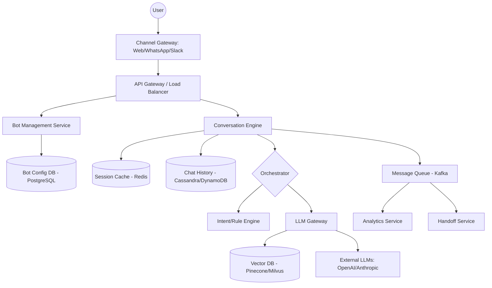

# System Design Document: Enterprise Chatbot Platform

## 1. Requirements & System Constraints

### 1.1 Functional Requirements
*   **Bot Management:** Businesses should be able to create, configure, and version multiple chatbots.
*   **Multi-Channel Integration:** Support for various front-ends (Web Widget, WhatsApp, Slack, Facebook Messenger).
*   **Conversation Orchestration:** 
    *   **Intent-based:** Rule-based flows or intent matching.
    *   **LLM-based:** Integration with Large Language Models (OpenAI, Claude, etc.) for generative responses.
    *   **RAG (Retrieval Augmented Generation):** Ability to upload knowledge bases (PDFs, Docs) for the bot to reference.
*   **Session Management:** Maintain state/context across a conversation.
*   **Human Handoff:** Ability to transfer the conversation to a live human agent.
*   **Analytics:** Track user engagement, drop-off rates, and intent accuracy.

### 1.2 Non-Functional Requirements
*   **Low Latency:** Responses should feel real-time (< 2 seconds for rule-based, streaming for LLM).
*   **High Availability:** The platform must be available 24/7; bot downtime equals business loss.
*   **Scalability:** Handle millions of concurrent users across thousands of different bots.
*   **Extensibility:** Easy to add new LLM providers or messaging channels without rewriting the core engine.
*   **Isolation:** One bot's heavy load or configuration error should not affect other bots.

### 1.3 Scale Estimations (HLD)
*   **Daily Active Users (DAU):** 10 million users across all bots.
*   **Average Messages per User/Day:** 10 messages.
*   **Total Daily Volume:** 100 million messages.
*   **Average QPS:** $\approx 1,150$ requests per second.
*   **Peak QPS:** $\approx 10,000$ requests per second.
*   **Storage:** Chat history for 100M messages/day $\approx$ 5-10 TB per month (assuming 50-100 bytes per message including metadata).

---

## 2. High-Level Architecture

The system follows a microservices architecture to decouple channel-specific logic from the core conversation engine.

### 2.1 Component Diagram



### 2.2 Core Component Interactions
1.  **Channel Gateway:** Normalizes incoming payloads from different providers (e.g., converting a WhatsApp JSON to a standard internal `Message` object).
2.  **Conversation Engine:** The central brain. It fetches the current session state, identifies the bot configuration, and determines the next action.
3.  **Orchestrator:** Decides whether the request should be handled by a predefined rule (Intent Engine) or passed to a generative model (LLM Gateway).
4.  **LLM Gateway:** Manages prompt templates, handles RAG by querying the Vector DB for relevant context, and manages API keys/rate limits for external LLM providers.
5.  **Session Store:** Stores short-term memory (e.g., "The user is currently in the 'Checkout' flow").

---

## 3. Detailed Database Schema Design

### 3.1 Relational Database (PostgreSQL)
Used for structured data requiring ACID compliance: Bot configurations, user accounts, and billing.

**Table: `bots`**
| Field | Type | Description |
| :--- | :--- | :--- |
| `bot_id` | UUID (PK) | Unique identifier for the bot |
| `owner_id` | UUID (FK) | Link to the business account |
| `name` | VARCHAR | Display name |
| `config_json` | JSONB | General settings (greeting, timeout, etc.) |
| `version` | INT | Current active version of the bot logic |
| `created_at` | TIMESTAMP | Audit trail |

**Table: `bot_flows`** (For rule-based bots)
| Field | Type | Description |
| :--- | :--- | :--- |
| `flow_id` | UUID (PK) | Unique flow ID |
| `bot_id` | UUID (FK) | Associated bot |
| `state_name` | VARCHAR | Name of the state (e.g., "ASK_EMAIL") |
| `response_text`| TEXT | What the bot says |
| `next_state` | VARCHAR | Transition logic |

### 3.2 NoSQL Database (Cassandra / DynamoDB)
Used for chat history due to high write volume and time-series nature.

**Table: `chat_history`**
*   **Partition Key:** `conversation_id` (to keep one conversation's messages on the same node).
*   **Sort Key:** `timestamp`.
*   **Fields:** `message_id`, `sender_id`, `text`, `metadata` (intent identified, LLM tokens used).

### 3.3 Session Store (Redis)
Used for ephemeral state.
*   **Key:** `session:{bot_id}:{user_id}`
*   **Value:** JSON object containing current `flow_state`, `temporary_variables` (e.g., `cart_id`), and `last_interaction_time`.
*   **TTL:** 30 minutes to 24 hours.

### 3.4 Vector Database (Pinecone / Milvus)
Used for RAG.
*   **Index:** `bot_id` (Namespace).
*   **Vector:** Embedding of a document chunk.
*   **Metadata:** `source_url`, `text_chunk`.

---

## 4. Core API Design

### 4.1 Message Webhook (Ingress)
`POST /v1/bot/{bot_id}/messages`
*   **Request:**
    ```json
    {
      "user_id": "user_123",
      "channel": "whatsapp",
      "message": "I want to track my order",
      "timestamp": "2023-10-27T10:00:00Z",
      "payload": { "extra_channel_data": "..." }
    }
    ```
*   **Response:**
    ```json
    {
      "message_id": "msg_987",
      "response_text": "Sure! Please provide your order number.",
      "action": "WAIT_FOR_INPUT",
      "context": { "current_intent": "order_tracking" }
    }
    ```

### 4.2 Bot Configuration API (Management)
`PUT /v1/admin/bot/{bot_id}/config`
*   **Request:**
    ```json
    {
      "llm_provider": "gpt-4",
      "system_prompt": "You are a helpful assistant for a shoe store.",
      "temperature": 0.7,
      "knowledge_base_id": "kb_456"
    }
    ```

---

## 5. Scalability & Advanced Topics

### 5.1 Caching Strategy
*   **Bot Config Cache:** Bot configurations are read-heavy and change rarely. Cache these in Redis with a TTL and use a "Cache-Aside" pattern.
*   **LLM Response Caching:** For common queries (e.g., "What are your hours?"), cache the LLM response based on a hash of the prompt to save costs and latency.

### 5.2 Message Queuing & Async Processing
*   **Analytics Pipeline:** Do not calculate analytics in the request path. Push every message event to **Kafka**. An analytics consumer will then aggregate data into a Data Warehouse (ClickHouse or Snowflake).
*   **Webhook Delivery:** When sending messages back to third-party APIs (like WhatsApp), use a retry queue with exponential backoff to handle external downtime.

### 5.3 Rate Limiting
*   **User Level:** Prevent a single user from spamming a bot (using Token Bucket algorithm in Redis).
*   **Bot Level:** Limit the total requests a business's bot can handle based on their subscription tier.

### 5.4 LLM Optimization
*   **Streaming:** Implement Server-Sent Events (SSE) or WebSockets to stream LLM responses to the user, reducing "perceived latency."
*   **Prompt Compression:** Truncate chat history to fit within the LLM context window, keeping only the most recent $N$ messages and a summary of the older conversation.

---

## 6. Trade-off Analysis

### 6.1 Consistency vs. Availability (CAP Theorem)
*   For **Chat History**, we prioritize **Availability and Partition Tolerance (AP)**. It is acceptable if a user sees a message slightly out of order or with a tiny delay, but the bot must never stop responding.
*   For **Bot Configuration**, we prioritize **Consistency (CP)**. If a business updates their bot's pricing logic, all users should see the updated logic as soon as possible.

### 6.2 Latency vs. Quality
*   **The LLM Dilemma:** Complex models (GPT-4) provide higher quality but higher latency.
*   **Solution:** A "Tiered Routing" approach. The Intent Engine (fast) handles 80% of common queries. The LLM (slow) handles the 20% complex long-tail queries.

### 6.3 SQL vs. NoSQL for History
*   **SQL:** Would allow complex queries (e.g., "Find all users who asked about X in June"), but would struggle with the write volume and scaling of billions of rows.
*   **NoSQL (Cassandra):** Offers linear scalability and high write throughput, which is critical for a platform with millions of concurrent messages. Complex analytics are offloaded to a dedicated OLAP system via Kafka.