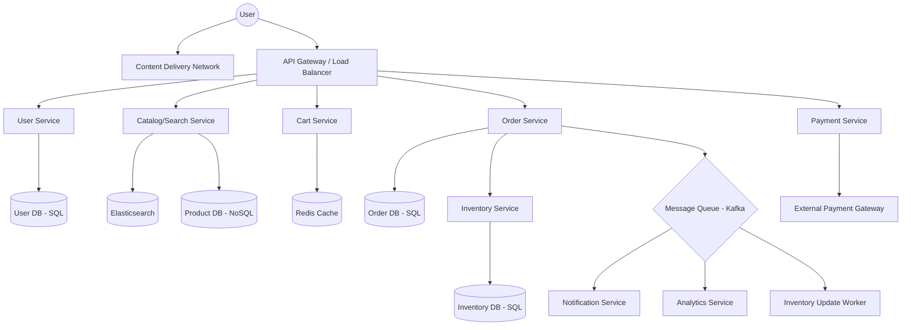

# System Design Document: Global E-commerce Platform

## 1. Requirements & System Constraints

### 1.1 Functional Requirements
*   **User Management:** User registration, authentication, profile management, and address books.
*   **Product Catalog:** Browsing products, searching with filters, and viewing detailed product pages.
*   **Shopping Cart:** Ability to add/remove items and persist the cart across sessions.
*   **Order Processing:** Checkout flow, order placement, and order history.
*   **Inventory Management:** Real-time tracking of stock levels and preventing overselling.
*   **Payment Integration:** Integration with third-party gateways (Stripe, PayPal) and payment status tracking.
*   **Reviews & Ratings:** Users can rate and review products they have purchased.

### 1.2 Non-Functional Requirements
*   **High Availability:** The system must be available 24/7, especially during peak sale events (e.g., Black Friday).
*   **Scalability:** Must handle millions of concurrent users and hundreds of millions of SKUs.
*   **Strong Consistency:** Required for Inventory and Payments (ACID compliance).
*   **Eventual Consistency:** Acceptable for Product Search, Reviews, and Recommendations.
*   **Low Latency:** Product discovery and browsing must be extremely fast (< 100ms).

### 1.3 Scale Estimations (High Level)
*   **Daily Active Users (DAU):** 10 Million.
*   **Average Orders per Day:** 1 Million.
*   **Peak Traffic:** 10x normal load during flash sales.
*   **Product Catalog Size:** 100 Million items.
*   **Read/Write Ratio:** Heavily read-intensive (approx. 100:1 for catalog browsing vs. ordering).

---

## 2. High-Level Architecture

The system follows a **Microservices Architecture** to ensure independent scalability and deployment of core business domains.

### 2.1 Architecture Diagram (Mermaid)



### 2.2 Component Descriptions
*   **API Gateway:** Handles authentication, rate limiting, request routing, and load balancing.
*   **Catalog Service:** Manages product data. Uses Elasticsearch for high-performance full-text search and filtering.
*   **Cart Service:** A lightweight service using an in-memory store (Redis) for low-latency updates.
*   **Order Service:** Orchestrates the checkout process. Ensures the transition from "Pending" to "Paid" to "Shipped".
*   **Inventory Service:** The "Source of Truth" for stock. Uses pessimistic locking or distributed locks to prevent overselling.
*   **Payment Service:** Wraps external API calls and handles webhooks for asynchronous payment confirmation.
*   **Notification Service:** Consumes events from Kafka to send emails/push notifications asynchronously.

---

## 3. Detailed Database Schema Design

The system uses **Polyglot Persistence** based on the specific needs of each service.

### 3.1 User Service (Relational - PostgreSQL)
*Used for ACID compliance on user accounts and security.*
*   **Users Table:** `user_id (PK)`, `email (Unique)`, `password_hash`, `created_at`, `updated_at`.
*   **Addresses Table:** `address_id (PK)`, `user_id (FK)`, `street`, `city`, `state`, `zip_code`, `is_default`.

### 3.2 Catalog Service (NoSQL - MongoDB & Elasticsearch)
*Used for flexible schema (different attributes for electronics vs. clothing) and fast search.*
*   **Products Collection (MongoDB):** 
    *   `product_id (PK)`, `name`, `description`, `category_id`, `brand`, `base_price`, `attributes (Map/JSON)`, `created_at`.
*   **Categories Collection:** `category_id (PK)`, `name`, `parent_category_id`.
*   **Search Index (Elasticsearch):** Denormalized view of `product_id`, `name`, `description`, `category`, `price`, `tags`.

### 3.3 Cart Service (Key-Value - Redis)
*Used for temporary storage with TTL.*
*   **Key:** `cart:{user_id}`
*   **Value:** `List<{product_id, quantity, added_at}>`

### 3.4 Order Service (Relational - PostgreSQL)
*Used for financial integrity and audit trails.*
*   **Orders Table:** `order_id (PK)`, `user_id (FK)`, `total_amount`, `order_status (Enum)`, `shipping_address_id`, `created_at`.
*   **Order_Items Table:** `item_id (PK)`, `order_id (FK)`, `product_id`, `quantity`, `price_at_purchase`.

### 3.5 Inventory Service (Relational - PostgreSQL)
*Strict consistency is paramount.*
*   **Inventory Table:** `product_id (PK)`, `stock_quantity`, `reserved_quantity`, `version (for optimistic locking)`.

---

## 4. Core API Design

### 4.1 Product Search & Discovery
`GET /v1/products?query=laptop&category=electronics&sort=price_asc&page=1&size=20`
*   **Response:**
    ```json
    {
      "products": [
        {"id": "p123", "name": "MacBook Pro", "price": 2499.00, "rating": 4.8, "thumbnail": "url"}
      ],
      "total": 150,
      "pages": 8
    }
    ```

### 4.2 Cart Management
`POST /v1/cart/items`
*   **Payload:** `{"product_id": "p123", "quantity": 1}`
*   **Response:** `201 Created`

### 4.3 Order Placement (Checkout)
`POST /v1/orders`
*   **Payload:** 
    ```json
    {
      "shipping_address_id": "addr_456",
      "payment_method_id": "pm_789",
      "cart_id": "cart_001"
    }
    ```
*   **Response:** `202 Accepted` (Processing asynchronously).

### 4.4 Payment Webhook (Internal/External)
`POST /v1/payments/webhook`
*   **Payload:** `{"order_id": "ord_999", "status": "SUCCESS", "transaction_id": "tx_abc"}`

---

## 5. Scalability & Advanced Topics

### 5.1 Caching Strategy
*   **Edge Caching (CDN):** Static assets (images, CSS, JS) and semi-static product pages are cached at the edge.
*   **Distributed Cache (Redis):** 
    *   **Session Store:** User authentication tokens.
    *   **Hot Products:** Top 1% of products that generate 90% of traffic are cached to reduce DB load.
    *   **Read-through Cache:** Catalog service checks Redis before hitting MongoDB.

### 5.2 Database Scalability
*   **Read Replicas:** Used for User and Order DBs to handle heavy read traffic.
*   **Sharding:**
    *   **Order DB:** Sharded by `user_id` to ensure all orders for a single user reside on one shard.
    *   **Product DB:** Sharded by `category_id` or `product_id` using a consistent hashing algorithm.

### 5.3 Handling Concurrent Inventory (Flash Sales)
To prevent overselling:
1.  **Distributed Locking:** Use Redis Redlock to lock a product ID during the checkout transition.
2.  **Optimistic Locking:** Use a `version` column in the SQL DB: 
    `UPDATE inventory SET stock = stock - 1, version = version + 1 WHERE product_id = ? AND version = ? AND stock > 0;`
3.  **Inventory Reservation:** When a user hits "Checkout", reserve stock for 15 minutes. If payment fails or timer expires, release stock via a TTL-based event.

### 5.4 Message Queues (Kafka)
*   **Order Pipeline:** `OrderPlaced` $\rightarrow$ `PaymentProcessed` $\rightarrow$ `InventoryDeducted` $\rightarrow$ `ShipmentTriggered`.
*   **Decoupling:** The Order service does not wait for the Email service to send a confirmation; it pushes an event to Kafka.

---

## 6. Trade-off Analysis

| Trade-off | Decision | Reasoning |
| :--- | :--- | :--- |
| **Consistency vs Availability** | **Mixed (PACELC)** | For **Catalog/Search**, we prioritize Availability (AP). For **Inventory/Payment**, we prioritize Consistency (CP). |
| **SQL vs NoSQL** | **Polyglot** | SQL is essential for transactions (Orders/Inventory). NoSQL (MongoDB/Elasticsearch) is essential for flexible attributes and high-speed searching. |
| **Sync vs Async** | **Async Checkout** | Making the checkout synchronous would create bottlenecks. Using a "Pending" state and Kafka allows the system to handle bursts and retry failed steps. |
| **Latency vs Storage** | **Denormalization** | We denormalize product data into Elasticsearch. This increases storage cost but reduces latency from seconds (complex SQL joins) to milliseconds. |
| **Strong vs Eventual Consistency** | **Eventual (Reviews)** | Product reviews do not need to appear instantly for all users worldwide. Eventual consistency via Kafka allows the system to scale. |