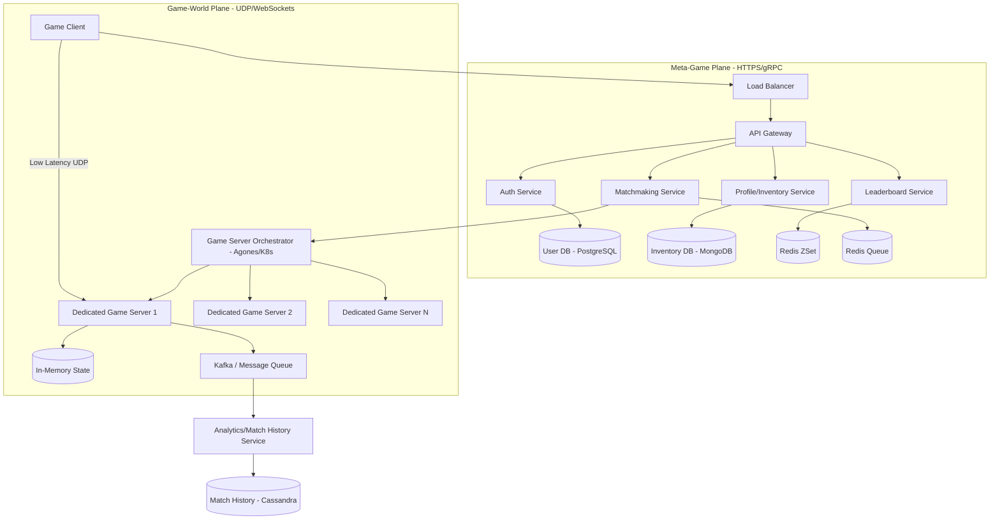

# System Design: High-Performance Multiplayer Game Backend

## 1. Requirements & System Constraints

### 1.1 Functional Requirements
*   **User Management:** Authentication, profile management, and friend lists.
*   **Matchmaking:** Grouping players based on skill level (Elo/MMR), latency (region), and game mode.
*   **Real-time Gameplay:** Low-latency state synchronization for player movement, actions, and combat.
*   **Game Session Management:** Orchestration of dedicated game servers to host matches.
*   **Leaderboards:** Real-time global and regional rankings.
*   **Persistence:** Saving player progress, inventory, and match history.

### 1.2 Non-Functional Requirements
*   **Ultra-Low Latency:** Critical for "twitch" gameplay. Target round-trip time (RTT) $< 50\text{--}100\text{ms}$.
*   **High Scalability:** Support for millions of Daily Active Users (DAU) and hundreds of thousands of Concurrent Users (CCU).
*   **Availability:** High availability for the meta-game (store, profiles), while individual game sessions are isolated (if one server crashes, only that match is affected).
*   **Consistency:** Strong consistency for inventory/purchases; eventual consistency for leaderboards; strict authoritative state for active game sessions.

### 1.3 Scale Estimations
*   **CCU:** 100,000 concurrent players.
*   **Game Server Capacity:** Assume 100 players per match (Battle Royale style).
*   **Active Game Servers:** $\sim 1,000$ concurrent instances.
*   **Tick Rate:** 30Hz to 60Hz (updates per second).
*   **Traffic:** 100k users $\times$ 30 updates/sec $\approx$ 3 million packets per second across the fleet.

---

## 2. High-Level Architecture

The system is split into two primary planes: the **Meta-Game Plane** (Request-Response, REST/gRPC) and the **Game-World Plane** (Real-time, UDP/WebSockets).

### 2.1 Architecture Diagram



### 2.2 Component Breakdown
1.  **API Gateway:** Handles authentication, rate limiting, and routing to microservices.
2.  **Matchmaking Service:** Uses a ticket-based system. Players enter a queue; the service groups them by MMR and region, then requests a game server from the Orchestrator.
3.  **Game Server Orchestrator (Agones):** Built on Kubernetes, it manages the lifecycle of Dedicated Game Servers (DGS). It handles scaling, health checks, and assigning "Allocated" status to servers when a match is found.
4.  **Dedicated Game Server (DGS):** The authoritative source of truth for the game simulation. It runs the physics engine and validates all client inputs to prevent cheating.
5.  **Event Bus (Kafka):** DGS sends match results and telemetry to Kafka to decouple the high-speed game loop from slow database writes.

---

## 3. Detailed Database Schema Design

### 3.1 User & Profile (PostgreSQL)
Used for critical data requiring ACID compliance.
*   **Users Table:** `user_id (PK)`, `username`, `email`, `password_hash`, `created_at`.
*   **Profiles Table:** `user_id (FK)`, `mmr_score`, `level`, `experience`, `region_id`.
*   **Index:** B-Tree index on `username` and `email`.

### 3.2 Inventory (MongoDB)
Used for flexible schema (different item types/attributes).
*   **Collection `inventories`:**
    ```json
    {
      "user_id": "UUID",
      "items": [
        { "item_id": "skin_01", "acquired_at": "timestamp", "attributes": { "color": "gold" } },
        { "item_id": "weapon_05", "level": 10 }
      ]
    }
    ```
*   **Index:** Sharded by `user_id`.

### 3.3 Leaderboards (Redis)
Uses **Sorted Sets (ZSET)** for $O(\log N)$ insertions and range queries.
*   **Key:** `leaderboard:global` or `leaderboard:region:us_east`.
*   **Score:** `mmr_score`.
*   **Value:** `user_id`.

### 3.4 Match History (Cassandra)
Optimized for high-volume writes and time-series retrieval.
*   **Table `match_history`:**
    *   Partition Key: `user_id`
    *   Clustering Key: `match_id` (Descending)
    *   Fields: `game_mode`, `result` (Win/Loss), `kills`, `duration`, `timestamp`.

---

## 4. Core API Design

### 4.1 Meta-Game APIs (REST)

| Endpoint | Method | Payload | Description |
| :--- | :--- | :--- | :--- |
| `/auth/login` | `POST` | `{user, pass}` | Returns JWT and Session ID. |
| `/profile` | `GET` | `Header: JWT` | Returns player stats and inventory. |
| `/match/join` | `POST` | `{game_mode, region}` | Adds player to matchmaking queue. |
| `/match/status` | `GET` | `{ticket_id}` | Polls for match status $\rightarrow$ returns DGS IP/Port. |
| `/leaderboard` | `GET` | `{region, limit}` | Returns top $N$ players. |

**Example `/match/status` Response:**
```json
{
  "status": "MATCH_FOUND",
  "server_address": "1.2.3.4",
  "port": 7777,
  "access_token": "secure_session_token_abc123"
}
```

### 4.2 Game-World Protocol (UDP/Custom Binary)
To minimize overhead, the DGS does not use JSON. It uses a binary format (e.g., **Protocol Buffers** or **FlatBuffers**).

**Packet Structure (Simplified):**
`[PacketHeader (4b)] [SequenceID (4b)] [Payload (Nb)] [Checksum (2b)]`

**Payload Examples:**
*   `PlayerInput`: `{ input_id, movement_vector, action_bits, timestamp }`
*   `GameStateUpdate`: `{ tick_id, [ { player_id, pos_x, pos_y, rot, state }, ... ] }`

---

## 5. Scalability & Advanced Topics

### 5.1 Latency Mitigation (The "Netcode")
Because the speed of light is a constant, we use several techniques to hide lag:
*   **Client-Side Prediction:** The client applies inputs immediately to the local avatar without waiting for server confirmation.
*   **Server Reconciliation:** The server sends the authoritative state. If the client's predicted state differs, the client "snaps" or smoothly interpolates to the server's state.
*   **Entity Interpolation:** Clients render other players slightly in the past (e.g., 100ms) to smoothly interpolate between received state packets.
*   **Lag Compensation (Backtracking):** For combat (e.g., shooting), the server rewinds the world state to the time the player fired the shot (based on their timestamp) to determine if it was a hit.

### 5.2 Matchmaking Scalability
To avoid a single bottleneck:
*   **Regional Queues:** Partition matchmaking by region (e.g., `queue:us_east`, `queue:eu_west`).
*   **Bucket-based Matching:** Group players into MMR buckets (e.g., 1000-1100). This reduces the search space from $O(N^2)$ to $O(N)$ within buckets.

### 5.3 Dedicated Game Server (DGS) Lifecycle
Using **Agones** on Kubernetes:
1.  **Fleet:** K8s maintains a pool of `Ready` game server pods.
2.  **Allocation:** Matchmaker calls Agones API $\rightarrow$ Agones marks a pod as `Allocated` $\rightarrow$ IP/Port returned.
3.  **Termination:** Once the match ends, the DGS signals Agones $\rightarrow$ Pod is shut down or recycled.

### 5.4 Fault Tolerance
*   **Stateless Meta-services:** All API services are stateless; load balancers distribute traffic.
*   **Zonal Redundancy:** Deploy DGS fleets across multiple availability zones to prevent total region blackout.
*   **Circuit Breakers:** Prevent the Matchmaking service from crashing the User DB during login spikes.

---

## 6. Trade-off Analysis

### 6.1 CAP Theorem Priorities
*   **Meta-Game (Profile/Store):** Prioritizes **Consistency and Partition Tolerance (CP)**. It is better to fail a purchase than to duplicate an item (Double Spend).
*   **Game Simulation:** Prioritizes **Availability and Partition Tolerance (AP)**. The game loop cannot pause to wait for a database update. We use an authoritative server with local state and asynchronous persistence.

### 6.2 UDP vs. TCP
*   **TCP:** Too slow due to head-of-line blocking (a single lost packet stalls all subsequent packets).
*   **UDP:** Fast, but unreliable.
*   **Hybrid Approach:** Use **Reliable UDP**. Critical events (e.g., "Player Died", "Game Over") are acknowledged and retransmitted. Ephemeral events (e.g., "Player Position") are sent without acknowledgement; if one is lost, the next update will correct it.

### 6.3 Latency vs. Storage
We sacrifice storage (by keeping redundant match logs and telemetry in Cassandra) to ensure that the "hot path" (DGS $\rightarrow$ Client) is completely devoid of disk I/O. All active game state is kept in RAM.