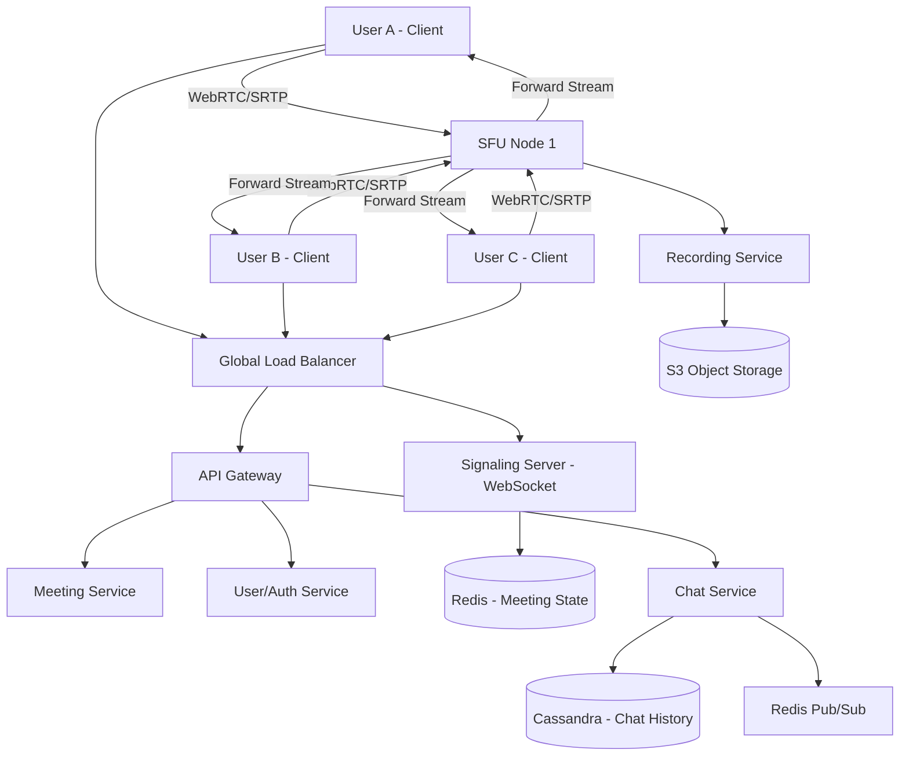

# System Design: Real-time Video Conferencing System (Zoom Clone)

## 1. Requirements & System Constraints

### 1.1 Functional Requirements
*   **Meeting Management:** Users can create a meeting, schedule a meeting, and join a meeting via a unique Meeting ID or URL.
*   **Real-time Media Streaming:** High-quality, low-latency audio and video streaming for multiple participants.
*   **Screen Sharing:** Ability for one or more participants to share their screen.
*   **Real-time Messaging:** In-meeting text chat.
*   **Meeting Controls:** Mute/unmute, camera on/off, and the ability for the host to kick participants.
*   **Recording:** Ability to record the session and store it for later playback.
*   **User Management:** Authentication, profiles, and contact lists.

### 1.2 Non-Functional Requirements
*   **Ultra-Low Latency:** End-to-end latency should be $< 200\text{ms}$ to ensure natural conversation.
*   **High Availability:** The system must be available $99.99\%$ of the time.
*   **Scalability:** Support millions of concurrent users and meetings of varying sizes (from 1-on-1 to 1,000+ participants).
*   **Reliability:** Graceful degradation (e.g., drop video quality before dropping audio).
*   **Global Reach:** Users should connect to the nearest data center to minimize jitter and lag.

### 1.3 Scale Estimations
*   **Daily Active Users (DAU):** 10 Million.
*   **Peak Concurrent Users (PCU):** 1 Million.
*   **Average Meeting Size:** 5–10 participants.
*   **Bandwidth (Approx):** 
    *   Audio: $\sim 50\text{--}100\text{ kbps}$.
    *   Video (720p): $\sim 1.5\text{--}2.5\text{ Mbps}$ per stream.
*   **Total Peak Bandwidth:** $1\text{M users} \times 2\text{ Mbps} \approx 2\text{ Tbps}$ (distributed across global SFUs).

---

## 2. High-Level Architecture

### 2.1 Core Components
1.  **Client Application:** Web/Mobile app implementing WebRTC for media capture and transmission.
2.  **Signaling Server:** A WebSocket-based service that coordinates the connection between participants (exchange of SDP - Session Description Protocol and ICE candidates).
3.  **SFU (Selective Forwarding Unit):** The heart of the media plane. Unlike an MCU (Multipoint Control Unit) which mixes streams, the SFU forwards encrypted media packets from one sender to multiple receivers without transcoding, reducing server CPU load.
4.  **Meeting Service:** Manages the lifecycle of a meeting (creation, joining, participant lists).
5.  **User/Auth Service:** Handles identity and access management.
6.  **Chat Service:** Manages real-time text messaging using Pub/Sub.
7.  **Recording Service:** Captures the media streams from the SFU, transcodes them, and uploads them to object storage.

### 2.2 Architecture Diagram (Mermaid)

### 2.3 Media Flow
1.  **Signaling:** User A creates a meeting. The Meeting Service assigns a Meeting ID and an available SFU. User B joins; the Signaling Server exchanges SDP (capabilities) and ICE candidates (network paths) between User A, User B, and the SFU.
2.  **Streaming:** User A sends one stream to the SFU. The SFU forwards that stream to User B and User C.
3.  **Optimization:** The SFU uses **Simulcast** (sender sends 3 quality levels: low, med, high). The SFU forwards the level appropriate for each receiver's bandwidth.

---

## 3. Detailed Database Schema Design

### 3.1 Database Selection
*   **PostgreSQL (Relational):** Used for User profiles and Meeting metadata where ACID compliance and complex querying (e.g., scheduling) are required.
*   **Redis (In-Memory):** Used for real-time meeting state (who is in which room, which SFU is being used) and Signaling session management.
*   **Cassandra (NoSQL):** Used for chat history due to high write throughput and time-series nature.
*   **S3 (Object Store):** Used for storing recorded video files.

### 3.2 Schema Definitions

#### User Table (PostgreSQL)
| Field | Type | Key | Description |
| :--- | :--- | :--- | :--- |
| `user_id` | UUID | PK | Unique identifier for user |
| `email` | VARCHAR(255)| Unique | User email |
| `password_hash`| TEXT | | Hashed password |
| `created_at` | TIMESTAMP | | Account creation date |

#### Meeting Table (PostgreSQL)
| Field | Type | Key | Description |
| :--- | :--- | :--- | :--- |
| `meeting_id` | UUID | PK | Unique meeting ID |
| `host_id` | UUID | FK | User who created the meeting |
| `start_time` | TIMESTAMP | | Scheduled start time |
| `status` | ENUM | | Scheduled, Active, Ended |
| `settings` | JSONB | | Recording enabled, Mute on entry, etc. |

#### Participant Table (PostgreSQL)
| Field | Type | Key | Description |
| :--- | :--- | :--- | :--- |
| `meeting_id` | UUID | FK/PK | Meeting identifier |
| `user_id` | UUID | FK/PK | User identifier |
| `joined_at` | TIMESTAMP | | Join timestamp |
| `role` | ENUM | | Host, Co-host, Participant |

#### Chat Messages (Cassandra)
*   **Partition Key:** `meeting_id`
*   **Clustering Key:** `timestamp` (descending)
*   **Fields:** `message_id (UUID)`, `user_id (UUID)`, `content (Text)`, `timestamp (Long)`.

---

## 4. Core API Design

### 4.1 Meeting Management
**Create Meeting**
`POST /v1/meetings`
*   **Request:** `{ "userId": "uuid", "startTime": "iso-timestamp", "settings": { "isPrivate": true } }`
*   **Response:** `201 Created { "meetingId": "uuid", "joinUrl": "https://zoom.clone/j/uuid" }`

**Join Meeting**
`POST /v1/meetings/{meetingId}/join`
*   **Request:** `{ "userId": "uuid", "token": "auth-token" }`
*   **Response:** `200 OK { "sfuAddress": "sfu-region-1.zoom.clone", "signalingToken": "jwt-token" }`

### 4.2 Meeting Controls
**Update Participant Status**
`PATCH /v1/meetings/{meetingId}/participants/{userId}`
*   **Request:** `{ "mute": true, "videoOff": false }`
*   **Response:** `200 OK`

### 4.3 Real-time Signaling (WebSocket)
The Signaling Server doesn't use REST but WebSocket frames:
*   **Client $\rightarrow$ Server:** `{"type": "offer", "sdp": "...", "meetingId": "uuid"}`
*   **Server $\rightarrow$ Client:** `{"type": "answer", "sdp": "...", "from": "userId"}`
*   **Client $\rightarrow$ Server:** `{"type": "ice-candidate", "candidate": "...", "meetingId": "uuid"}`

---

## 5. Scalability & Advanced Topics

### 5.1 Media Optimization (SFU Strategies)
*   **Simulcast:** The client uploads three versions of the video (180p, 360p, 720p). The SFU decides which one to forward based on the receiver's downlink.
*   **SVC (Scalable Video Coding):** An advanced version of simulcast where a single stream contains multiple layers of quality.
*   **Dynamic Forwarding:** The SFU prioritizes the "Active Speaker" stream (high quality) and down-samples the other participants (low quality) to save bandwidth.

### 5.2 Load Balancing & Geo-Routing
*   **Geo-DNS:** Users are routed to the closest data center via Anycast IP or Geo-DNS.
*   **SFU Orchestrator:** A global service that tracks the CPU/Bandwidth load of all SFU nodes. When a meeting is created, the orchestrator assigns the SFU node with the lowest load in the closest region.

### 5.3 Fault Tolerance & Reliability
*   **SFU Failover:** If an SFU node crashes, the signaling server detects the disconnect and triggers a "Re-join" event. Clients automatically reconnect to a backup SFU node.
*   **Jitter Buffer:** Implemented on the client side to handle packets arriving out of order or with varying delay.
*   **Packet Loss Concealment (PLC):** Use of FEC (Forward Error Correction) to reconstruct lost audio packets.

### 5.4 Recording Pipeline
1.  **SFU Sidecar:** The SFU forks the media streams to a Recording Worker.
2.  **Composition:** The Recording Worker (using FFmpeg) composites multiple streams into a single MP4 file or saves them as raw streams.
3.  **Asynchronous Upload:** The resulting file is uploaded to S3, and a webhook notifies the User Service to mark the recording as "Ready".

---

## 6. Trade-off Analysis

### 6.1 SFU vs. MCU vs. Mesh
*   **Mesh (P2P):** Low server cost, but $O(N^2)$ bandwidth on client. Unusable for $> 3$ participants.
*   **MCU:** Server mixes all video into one stream. Lowest client bandwidth, but extremely high server CPU cost (transcoding).
*   **SFU (Chosen):** Server forwards packets. Balanced CPU cost and bandwidth. Requires clients to decode multiple streams, but this is acceptable for modern devices.

### 6.2 CAP Theorem Priorities
*   **Signaling/Meeting State:** Prioritizes **Availability and Partition Tolerance (AP)**. If a user's "Mute" status takes 1 second to propagate to others, it is acceptable. Eventual consistency via Redis is sufficient.
*   **User Auth/Billing:** Prioritizes **Consistency and Partition Tolerance (CP)**. We cannot allow duplicate account creation or incorrect billing.

### 6.3 Latency vs. Quality
*   **UDP vs TCP:** We use **UDP** (via SRTP) for media. TCP's retransmission mechanism (Head-of-Line blocking) causes unacceptable lag in real-time video. We prefer losing a few frames (packet loss) over delaying the entire stream to wait for a retransmission.