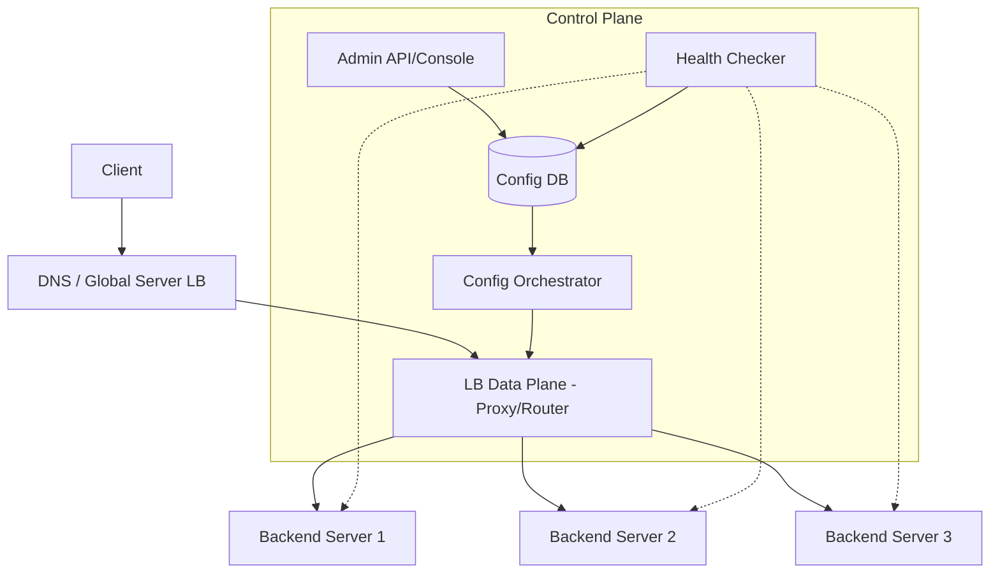

# System Design Guide: Load Balancer Routing Logic

## 1. Requirements & System Constraints

The objective is to design the routing logic for a high-performance Load Balancer (LB) capable of distributing incoming network traffic across a pool of backend servers to ensure reliability, availability, and optimal resource utilization.

### 1.1 Functional Requirements
*   **Routing Algorithms**: Support multiple distribution strategies:
    *   **Round Robin**: Sequential distribution.
    *   **Weighted Round Robin**: Distribution based on server capacity.
    *   **Least Connections**: Routing to the server with the fewest active requests.
    *   **Consistent Hashing**: Mapping requests to servers based on a key (e.g., Client IP, User ID) to ensure session persistence.
*   **Health Monitoring**: Continuously monitor backend server health and automatically remove unhealthy nodes from the rotation.
*   **Session Persistence (Sticky Sessions)**: Ensure a client is routed to the same backend server for the duration of a session.
*   **Dynamic Configuration**: Ability to add or remove backend servers without downtime.

### 1.2 Non-Functional Requirements
*   **Ultra-Low Latency**: The routing decision must be made in microseconds to avoid becoming a bottleneck.
*   **High Availability**: The LB must not be a Single Point of Failure (SPOF).
*   **Scalability**: Capable of handling millions of requests per second (RPS).
*   **Fault Tolerance**: Graceful degradation if a subset of backend servers fails.

### 1.3 Scale Estimations
*   **Traffic**: 1 Million Requests Per Second (RPS).
*   **Backend Pool**: 10 to 1,000 servers per cluster.
*   **Latency Budget**: Routing overhead < 1ms.

---

## 2. High-Level Architecture

The system is split into two primary planes: the **Control Plane** (management and configuration) and the **Data Plane** (the high-speed request path).

### 2.1 Architecture Diagram



### 2.2 Component Descriptions
*   **LB Data Plane**: The "Hot Path." It intercepts packets, applies the routing logic stored in local memory, and forwards the request.
*   **Control Plane**: Manages the "Source of Truth." It handles the registration of servers and the definition of routing policies.
*   **Health Checker**: An active probe service that sends heartbeats (TCP/HTTP) to backends. If a server fails $N$ consecutive checks, it is marked "Unhealthy."
*   **Config Orchestrator**: Pushes configuration updates (e.g., new server lists) to the Data Plane using a pub/sub mechanism or a configuration provider (like etcd or Consul).

---

## 3. Detailed Design: Routing Logic

### 3.1 Routing Algorithm Implementations

#### A. Round Robin & Weighted Round Robin
*   **Logic**: Maintain an index pointer. For Weighted RR, create a virtual list where servers appear proportional to their weight.
*   **Complexity**: $O(1)$.
*   **Use Case**: Homogeneous workloads where all requests have similar resource costs.

#### B. Least Connections
*   **Logic**: Maintain a counter of active connections per server. The LB selects the server with the minimum count.
*   **Complexity**: $O(1)$ with a Min-Heap or $O(N)$ for small $N$.
*   **Use Case**: Long-lived connections (e.g., WebSockets, database streams).

#### C. Consistent Hashing
*   **Logic**: Map servers and request keys (e.g., `hash(client_ip)`) onto a logical ring (0 to $2^{32}-1$). The request is routed to the first server encountered moving clockwise on the ring.
*   **Complexity**: $O(\log N)$ using binary search on the ring.
*   **Use Case**: Statefull services, caching layers (to maximize cache hit rates).

### 3.2 Database Schema (Control Plane)

Since configuration changes are infrequent compared to request volume, a Relational Database (PostgreSQL) is used for strong consistency, while the Data Plane uses an in-memory cache.

**Table: `clusters`**
| Field | Type | Key | Description |
| :--- | :--- | :--- | :--- |
| `cluster_id` | UUID | PK | Unique ID for the server group |
| `name` | String | Index | Human-readable name |
| `routing_policy` | Enum | - | RR, WRR, LC, CH |
| `health_check_interval`| Int | - | Seconds between probes |

**Table: `backend_nodes`**
| Field | Type | Key | Description |
| :--- | :--- | :--- | :--- |
| `node_id` | UUID | PK | Unique ID for the server |
| `cluster_id` | UUID | FK | Reference to the cluster |
| `ip_address` | String | - | Server IP |
| `port` | Int | - | Server Port |
| `weight` | Int | - | Weight for WRR |
| `status` | Enum | Index | Healthy, Unhealthy, Draining |

---

## 4. Core API Design

The Control Plane provides REST endpoints for administrative tasks.

### 4.1 Add Backend Node
`POST /api/v1/clusters/{cluster_id}/nodes`
**Request:**
```json
{
  "ip_address": "10.0.0.5",
  "port": 8080,
  "weight": 10
}
```
**Response:** `201 Created`

### 4.2 Update Routing Policy
`PATCH /api/v1/clusters/{cluster_id}`
**Request:**
```json
{
  "routing_policy": "CONSISTENT_HASHING"
}
```
**Response:** `200 OK`

### 4.3 Get Cluster Health
`GET /api/v1/clusters/{cluster_id}/health`
**Response:**
```json
{
  "cluster_id": "uuid-123",
  "healthy_nodes": 45,
  "unhealthy_nodes": 2,
  "nodes": [
    {"node_id": "n1", "status": "HEALTHY", "latency": "12ms"},
    {"node_id": "n2", "status": "UNHEALTHY", "latency": "N/A"}
  ]
}
```

---

## 5. Scalability & Advanced Topics

### 5.1 L4 vs L7 Load Balancing
*   **L4 (Transport Layer)**: Routes based on IP and Port. Faster, less CPU intensive, no visibility into HTTP headers. (e.g., Maglev, LVS).
*   **L7 (Application Layer)**: Routes based on URL, Cookies, or Headers. Allows for "Canary Deployments" and "A/B Testing." (e.g., Nginx, HAProxy, Envoy).

### 5.2 Avoiding the LB Single Point of Failure
*   **Anycast IP**: Use BGP to announce the same IP address from multiple LB nodes globally.
*   **VRRP (Virtual Router Redundancy Protocol)**: A "Master-Backup" setup where the backup takes over the Virtual IP (VIP) if the master fails.

### 5.3 Health Check Optimization
*   **Active Probing**: LB sends periodic pings.
*   **Passive Probing**: LB observes actual traffic. If a server returns five consecutive 5xx errors, it is marked unhealthy.

### 5.4 Handling "Thundering Herd"
When a server recovers from failure, it may be overwhelmed by a sudden surge of traffic.
*   **Slow Start Mode**: Gradually increase the weight of a newly healthy server over a period of time (e.g., 0% $\rightarrow$ 100% over 2 minutes).

---

## 6. Trade-off Analysis

| Trade-off | Selection | Reasoning |
| :--- | :--- | :--- |
| **Consistency vs. Availability** | **Availability (AP)** | In a routing scenario, it is better to route a request to a slightly suboptimal server (Availability) than to fail the request because the LB is waiting for the latest config update (Consistency). |
| **Least Conn vs. Round Robin** | **Round Robin** | RR has $O(1)$ complexity and requires no shared state between LB instances. Least Conn requires tracking global active connections, which adds overhead in distributed LB setups. |
| **L4 vs L7** | **Hybrid** | Use L4 for initial high-volume entry (performance) and L7 for internal microservice routing (flexibility/logic). |
| **Stateful vs Stateless** | **Stateless** | By using Consistent Hashing based on the request key rather than storing session IDs in the LB memory, the LB remains stateless and easier to scale horizontally. |