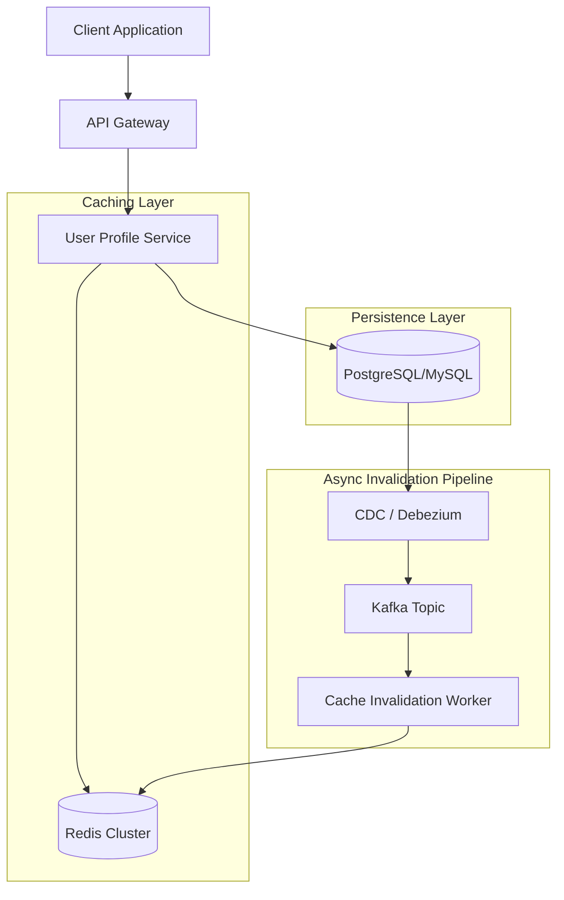

# System Design Guide: Redis Caching & Write Invalidation Policies

## 1. Requirements & System Constraints

### 1.1 Problem Statement
In a distributed system, maintaining data consistency between a fast-access cache (Redis) and a persistent system of record (Database) is a critical challenge. This design focuses on implementing various **Write Policies** to ensure that the cache does not serve stale data after an update occurs in the primary database.

### 1.2 Functional Requirements
*   **Low Latency Reads:** Frequent data access must be served from Redis to minimize DB load.
*   **Data Consistency:** The system must provide a mechanism to invalidate or update the cache when the underlying data changes.
*   **Reliable Persistence:** All writes must eventually be persisted to the database.

### 1.3 Non-Functional Requirements
*   **High Availability:** The caching layer should not be a single point of failure.
*   **Scalability:** The solution must handle linear growth in read/write traffic.
*   **Tunable Consistency:** Depending on the use case, the system should allow a choice between strong consistency (Write-Through) and eventual consistency (Write-Back).

### 1.4 Scale Estimations (Example Scenario)
*   **Daily Active Users (DAU):** 10 Million.
*   **Read/Write Ratio:** 100:1 (Read-heavy).
*   **Read Throughput:** 100k Requests Per Second (RPS).
*   **Write Throughput:** 1k RPS.
*   **Average Object Size:** 2KB.
*   **Cache Size Requirement:** $10^7 \text{ users} \times 2\text{KB} \approx 20\text{GB}$ (easily manageable by a small Redis cluster).

---

## 2. High-Level Architecture

The architecture follows a standard layered approach where the Application Service acts as the orchestrator between the Cache and the Database.

### 2.1 Architecture Diagram



### 2.2 Component Interactions
1.  **Client:** Requests data or updates data via the API Gateway.
2.  **User Profile Service:** Implements the chosen cache write policy (see Section 5).
3.  **Redis Cluster:** Stores hot data as Key-Value pairs with associated TTLs (Time-to-Live).
4.  **Database:** The source of truth for all user profile data.
5.  **CDC Pipeline (Advanced):** Captures database changes in real-time to invalidate cache keys asynchronously, reducing application-layer complexity.

---

## 3. Detailed Database Schema Design

### 3.1 Primary Database (SQL - PostgreSQL)
We use a relational database to ensure ACID compliance for user profile updates.

**Table: `user_profiles`**
| Field | Type | Constraint | Description |
| :--- | :--- | :--- | :--- |
| `user_id` | UUID | PK | Unique identifier for the user |
| `username` | VARCHAR(50) | Unique, Indexed | User's handle |
| `email` | VARCHAR(255) | Unique, Indexed | User's contact email |
| `bio` | TEXT | - | User profile description |
| `updated_at` | TIMESTAMP | Indexed | Used for versioning/conflict detection |

**Index Selection:**
*   B-Tree index on `user_id` (Default PK).
*   B-Tree index on `username` and `email` for fast lookups.

### 3.2 Cache Schema (Redis)
Data is stored as a **Redis Hash** to allow partial updates of fields.

**Key Pattern:** `user:profile:{user_id}`
**Value Structure:**
*   `username` $\rightarrow$ "john_doe"
*   `email` $\rightarrow$ "john@example.com"
*   `bio` $\rightarrow$ "Software Architect"

**Reasoning:** Using Hashes instead of JSON strings reduces memory overhead and allows the service to fetch or update specific fields without transferring the entire object.

---

## 4. Core API Design

### 4.1 Read Profile
`GET /v1/profiles/{user_id}`

**Response:**
```json
{
  "user_id": "550e8400-e29b-41d4-a716-446655440000",
  "username": "john_doe",
  "email": "john@example.com",
  "bio": "Software Architect",
  "source": "cache" // Metadata to track if served from Redis or DB
}
```

### 4.2 Update Profile
`PUT /v1/profiles/{user_id}`

**Request Body:**
```json
{
  "bio": "Senior Staff Systems Architect",
  "email": "john_new@example.com"
}
```
**Response:** `200 OK` or `204 No Content`.

---

## 5. Scalability & Advanced Topics: Cache Write Policies

The core of this challenge is selecting the right write policy based on the consistency vs. latency trade-off.

### 5.1 Write-Through Cache
The application writes data to the cache and the database simultaneously.
*   **Flow:** `App` $\rightarrow$ `Write to Redis` $\rightarrow$ `Write to DB` $\rightarrow$ `Return Success`.
*   **Pros:** Strong consistency; cache is always up-to-date.
*   **Cons:** Higher write latency (two synchronous writes).

### 5.2 Write-Around Cache
Data is written directly to the database, bypassing the cache.
*   **Flow:** `App` $\rightarrow$ `Write to DB` $\rightarrow$ `Return Success`.
*   **Invalidation:** The corresponding cache key is either deleted (evicted) or left to expire via TTL.
*   **Pros:** Prevents "cache pollution" (writing data that may not be read again soon).
*   **Cons:** The first read after a write will always be a "cache miss," increasing read latency for updated data.

### 5.3 Write-Back (Write-Behind) Cache
Data is written to the cache immediately, and the database is updated asynchronously.
*   **Flow:** `App` $\rightarrow$ `Write to Redis` $\rightarrow$ `Return Success` $\rightarrow$ `Async Queue` $\rightarrow$ `DB Write`.
*   **Pros:** Extreme write performance; minimal latency.
*   **Cons:** Risk of data loss if Redis crashes before the async write to the DB completes.

### 5.4 Cache-Aside (Lazy Loading)
The most common pattern where the application manages the cache and DB independently.
*   **Read Flow:** Check Redis $\rightarrow$ if Miss $\rightarrow$ Read DB $\rightarrow$ Populate Redis $\rightarrow$ Return.
*   **Write Flow:** Write to DB $\rightarrow$ **Delete (Invalidate)** Redis key.
*   **Pros:** Resilient to cache failure; flexible.
*   **Cons:** Potential for "Cache Stampede" if a hot key expires and thousands of requests hit the DB simultaneously.

### 5.5 Mitigating Common Caching Issues
*   **Cache Stampede:** Use **distributed locking (Redlock)** or "Probabilistic Early Recomputation" to ensure only one request refills the cache.
*   **Cache Penetration:** Store "Null" values in Redis with a short TTL for keys that do not exist in the DB to prevent repeated DB hits for non-existent IDs.
*   **Cache Avalanche:** Introduce **jitter** (randomness) to TTLs so that thousands of keys do not expire at the exact same second.

---

## 6. Trade-off Analysis

| Policy | Consistency | Write Latency | Read Latency | Complexity | Use Case |
| :--- | :--- | :--- | :--- | :--- | :--- |
| **Write-Through** | High | High | Low | Medium | Critical data (e.g., User Permissions) |
| **Write-Around** | Medium | Low | Medium (1st read) | Low | Bulk data, rarely accessed updates |
| **Write-Back** | Low (Eventual) | Very Low | Low | High | Real-time counters, gaming leaderboards |
| **Cache-Aside** | Medium | Low | Low (after 1st read) | Low | General purpose web applications |

### CAP Theorem Application
*   **Prioritizing Consistency (CP):** Use **Write-Through**. Ensure the cache and DB are updated in a pseudo-transactional manner.
*   **Prioritizing Availability/Latency (AP):** Use **Write-Back** or **Cache-Aside** with a reasonable TTL. Accept that some users may see stale data for a few seconds.

### Latency vs. Storage
By using Redis Hashes instead of full-object serialization, we trade a small amount of CPU (to assemble the object in the app layer) for a significant reduction in memory usage and network bandwidth.