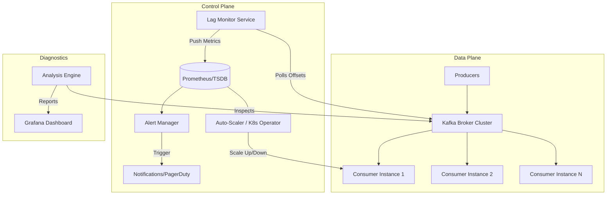

# Solution Guide: Handling and Mitigating Kafka Topic Partition Consumer Lag

## 1. Requirements & System Constraints

### 1.1 Problem Statement
In a high-throughput Kafka ecosystem, **Consumer Lag** occurs when the rate of production to a topic exceeds the rate of consumption by the consumer group. This leads to increased end-to-end latency, stale data for downstream systems, and potential disk pressure on Kafka brokers if retention policies are tight.

The objective is to design a robust system to monitor, alert, and automatically remediate consumer lag across thousands of partitions and multiple consumer groups.

### 1.2 Functional Requirements
*   **Real-time Monitoring:** Track the delta between the Log End Offset (LEO) and the Current Committed Offset for every partition in every consumer group.
*   **Alerting:** Trigger notifications (Slack, PagerDuty) when lag exceeds defined thresholds (either absolute record count or time-based).
*   **Auto-Scaling:** Dynamically increase consumer instances based on lag metrics (up to the number of partitions).
*   **Bottleneck Analysis:** Identify "hot partitions" caused by skewed keys.
*   **Remediation Control:** Provide mechanisms to temporarily increase processing power or reroute traffic.

### 1.3 Non-Functional Requirements
*   **Low Overhead:** The monitoring system must not introduce significant load on the Kafka brokers.
*   **High Availability:** The lag detection system must be decoupled from the data processing pipeline to ensure it remains operational during consumer crashes.
*   **Scalability:** Support millions of messages per second and thousands of partitions.
*   **Observability:** Provide a dashboard for visualizing lag trends over time.

### 1.4 Scale Estimations
*   **Topics:** 1,000+
*   **Partitions per Topic:** 10–100
*   **Consumer Groups:** 50+
*   **Message Throughput:** 1M+ events/sec
*   **Metric Resolution:** 10–30 second polling intervals.

---

## 2. High-Level Architecture

The architecture consists of a **Control Plane** (Monitoring & Scaling) and a **Data Plane** (Kafka & Consumers).

### 2.1 Core Components
1.  **Kafka Broker Cluster:** The source of offsets.
2.  **Lag Monitor Service:** A specialized service using the Kafka `AdminClient` to fetch the latest offsets and committed offsets.
3.  **Time-Series Database (TSDB):** Stores lag metrics for historical analysis and trend detection (e.g., Prometheus).
4.  **Alert Manager:** Evaluates metrics against thresholds and triggers alerts.
5.  **Auto-Scaler (K8s Operator):** Adjusts the replica count of consumer deployments based on lag data.
6.  **Analysis Engine:** Samples messages from lagging partitions to detect "poison pills" (malformed messages causing processing loops).

### 2.2 Architecture Diagram



---

## 3. Detailed Design

### 3.1 Metric Collection Strategy
To avoid overloading brokers, the **Lag Monitor Service** should not poll every single partition every second.
*   **Strategy:** Use the `AdminClient.listConsumerGroupOffsets` API to fetch offsets for an entire group in one call rather than per-partition.
*   **Calculation:** $\text{Lag} = \text{Log End Offset (LEO)} - \text{Current Committed Offset}$.

### 3.2 Database Schema Design
Since lag is a time-series metric, a traditional SQL database is suboptimal. We use a combination of a TSDB for metrics and a Relational DB for configuration.

#### A. TSDB (Prometheus/InfluxDB)
**Metric Name:** `kafka_consumer_lag`
*   **Labels:** `topic`, `partition`, `consumer_group`, `cluster_id`
*   **Value:** `integer` (number of messages)
*   **Timestamp:** `epoch`

#### B. Configuration DB (PostgreSQL) - For Thresholds
Used to store customized alerting rules per consumer group.

| Field | Type | Description | Index |
| :--- | :--- | :--- | :--- |
| `group_id` | VARCHAR(255) | Primary Key - The Kafka consumer group ID | PK |
| `topic_name` | VARCHAR(255) | Topic associated with the group | Index |
| `lag_threshold` | BIGINT | Max allowable lag before alerting | - |
| `time_threshold` | INT | Max allowable lag in seconds (latency) | - |
| `scaling_enabled` | BOOLEAN | Whether auto-scaling is active for this group | - |
| `max_replicas` | INT | Upper limit for consumer scaling | - |

---

## 4. Core API Design

The Control Plane exposes APIs for managing thresholds and inspecting lag.

### 4.1 Get Current Lag
**Endpoint:** `GET /api/v1/lag/{consumer_group}`
**Response:**
```json
{
  "consumer_group": "order-processor-group",
  "total_lag": 150000,
  "partitions": [
    { "partition": 0, "lag": 2000, "offset": 10500, "leo": 12000 },
    { "partition": 1, "lag": 148000, "offset": 5000, "leo": 153000 }
  ],
  "status": "CRITICAL"
}
```

### 4.2 Update Thresholds
**Endpoint:** `POST /api/v1/thresholds`
**Payload:**
```json
{
  "consumer_group": "order-processor-group",
  "lag_threshold": 100000,
  "time_threshold": 300,
  "scaling_enabled": true,
  "max_replicas": 32
}
```

---

## 5. Scalability & Advanced Topics

### 5.1 Remediation Strategies for High Lag
When lag is detected, the system can trigger the following actions:

1.  **Horizontal Scaling:** Increase the number of consumer pods. *Constraint: The number of consumers cannot exceed the number of partitions.*
2.  **Parallel Processing (Internal):** If the partition count is fixed, the consumer should implement an internal worker pool (e.g., using a `CompletableFuture` or `Worker Queue`) to process messages concurrently.
    *   *Caution:* This breaks strict ordering per partition unless messages are sharded by key internally.
3.  **Batch Size Tuning:** Dynamically adjust `max.poll.records` and `fetch.min.bytes` to increase throughput at the cost of slight latency.
4.  **Increasing Partitions:** If the consumer group is at `max_replicas` (replicas == partitions) and lag persists, the system must trigger a partition expansion.
    *   *Risk:* Changing partition counts changes the mapping of keys to partitions, breaking ordering for existing keys.

### 5.2 Handling "Poison Pills"
Often, lag is caused by a single message that causes the consumer to crash or retry infinitely.
*   **DLQ (Dead Letter Queue):** Implement a try-catch block around the processing logic. After $N$ retries, move the message to a `topic_name_dlq` and commit the offset to move forward.

### 5.3 Tackling Data Skew (Hot Partitions)
If one partition has significantly more lag than others:
*   **Key Redistribution:** Analyze the key distribution. If one key is too frequent, implement a "salted key" strategy to spread that key across multiple partitions.

---

## 6. Trade-off Analysis

### 6.1 CAP Theorem Perspective
The monitoring system prioritizes **Availability (A)** and **Partition Tolerance (P)** over **Consistency (C)**. It is acceptable if the lag metric is slightly delayed by a few seconds; it is not acceptable for the monitoring system to go down and leave the engineers blind to a production outage.

### 6.2 Latency vs. Throughput
*   **Increasing Batch Size:** Higher `max.poll.records` increases throughput (efficiency) but increases the "stale" time for the first message in the batch.
*   **Parallel Processing:** Using internal threads increases throughput but sacrifices the guaranteed order of processing within a partition.

### 6.3 Polling vs. Pushing
*   **Polling (Current Design):** Using `AdminClient` to poll offsets is simpler and puts less load on the broker.
*   **Pushing (Alternative):** Consumers could push their offsets to the TSDB every $X$ messages.
    *   *Trade-off:* Pushing increases the load on the consumer application and the TSDB, and if the consumer crashes, the last "push" may be missing, leading to inaccurate lag metrics. Polling the broker is the "Source of Truth."