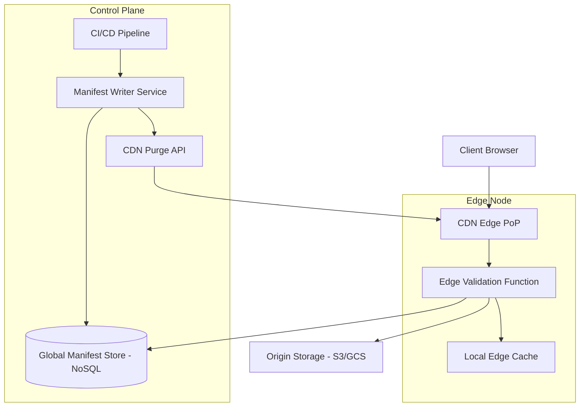

# System Design Document: Static Content Edge Validation

## 1. Requirements & System Constraints

### 1.1 Functional Requirements
*   **Integrity Verification:** Ensure that static assets (JS, CSS, Images, WASM) delivered via the CDN have not been tampered with or corrupted during transit or storage.
*   **Version Validation:** Prevent "version skew" where a client receives a mismatched set of assets (e.g., an old CSS file with a new HTML file).
*   **Access Control at Edge:** Validate signed URLs or tokens at the edge to ensure only authorized users can access specific static content.
*   **Atomic Updates:** Ensure that a new version of a static site is promoted globally and validated before being served.
*   **Cache Invalidation:** Provide a mechanism to explicitly invalidate specific assets or entire distributions across all PoPs (Points of Presence).

### 1.2 Non-Functional Requirements
*   **Ultra-Low Latency:** Validation logic must execute in the low millisecond range to avoid impacting the Time to First Byte (TTFB).
*   **High Availability:** The validation mechanism must not become a single point of failure; if the validation service is unreachable, a fallback policy (fail-open or fail-closed) must be defined.
*   **Global Scalability:** The system must handle millions of requests per second (RPS) across diverse geographic regions.
*   **Security:** Protection against Cache Poisoning attacks and unauthorized origin access.

### 1.3 Scale Estimations (HLD)
*   **Traffic:** 10M+ requests per second globally.
*   **Asset Volume:** 100TB+ of static content.
*   **Manifest Size:** Metadata for millions of files, requiring a distributed, low-latency lookup store.
*   **Propagation Delay:** Global invalidation/update propagation should occur within < 60 seconds.

---

## 2. High-Level Architecture

The architecture leverages **Edge Computing** (e.g., Lambda@Edge, Cloudflare Workers, Fastly Compute@Edge) to intercept requests and responses, validating them against a globally distributed **Manifest Store**.

### 2.1 Component Diagram



### 2.2 Interaction Workflow
1.  **Deployment:** The CI/CD pipeline uploads assets to the Origin. It calculates the SHA-256 hash of each file and updates the **Global Manifest Store** with the new version mapping.
2.  **Request:** A client requests `style.v2.css`.
3.  **Edge Interception:** The Edge Function intercepts the request.
4.  **Validation:** 
    *   The function checks the `Manifest Store` (or a local cached copy) for the expected hash/version of `style.v2.css`.
    *   If the asset is in `Edge Cache`, it validates the cached asset's hash.
    *   If the asset is missing or invalid, it fetches it from the `Origin`.
5.  **Integrity Check:** The Edge Function verifies the checksum of the fetched content before serving it to the client and caching it.
6.  **Response:** The validated content is delivered to the client.

---

## 3. Detailed Database Schema Design

The **Global Manifest Store** must be a globally replicated NoSQL database (e.g., DynamoDB Global Tables or CosmosDB) to ensure low-latency reads at any PoP.

### 3.1 Schema: `AssetManifest`
This table stores the "Source of Truth" for every static asset version.

| Field | Type | Key | Description |
| :--- | :--- | :--- | :--- |
| `asset_path` | String | PK | The URI of the asset (e.g., `/static/js/main.js`). |
| `version_id` | String | SK | Unique version identifier (e.g., Git commit hash or Semantic Version). |
| `checksum` | String | - | SHA-256 hash of the file content. |
| `content_type` | String | - | MIME type (e.g., `text/javascript`). |
| `created_at` | Timestamp | - | Deployment timestamp. |
| `status` | Enum | - | `STAGING`, `ACTIVE`, `DEPRECATED`. |

### 3.2 Indexing Strategy
*   **Primary Key:** Composite key `(asset_path, version_id)` allows for rapid lookup of specific versions.
*   **Global Secondary Index (GSI):** An index on `status` where `status = 'ACTIVE'` allows the edge to quickly find the current production version of an asset if the request does not specify a version.

### 3.3 Storage Reasoning
*   **NoSQL over SQL:** We require predictable, single-digit millisecond read latency and seamless global replication. The schema is simple and doesn't require complex joins.
*   **Edge Caching:** To avoid hitting the Manifest Store on every single request, the Edge Function caches the manifest entry for a short TTL (e.g., 60 seconds) or until an invalidation signal is received.

---

## 4. Core API Design

### 4.1 Manifest Update API (Internal Control Plane)
Used by CI/CD to register new assets.

**Endpoint:** `POST /v1/manifest/update`
**Request Payload:**
```json
{
  "deployment_id": "dep_98765",
  "assets": [
    {
      "path": "/js/bundle.js",
      "version": "v1.0.4",
      "hash": "e3b0c44298fc1c149afbf4c8996fb92427ae41e4649b934ca495991b7852b855",
      "mime_type": "application/javascript"
    }
  ],
  "activate": true
}
```
**Response:** `202 Accepted` (Processing asynchronous replication).

### 4.2 Asset Invalidation API
Used to purge corrupted or leaked assets.

**Endpoint:** `POST /v1/purge`
**Request Payload:**
```json
{
  "paths": ["/js/bundle.js", "/css/theme.css"],
  "scope": "global",
  "force_revalidate": true
}
```
**Response:** `200 OK`.

---

## 5. Scalability & Advanced Topics

### 5.1 Caching Strategies
*   **Tiered Caching:** Use a Regional Edge Cache between the PoP and the Origin to reduce origin load during a "cache stampede" when a new version is released.
*   **Stale-While-Revalidate:** Configure the CDN to serve a stale version of the asset while the Edge Function validates the new version in the background.

### 5.2 Edge Validation Logic (Optimization)
To prevent expensive hash calculations on every request:
1.  **Header-based Validation:** The origin attaches a `X-Asset-Hash` header. The Edge Function compares this header against the Manifest Store.
2.  **Sampling:** For very large assets (e.g., 100MB video chunks), perform "sparse validation" by hashing only the first, middle, and last 4KB of the file.

### 5.3 Rate Limiting & Security
*   **Origin Shielding:** Only allow requests to the Origin if they originate from the CDN's IP range and carry a secret "Origin-Access-Key".
*   **Signed URLs:** For private static content, the Edge Function validates an HMAC signature in the URL query string before checking the manifest.

### 5.4 Fault Tolerance
*   **Fail-Open Mechanism:** If the Manifest Store is unreachable, the Edge Function can be configured to "Fail-Open" (serve the cached asset without validation) to ensure availability, while logging a critical alert.
*   **Circuit Breaker:** If the Origin returns 5xx errors, the Edge Function stops attempting re-validation and serves the last known good version from cache.

---

## 6. Trade-off Analysis

### 6.1 CAP Theorem Priorities
In this system, we prioritize **Availability (A)** and **Partition Tolerance (P)**. 
*   **Reasoning:** A CDN that refuses to serve a CSS file because it cannot reach the validation database results in a broken website (high impact). Therefore, we accept **Eventual Consistency (C)**, meaning some PoPs may serve version $N$ while others serve $N+1$ for a few seconds during propagation.

### 6.2 Latency vs. Security
| Approach | Latency | Security/Integrity |
| :--- | :--- | :--- |
| **No Validation** | Lowest | Low (Risk of Cache Poisoning/Corruption) |
| **Header Validation** | Low | Medium (Relies on Origin Header trust) |
| **Full Body Hashing** | High | Highest (Guarantees byte-for-byte integrity) |

**Decision:** Implement **Header Validation** by default, with **Full Body Hashing** triggered only on the first fetch from Origin to Edge.

### 6.3 Storage vs. Compute
We choose to store the manifest in a distributed NoSQL store rather than embedding versioning in the file names (e.g., `main.v123.js`). 
*   **Trade-off:** This increases the compute overhead at the edge (one lookup per asset). 
*   **Benefit:** It allows for "Instant Rollbacks" by simply updating the `ACTIVE` version in the manifest without needing to change the HTML references across the entire site.