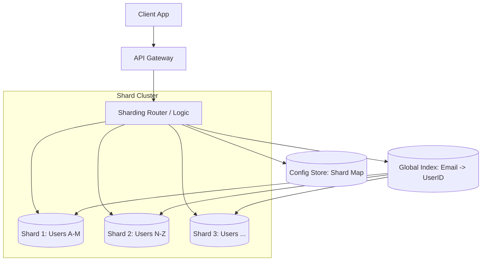

# System Design Guide: Horizontal Database Sharding

## 1. Requirements & System Constraints

This document outlines the architectural approach for implementing horizontal database sharding for a high-scale User Profile and Activity System. 

### 1.1 Functional Requirements
*   **User Management:** Ability to create, update, and retrieve user profiles by a unique identifier.
*   **Scalable Storage:** Support for billions of user records and associated activity logs.
*   **Low Latency:** Sub-100ms response time for point lookups.
*   **Global Distribution:** Ability to route requests to the nearest data center/shard.

### 1.2 Non-Functional Requirements
*   **High Availability:** The system must remain operational even if a single shard fails (99.99% availability).
*   **Linear Scalability:** Adding more hardware should linearly increase the system's throughput and storage capacity.
*   **Fault Isolation:** A failure in one shard should not impact the availability of data in other shards (blast radius limitation).
*   **Consistency:** Strong consistency for individual user updates; eventual consistency for cross-user analytics.

### 1.3 Scale Estimations
*   **Total Users:** 1 Billion.
*   **Avg. Profile Size:** 2 KB $\rightarrow$ Total Storage $\approx$ 2 TB for profiles.
*   **Activity Logs:** 100 events/user/day $\rightarrow$ 100 Billion events/day $\approx$ 10-20 TB/day.
*   **Read Throughput:** 1 Million Requests Per Second (RPS).
*   **Write Throughput:** 100 Thousand Requests Per Second (RPS).

---

## 2. High-Level Architecture

The architecture moves from a monolithic database to a distributed cluster where data is partitioned across multiple independent database nodes.

### 2.1 Core Components
1.  **API Gateway:** Handles authentication, rate limiting, and request routing.
2.  **Sharding Router (Application Layer or Middleware):** The "brain" that determines which shard holds the requested data based on the Shard Key.
3.  **Configuration Store (Control Plane):** A highly available store (e.g., etcd, ZooKeeper) that maintains the shard map (which range/hash belongs to which physical node).
4.  **Shard Nodes:** Independent database instances (e.g., PostgreSQL or MySQL) containing a subset of the total data.
5.  **Global Index / Lookup Table:** An optional service to map secondary keys (like email) to the Shard Key (`user_id`).

### 2.2 Architecture Diagram



---

## 3. Detailed Database Schema Design

### 3.1 Database Selection: SQL vs. NoSQL
For this specific use case, we utilize **Relational Databases (PostgreSQL)** for the shards. 
*   **Reasoning:** User profiles require ACID properties for updates (e.g., changing a password or email). While NoSQL (Cassandra/DynamoDB) handles sharding natively, a sharded SQL approach allows for complex joins within a single shard and strong consistency.

### 3.2 Schema Definition
**Table: `users`**
| Field | Type | Constraint | Index | Note |
| :--- | :--- | :--- | :--- | :--- |
| `user_id` | BIGINT | PRIMARY KEY | B-Tree | Shard Key (Snowflake ID) |
| `email` | VARCHAR(255) | UNIQUE | B-Tree | Global Index Key |
| `username` | VARCHAR(50) | NOT NULL | B-Tree | |
| `profile_data` | JSONB | | GIN | Flexible attributes |
| `created_at` | TIMESTAMP | | | |
| `updated_at` | TIMESTAMP | | | |

**Table: `user_activities`**
| Field | Type | Constraint | Index | Note |
| :--- | :--- | :--- | :--- | :--- |
| `activity_id` | BIGINT | PRIMARY KEY | B-Tree | |
| `user_id` | BIGINT | FOREIGN KEY | B-Tree | Shard Key (Co-located) |
| `action` | VARCHAR(50) | | | |
| `timestamp` | TIMESTAMP | | B-Tree | For range queries |

### 3.3 Sharding Strategy: The Shard Key
The `user_id` is chosen as the **Shard Key**.
*   **Selection Criteria:** High cardinality, uniform distribution, and used in the majority of queries.
*   **ID Generation:** We use **Twitter Snowflake IDs** (64-bit) to ensure IDs are unique across shards and roughly time-sorted without requiring a central auto-increment bottleneck.

---

## 4. Core API Design

### 4.1 User Profile Retrieval
**Endpoint:** `GET /v1/users/{userId}`
*   **Request:** `userId` in path.
*   **Internal Logic:** `shard_id = hash(userId) % total_shards`.
*   **Response:**
```json
{
  "user_id": 123456789,
  "username": "johndoe",
  "email": "john@example.com",
  "profile": { "theme": "dark", "lang": "en" }
}
```

### 4.2 User Creation
**Endpoint:** `POST /v1/users`
*   **Payload:** `{"username": "johndoe", "email": "john@example.com"}`
*   **Internal Logic:** Generate Snowflake ID $\rightarrow$ Calculate Shard $\rightarrow$ Write to Shard $\rightarrow$ Update Global Index.
*   **Response:** `201 Created` with `user_id`.

### 4.3 Search by Email (Cross-Shard Query)
**Endpoint:** `GET /v1/users/search?email=john@example.com`
*   **Internal Logic:** 
    1. Query `GlobalIndex` table $\rightarrow$ returns `user_id: 123456789`.
    2. Use `user_id` to route to specific shard.
*   **Response:** User profile JSON.

---

## 5. Scalability & Advanced Topics

### 5.1 Horizontal Partitioning Schemes
We evaluate three primary schemes:

1.  **Key-Based (Hash) Sharding:**
    *   *Mechanism:* `shard = hash(key) % N`.
    *   *Pros:* Even data distribution.
    *   *Cons:* Adding new shards requires massive data migration (resharding).

2.  **Range-Based Sharding:**
    *   *Mechanism:* `0-1M -> Shard 1`, `1M-2M -> Shard 2`.
    *   *Pros:* Efficient range queries.
    *   *Cons:* Leads to "Hot Spots" (e.g., new users hitting the latest shard).

3.  **Consistent Hashing (The Staff Architect's Choice):**
    *   *Mechanism:* Map keys and nodes onto a logical circle (ring).
    *   *Pros:* Minimizes data movement during scaling. Only $K/N$ keys need to move when a shard is added.
    *   *Implementation:* Use **virtual nodes** to prevent uneven distribution.

### 5.2 Handling the "Hot Key" Problem
If a specific user (e.g., a celebrity) generates massive traffic:
*   **Caching Layer:** Implement a distributed cache (Redis) in front of the shards.
*   **Read Replicas:** Create read-only replicas for the specific shard containing the hot key.

### 5.3 Resharding and Migration
To move from $N$ to $M$ shards without downtime:
1.  **Dual Writes:** Start writing new data to both old and new shards.
2.  **Backfill:** Migrate historical data from old to new shards in the background.
3.  **Verification:** Compare checksums between old and new shards.
4.  **Cutover:** Update the Config Store to point to the new shard map.

### 5.4 Cross-Shard Queries (Scatter-Gather)
For queries that don't include the shard key (e.g., "Find all users aged 20-30"):
*   **Scatter:** The Router sends the query to *all* shards in parallel.
*   **Gather:** The Router aggregates results, performs final sorting/filtering, and returns the response.
*   *Optimization:* Use an asynchronous message queue or an OLAP database (ClickHouse/StarRocks) for these queries to avoid overloading the OLTP shards.

---

## 6. Trade-off Analysis

| Trade-off | Choice | Reasoning |
| :--- | :--- | :--- |
| **Consistency vs. Availability** | **Availability (AP)** | For global user profiles, high availability is prioritized. We accept eventual consistency for the Global Index but maintain strong consistency within a single shard. |
| **Latency vs. Storage** | **Latency** | We introduce a Global Index (extra storage) to avoid "Scatter-Gather" queries for common lookups (email $\rightarrow$ id), reducing latency from $O(N_{shards})$ to $O(1)$. |
| **Complexity vs. Scalability** | **Complexity** | Sharding adds significant architectural complexity (router, config store, migration logic), but it is the only way to handle 1B+ users where a single vertical instance reaches hardware limits. |
| **Hash vs. Range** | **Consistent Hashing** | While range sharding is simpler for time-series data, consistent hashing prevents the "hot shard" problem and makes scaling predictable. |